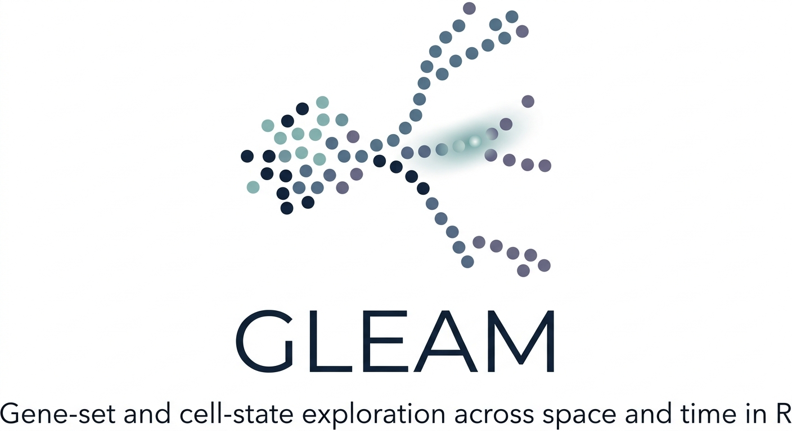
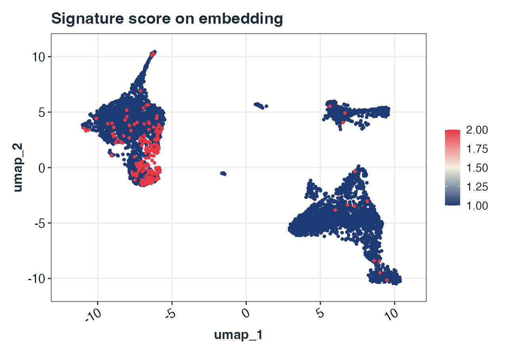
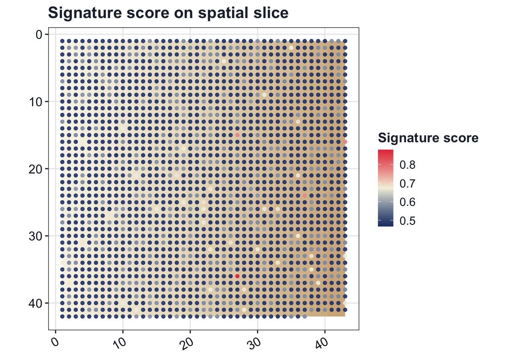
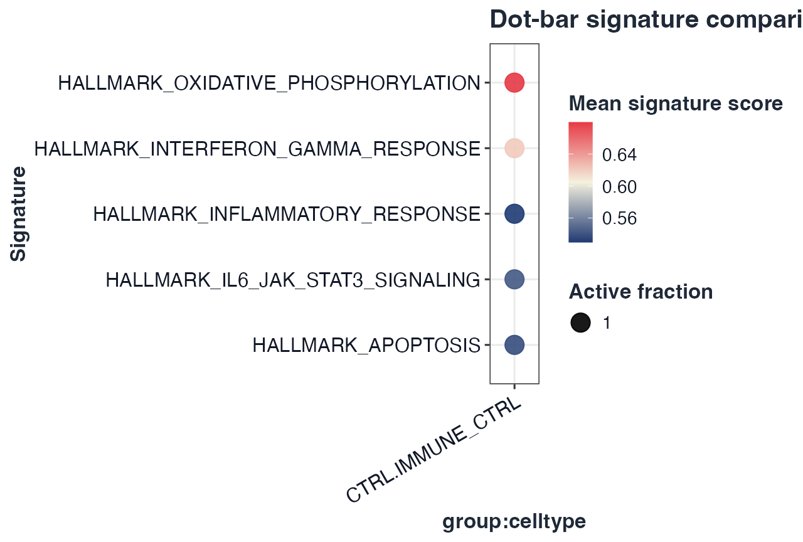

<p align="center">
  
</p>

# GLEAM

GLEAM: Gene-set and cell-state exploration across space and time in R


GLEAM provides pathway/signature scoring, cell-state exploration, differential analysis after scoring, trajectory-aware mapping, and spatial transcriptomics analysis for both matrix-native and Seurat workflows. Built-in geneset examples focus on human and mouse, and custom genesets remain fully supported for other species.

## Installation

```r
# Core install
if (!requireNamespace("devtools", quietly = TRUE)) install.packages("devtools")
devtools::install_github("JamesWu7/GLEAM")
```

```r
# Recommended ecosystem (Seurat + curated genesets)
install.packages(c("Seurat", "SeuratObject", "msigdbr"))
```

```r
# Optional trajectory backend (Monocle3 path; not required for core workflows)
if (!requireNamespace("BiocManager", quietly = TRUE)) install.packages("BiocManager")
BiocManager::install(version = "3.21", ask = FALSE)
install.packages(c("remotes", "devtools"))
remotes::install_github("bnprks/BPCells/r", upgrade = "never")
devtools::install_github("cole-trapnell-lab/monocle3", upgrade = "never")
```

**Navigation:** [Documentation](https://JamesWu7.github.io/GLEAM/) | [Reference](https://JamesWu7.github.io/GLEAM/reference/) | [Tutorials](https://JamesWu7.github.io/GLEAM/articles/) | [Citation](#citation)

## Workflow highlights

Figures below are generated from `vignettes/GLEAM_homepage_showcase.Rmd` via `scripts/generate_homepage_figures.R`.

<p align="center">
  
  
</p>
<p align="center">
  
  
</p>

## Quick start (Seurat scRNA-seq)

```r
library(GLEAM)

hallmark_gs <- get_geneset("hallmark", source = "builtin", species = "human")

sc <- score_signature(object = seu, geneset = hallmark_gs, geneset_source = "list", seurat = TRUE, method = "ensemble")
res <- test_signature(sc, group = "group", sample = "sample", celltype = "celltype", level = "pseudobulk")
top_pw <- res$table$pathway[order(res$table$p_adj)][1]
if (!"pca" %in% names(seu@reductions)) seu <- Seurat::RunPCA(seu)
if (!"umap" %in% names(seu@reductions)) seu <- Seurat::RunUMAP(seu, dims = 1:20)
plot_embedding_score(sc, pathway = top_pw, object = seu, reduction = "umap")
plot_violin(sc, pathway = rownames(sc$score)[1], group = "group")
```

<p align="center">
  
</p>

## Quick start (Seurat spatial)

```r
sp <- score_signature(object = sp_seu, geneset = hallmark_gs, geneset_source = "list", seurat = TRUE, assay = "Spatial")
stopifnot(all(c("x", "y") %in% colnames(sp_seu@meta.data)))
coords <- data.frame(
  x = sp_seu@meta.data$x,
  y = sp_seu@meta.data$y,
  row.names = rownames(sp_seu@meta.data)
)
img <- as.raster(matrix(colorRampPalette(c("#f7f3e8", "#eadfca", "#d9c7a4"))(256), nrow = 16))
plot_spatial_score(sp, pathway = rownames(sp$score)[1], coords = coords, image = img, split.by = "sample")
sp_res <- test_signature(sp, region = "region", group = "group", sample = "sample", level = "sample_region")
top_sp_pw <- sp_res$table$pathway[order(sp_res$table$p_adj)][1]
plot_spatial_score(sp, pathway = top_sp_pw, coords = coords, image = img, split.by = "region")
```

<p align="center">
  
</p>

## Custom gene-set example (concise)

```r
custom_gs <- list(
  IFN_custom = c("STAT1", "IRF1", "ISG15", "IFIT3"),
  CYT_custom = c("NKG7", "PRF1", "GZMB", "GNLY")
)

sc_custom <- score_signature(
  object = seu,
  geneset = custom_gs,
  geneset_source = "list",
  seurat = TRUE,
  method = "mean"
)
plot_dot(sc_custom, by = c("group", "celltype"))
```

## Supported gene-set sources

- `builtin`: in-package Hallmark-like and immune collections (human/mouse focus).
- `list`: user-provided named list.
- `gmt`: GMT file input via `read_gmt()`.
- `data.frame`: tabular input with `pathway` + `gene` columns.
- `msigdb`, `go`, `kegg`, `reactome`: optional curated sources (dependency-gated, no silent internet-only behavior).

## Visualization parameter guide

- Grouping/faceting: `group`, `group.by`, `split.by`, `region`, `sample`, `celltype`.
- Embeddings: `reduction = "umap"|"pca"|"tsne"` in embedding/trajectory plots.
- Spatial display: `coords` with optional `image` for slice-style overlays.
- Style controls through theme helpers: `base_size`, `title_size`, `axis_text_size`, `legend_text_size`, `font_family`, `font_face`, `title_color`, `text_color`.
- Palette controls: plot-level `palette` plus `get_palette()`, `scale_gleam_color()`, `scale_gleam_fill()`.

## Detailed tutorials by function category

- Input/extraction: [Seurat v4/v5 input guide](https://JamesWu7.github.io/GLEAM/articles/GLEAM_seurat_v4_v5_input.html)
- Geneset management: [Supported genesets](https://JamesWu7.github.io/GLEAM/articles/GLEAM_supported_genesets.html)
- Scoring/methods: [Scoring method comparison](https://JamesWu7.github.io/GLEAM/articles/GLEAM_scoring_method_comparison.html)
- Differential analysis: [Differential analysis tutorial](https://JamesWu7.github.io/GLEAM/articles/GLEAM_differential_analysis.html)
- Trajectory analysis: [Trajectory mapping tutorial](https://JamesWu7.github.io/GLEAM/articles/GLEAM_trajectory_mapping.html)
- Spatial analysis: [Spatial full workflow](https://JamesWu7.github.io/GLEAM/articles/GLEAM_full_spatial_workflow.html)
- Function categories overview: [Function categories](https://JamesWu7.github.io/GLEAM/articles/GLEAM_function_categories.html)

## Full workflow tutorials

- Full scRNA workflow: [GLEAM_full_scrna_workflow](https://JamesWu7.github.io/GLEAM/articles/GLEAM_full_scrna_workflow.html)
- Full spatial workflow: [GLEAM_full_spatial_workflow](https://JamesWu7.github.io/GLEAM/articles/GLEAM_full_spatial_workflow.html)

## Citation

- GitHub repository: <https://github.com/JamesWu7/GLEAM>
- R-native citation: `citation("GLEAM")`

Suggested text for manuscripts:

> GLEAM: Gene-set and cell-state exploration across space and time in R. R package (v0.2.0). Available at: https://github.com/JamesWu7/GLEAM.
