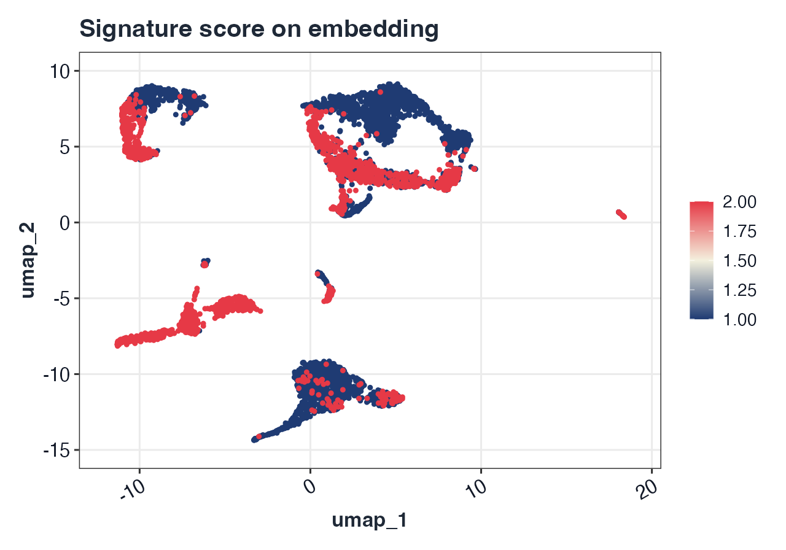
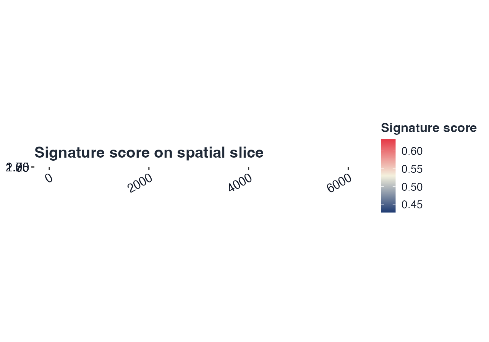
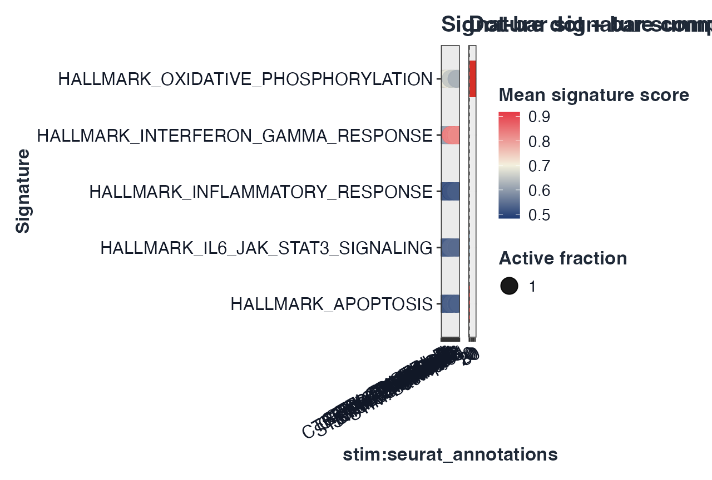
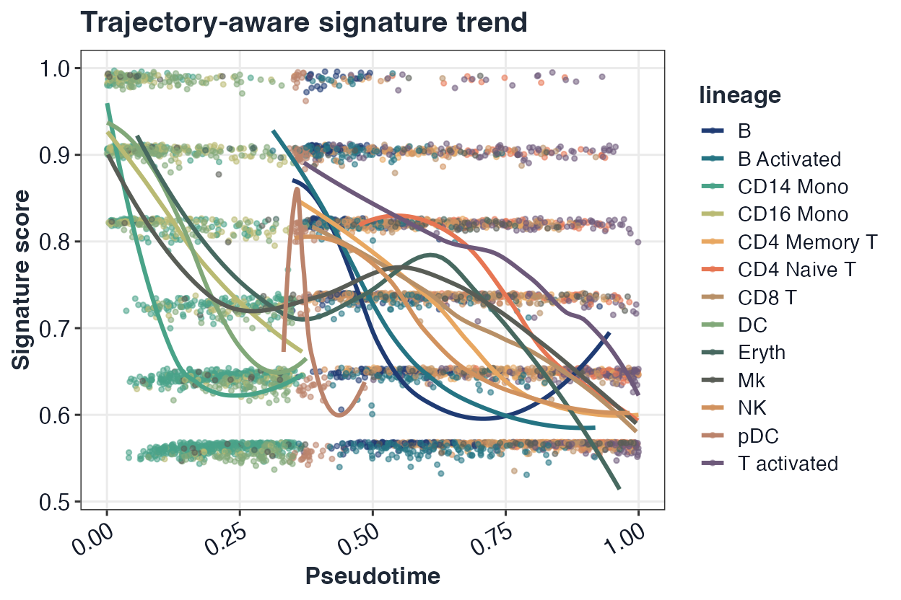

<p align="center">
  
</p>

# GLEAM

GLEAM: Gene-set and cell-state exploration across space and time in R


GLEAM provides pathway/signature scoring, cell-state exploration, differential analysis after scoring, trajectory-aware mapping, and spatial transcriptomics analysis for both matrix-native and Seurat workflows. Built-in geneset examples focus on human and mouse, and custom genesets remain fully supported for other species.

## Installation

```r
if (!requireNamespace("devtools", quietly = TRUE)) install.packages("devtools")
devtools::install_github("JamesWu7/GLEAM")
```

**Navigation:** [Documentation](https://JamesWu7.github.io/GLEAM/) | [Reference](https://JamesWu7.github.io/GLEAM/reference/) | [Tutorials](https://JamesWu7.github.io/GLEAM/articles/) | [Citation](#citation)

## Workflow highlights

Figures below are generated from `vignettes/GLEAM_homepage_showcase.Rmd` via `scripts/generate_homepage_figures.R`.

<p align="center">
  
  
</p>
<p align="center">
  
  
</p>

## Quick start (Seurat scRNA-seq)

```r
library(GLEAM)
library(Seurat)

ifnb_path <- system.file("extdata", "full_examples", "ifnb_seurat.rds", package = "GLEAM")
if (ifnb_path == "") ifnb_path <- file.path("inst", "extdata", "full_examples", "ifnb_seurat.rds")
seu <- readRDS(ifnb_path)
pick_first_col <- function(candidates, cols) {
  hit <- candidates[candidates %in% cols]
  if (length(hit) == 0L) return(NULL)
  hit[[1]]
}

stratified_keep <- function(meta, n_target, strata_candidates = character()) {
  if (nrow(meta) <= n_target) return(rownames(meta))
  strata <- intersect(strata_candidates, colnames(meta))
  all_ids <- rownames(meta)
  if (length(strata) == 0L) return(all_ids[seq_len(n_target)])

  key <- interaction(meta[, strata, drop = FALSE], drop = TRUE, lex.order = TRUE)
  groups <- split(all_ids, key)
  per_group <- max(1L, floor(n_target / max(1L, length(groups))))
  keep <- unlist(lapply(groups, function(ids) {
    ids <- sort(ids)
    head(ids, per_group)
  }), use.names = FALSE)
  if (length(keep) < n_target) {
    keep <- c(keep, head(setdiff(all_ids, keep), n_target - length(keep)))
  }
  unique(keep)[seq_len(min(n_target, length(unique(keep))))]
}

if (ncol(seu) > 5000) {
  keep <- stratified_keep(
    meta = seu@meta.data,
    n_target = 5000,
    strata_candidates = c("orig.ident", "stim", "seurat_annotations", "seurat_clusters")
  )
  seu <- subset(seu, cells = keep)
}

md <- seu@meta.data
sample_col <- pick_first_col(c("sample", "orig.ident"), colnames(md))
if (is.null(sample_col)) {
  md$sample <- "sample_1"
  sample_col <- "sample"
} else if (sample_col != "sample") {
  md$sample <- as.character(md[[sample_col]])
}

group_col <- pick_first_col(c("stim", "group"), colnames(md))
if (is.null(group_col)) {
  md$group <- ifelse(seq_len(nrow(md)) <= nrow(md) / 2, "A", "B")
  group_col <- "group"
} else if (group_col != "group") {
  md$group <- as.character(md[[group_col]])
}

celltype_col <- pick_first_col(c("seurat_annotations", "celltype", "seurat_clusters"), colnames(md))
if (is.null(celltype_col)) {
  md$celltype <- as.character(Idents(seu))
  celltype_col <- "celltype"
} else if (celltype_col == "seurat_clusters") {
  md$celltype <- paste0("cluster_", md$seurat_clusters)
} else if (celltype_col != "celltype") {
  md$celltype <- as.character(md[[celltype_col]])
}
if (length(unique(md$sample)) < 2L) {
  md$sample <- ifelse(seq_len(nrow(md)) <= nrow(md) / 2, "sample_A", "sample_B")
}
if (length(unique(md$group)) < 2L) {
  s1 <- unique(md$sample)[1]
  md$group <- ifelse(md$sample == s1, "A", "B")
}
seu@meta.data <- md

if (!"pca" %in% names(seu@reductions)) seu <- RunPCA(seu)
if (!"umap" %in% names(seu@reductions)) seu <- RunUMAP(seu, dims = 1:20)

hallmark_gs <- get_geneset("hallmark", source = "builtin", species = "human")
sc <- score_signature(object = seu, geneset = hallmark_gs, geneset_source = "list", seurat = TRUE, method = "ensemble", min_genes = 3)
res <- test_signature(sc, group = group_col, sample = "sample", celltype = celltype_col, level = "pseudobulk")
top_pw <- res$table$pathway[order(res$table$p_adj)][1]

p1 <- plot_embedding_score(sc, pathway = top_pw, object = seu, reduction = "umap")
p2 <- plot_violin(sc, pathway = rownames(sc$score)[1], group = group_col)

if (requireNamespace("patchwork", quietly = TRUE)) {
  p1 + p2 + patchwork::plot_layout(ncol = 2)
} else {
  p1
  p2
}
```

<p align="center">
  
</p>

## Quick start (Seurat spatial)

```r
library(Seurat)

a1_path <- system.file("extdata", "full_examples", "stxBrain_anterior1_seurat.rds", package = "GLEAM")
p1_path <- system.file("extdata", "full_examples", "stxBrain_posterior1_seurat.rds", package = "GLEAM")
if (a1_path == "") a1_path <- file.path("inst", "extdata", "full_examples", "stxBrain_anterior1_seurat.rds")
if (p1_path == "") p1_path <- file.path("inst", "extdata", "full_examples", "stxBrain_posterior1_seurat.rds")

sp_a1 <- readRDS(a1_path)
sp_p1 <- readRDS(p1_path)
resolve_expr <- function(obj) {
  assay_candidates <- unique(c(
    tryCatch(SeuratObject::DefaultAssay(obj), error = function(e) NULL),
    "Spatial",
    "RNA"
  ))
  assay_candidates <- assay_candidates[!is.na(assay_candidates) & nzchar(assay_candidates)]

  get_if_nonempty <- function(expr) {
    m <- tryCatch(eval.parent(substitute(expr)), error = function(e) NULL)
    if (!is.null(m) && nrow(m) > 0L && ncol(m) > 0L) return(m)
    NULL
  }

  for (assay in assay_candidates) {
    m <- get_if_nonempty(SeuratObject::LayerData(object = obj, assay = assay, layer = "data"))
    if (!is.null(m)) return(m)
    m <- get_if_nonempty(SeuratObject::LayerData(object = obj, assay = assay, layer = "counts"))
    if (!is.null(m)) return(m)
    m <- get_if_nonempty(SeuratObject::GetAssayData(object = obj, assay = assay, slot = "data"))
    if (!is.null(m)) return(m)
    m <- get_if_nonempty(SeuratObject::GetAssayData(object = obj, assay = assay, slot = "counts"))
    if (!is.null(m)) return(m)
  }

  stop("Failed to extract non-empty expression matrix from Seurat spatial object.")
}

prep_spatial_object <- function(obj, sample_label) {
  expr <- resolve_expr(obj)
  md <- as.data.frame(obj[[]], stringsAsFactors = FALSE)
  if (is.null(rownames(md))) rownames(md) <- colnames(expr)
  md <- md[colnames(expr), , drop = FALSE]
  if (!"sample" %in% colnames(md)) md$sample <- sample_label
  if (!all(c("x", "y") %in% colnames(md))) {
    if (all(c("imagecol", "imagerow") %in% colnames(md))) {
      md$x <- md$imagecol
      md$y <- md$imagerow
    } else if (all(c("col", "row") %in% colnames(md))) {
      md$x <- md$col
      md$y <- md$row
    }
  }
  prefixed_ids <- make.unique(paste0(sample_label, "_", colnames(expr)), sep = "_dup")
  colnames(expr) <- prefixed_ids
  rownames(md) <- prefixed_ids
  list(expr = expr, meta = md)
}

stratified_keep <- function(meta, n_target, strata_candidates = character()) {
  if (nrow(meta) <= n_target) return(rownames(meta))
  strata <- intersect(strata_candidates, colnames(meta))
  all_ids <- rownames(meta)
  if (length(strata) == 0L) return(all_ids[seq_len(n_target)])

  key <- interaction(meta[, strata, drop = FALSE], drop = TRUE, lex.order = TRUE)
  groups <- split(all_ids, key)
  per_group <- max(1L, floor(n_target / max(1L, length(groups))))
  keep <- unlist(lapply(groups, function(ids) {
    ids <- sort(ids)
    head(ids, per_group)
  }), use.names = FALSE)
  if (length(keep) < n_target) {
    keep <- c(keep, head(setdiff(all_ids, keep), n_target - length(keep)))
  }
  unique(keep)[seq_len(min(n_target, length(unique(keep))))]
}

sp1 <- prep_spatial_object(sp_a1, "anterior")
sp2 <- prep_spatial_object(sp_p1, "posterior")
common_genes <- intersect(rownames(sp1$expr), rownames(sp2$expr))
sp_expr <- cbind(sp1$expr[common_genes, , drop = FALSE], sp2$expr[common_genes, , drop = FALSE])
sp_md <- rbind(sp1$meta[colnames(sp1$expr), , drop = FALSE], sp2$meta[colnames(sp2$expr), , drop = FALSE])
sp_md <- sp_md[colnames(sp_expr), , drop = FALSE]
if (!"group" %in% colnames(sp_md)) sp_md$group <- ifelse(grepl("anterior", sp_md$sample, ignore.case = TRUE), "anterior", "posterior")
if (!"region" %in% colnames(sp_md)) sp_md$region <- if ("seurat_clusters" %in% colnames(sp_md)) paste0("cluster_", sp_md$seurat_clusters) else sp_md$group
if (ncol(sp_expr) > 6000) {
  keep <- stratified_keep(
    meta = sp_md,
    n_target = 6000,
    strata_candidates = c("sample", "group", "region", "seurat_clusters")
  )
  sp_expr <- sp_expr[, keep, drop = FALSE]
  sp_md <- sp_md[keep, , drop = FALSE]
}
if (!all(c("x", "y") %in% colnames(sp_md))) {
  if (all(c("array_col", "array_row") %in% colnames(sp_md))) {
    sp_md$x <- sp_md$array_col
    sp_md$y <- sp_md$array_row
  } else {
    n <- nrow(sp_md)
    sp_md$x <- seq_len(n)
    sample_vec <- if ("sample" %in% colnames(sp_md)) sp_md$sample else rep("sample_1", n)
    sp_md$y <- as.numeric(as.factor(sample_vec))
  }
}
coords <- data.frame(x = sp_md$x, y = sp_md$y, row.names = rownames(sp_md))

sp_genes <- rownames(sp_expr)
half_n <- max(30, floor(length(sp_genes) / 2))
idx_a <- seq_len(min(half_n, length(sp_genes)))
idx_b <- seq(from = min(half_n + 1, length(sp_genes)), to = length(sp_genes))
gs_spatial <- list(
  Spatial_signature_A = unique(sp_genes[idx_a])[1:min(30, length(unique(sp_genes[idx_a])))],
  Spatial_signature_B = unique(sp_genes[idx_b])[1:min(30, length(unique(sp_genes[idx_b])))]
)

sp <- score_signature(expr = sp_expr, meta = sp_md, geneset = gs_spatial, geneset_source = "list", seurat = FALSE, method = "rank", min_genes = 3)
img <- as.raster(matrix(colorRampPalette(c("#f7f3e8", "#eadfca", "#d9c7a4"))(256), nrow = 16))
sp_res <- test_signature(sp, region = "region", group = "group", sample = "sample", level = "sample_region")
top_sp_pw <- sp_res$table$pathway[order(sp_res$table$p_adj)][1]

p1 <- plot_spatial_score(sp, pathway = rownames(sp$score)[1], coords = coords, image = img, split.by = "sample")
p2 <- plot_spatial_score(sp, pathway = top_sp_pw, coords = coords, image = img, split.by = "region")

if (requireNamespace("patchwork", quietly = TRUE)) {
  p1 + p2 + patchwork::plot_layout(ncol = 2)
} else {
  p1
  p2
}
```

<p align="center">
  
</p>

## Custom gene-set example (concise)

```r
custom_gs <- list(
  IFN_custom = c("STAT1", "IRF1", "ISG15", "IFIT3"),
  CYT_custom = c("NKG7", "PRF1", "GZMB", "GNLY")
)

sc_custom <- score_signature(
  object = seu,
  geneset = custom_gs,
  geneset_source = "list",
  seurat = TRUE,
  method = "mean"
)
plot_dot(sc_custom, by = c("group", "celltype"))
```

## Supported gene-set sources

- `builtin`: in-package Hallmark-like and immune collections (human/mouse focus).
- `list`: user-provided named list.
- `gmt`: GMT file input via `read_gmt()`.
- `data.frame`: tabular input with `pathway` + `gene` columns.
- `msigdb`, `go`, `kegg`, `reactome`: optional curated sources (dependency-gated, no silent internet-only behavior).

## Visualization parameter guide

- Grouping/faceting: `group`, `group.by`, `split.by`, `region`, `sample`, `celltype`.
- Embeddings: `reduction = "umap"|"pca"|"tsne"` in embedding/trajectory plots.
- Spatial display: `coords` with optional `image` for slice-style overlays.
- Style controls through theme helpers: `base_size`, `title_size`, `axis_text_size`, `legend_text_size`, `font_family`, `font_face`, `title_color`, `text_color`.
- Palette controls: plot-level `palette` plus `get_palette()`, `scale_gleam_color()`, `scale_gleam_fill()`.

## Detailed tutorials by function category

- Input/extraction: [Seurat v4/v5 input guide](https://JamesWu7.github.io/GLEAM/articles/GLEAM_seurat_v4_v5_input.html)
- Geneset management: [Supported genesets](https://JamesWu7.github.io/GLEAM/articles/GLEAM_supported_genesets.html)
- Scoring/methods: [Scoring method comparison](https://JamesWu7.github.io/GLEAM/articles/GLEAM_scoring_method_comparison.html)
- Differential analysis: [Differential analysis tutorial](https://JamesWu7.github.io/GLEAM/articles/GLEAM_differential_analysis.html)
- Trajectory analysis: [Trajectory mapping tutorial](https://JamesWu7.github.io/GLEAM/articles/GLEAM_trajectory_mapping.html)
- Spatial analysis: [Spatial full workflow](https://JamesWu7.github.io/GLEAM/articles/GLEAM_full_spatial_workflow.html)
- Function categories overview: [Function categories](https://JamesWu7.github.io/GLEAM/articles/GLEAM_function_categories.html)

## Full workflow tutorials

- Full scRNA workflow: [GLEAM_full_scrna_workflow](https://JamesWu7.github.io/GLEAM/articles/GLEAM_full_scrna_workflow.html)
- Full spatial workflow: [GLEAM_full_spatial_workflow](https://JamesWu7.github.io/GLEAM/articles/GLEAM_full_spatial_workflow.html)

## Citation

- GitHub repository: <https://github.com/JamesWu7/GLEAM>
- R-native citation: `citation("GLEAM")`

Suggested text for manuscripts:

> GLEAM: Gene-set and cell-state exploration across space and time in R. R package (v0.2.0). Available at: https://github.com/JamesWu7/GLEAM.
