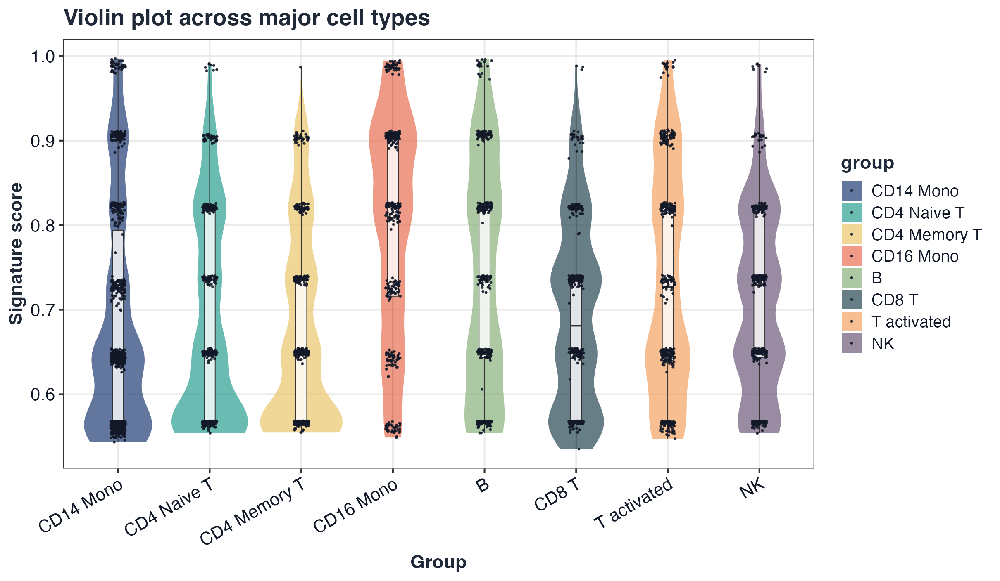
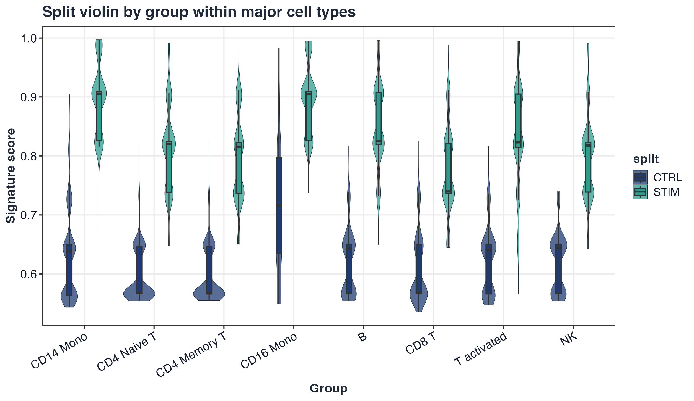
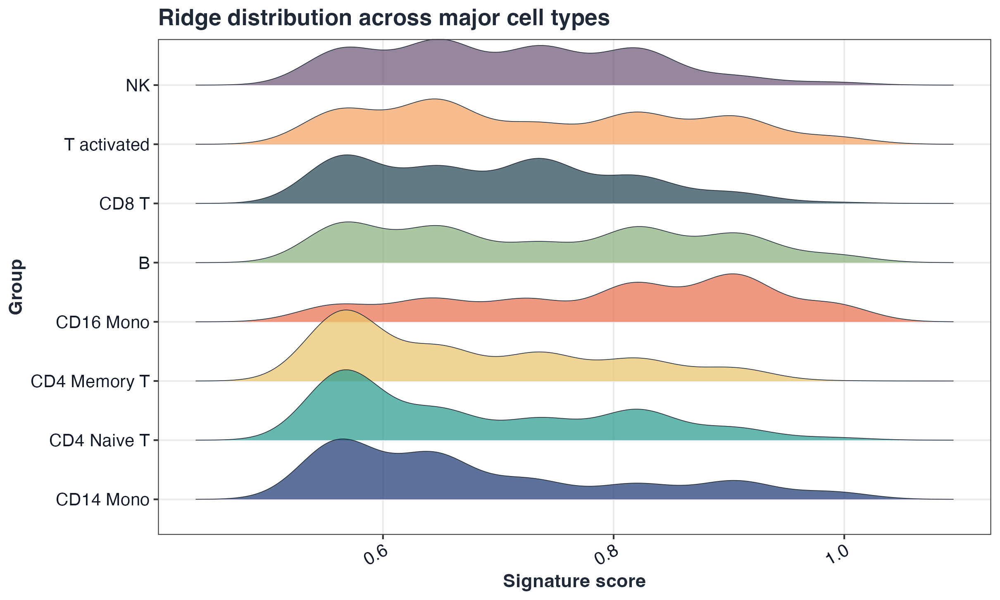

<p align="center">
  
</p>

# GLEAM

GLEAM: Gene-set and cell-state exploration across space and time in R


GLEAM provides pathway/signature scoring, cell-state exploration, differential analysis after scoring, trajectory-aware mapping, and spatial transcriptomics analysis for both matrix-native and Seurat workflows. Built-in geneset examples focus on human and mouse, and custom genesets remain fully supported for other species.

## Installation

```r
if (!requireNamespace("devtools", quietly = TRUE)) install.packages("devtools")
devtools::install_github("JamesWu7/GLEAM")
```

**Navigation:** [Documentation](https://JamesWu7.github.io/GLEAM/) | [Reference](https://JamesWu7.github.io/GLEAM/reference/) | [Tutorials](https://JamesWu7.github.io/GLEAM/articles/) | [Citation](#citation)

## Workflow highlights

Figures below are generated from `scripts/GLEAM_homepage_showcase.Rmd` via `scripts/generate_homepage_figures.R`.

<p align="center">
  
</p>
<p align="center">
  
</p>
<p align="center">
  
</p>
<p align="center">
  
  
</p>
<p align="center">
  
  
</p>

## Quick start (Seurat scRNA-seq)

```r
library(GLEAM)
library(Seurat)

ifnb_path <- system.file("extdata", "full_examples", "ifnb_seurat.rds", package = "GLEAM")
if (ifnb_path == "") ifnb_path <- file.path("inst", "extdata", "full_examples", "ifnb_seurat.rds")
seu <- readRDS(ifnb_path)
pick_first_col <- function(candidates, cols) {
  hit <- candidates[candidates %in% cols]
  if (length(hit) == 0L) return(NULL)
  hit[[1]]
}

stratified_keep <- function(meta, n_target, strata_candidates = character()) {
  if (nrow(meta) <= n_target) return(rownames(meta))
  strata <- intersect(strata_candidates, colnames(meta))
  all_ids <- rownames(meta)
  if (length(strata) == 0L) return(all_ids[seq_len(n_target)])

  key <- interaction(meta[, strata, drop = FALSE], drop = TRUE, lex.order = TRUE)
  groups <- split(all_ids, key)
  per_group <- max(1L, floor(n_target / max(1L, length(groups))))
  keep <- unlist(lapply(groups, function(ids) {
    ids <- sort(ids)
    head(ids, per_group)
  }), use.names = FALSE)
  if (length(keep) < n_target) {
    keep <- c(keep, head(setdiff(all_ids, keep), n_target - length(keep)))
  }
  unique(keep)[seq_len(min(n_target, length(unique(keep))))]
}

if (ncol(seu) > 5000) {
  keep <- stratified_keep(
    meta = seu@meta.data,
    n_target = 5000,
    strata_candidates = c("orig.ident", "stim", "seurat_annotations", "seurat_clusters")
  )
  seu <- subset(seu, cells = keep)
}

md <- seu@meta.data
sample_col <- pick_first_col(c("sample", "orig.ident"), colnames(md))
if (is.null(sample_col)) {
  md$sample <- "sample_1"
  sample_col <- "sample"
} else if (sample_col != "sample") {
  md$sample <- as.character(md[[sample_col]])
}

group_col <- pick_first_col(c("stim", "group"), colnames(md))
if (is.null(group_col)) {
  md$group <- ifelse(seq_len(nrow(md)) <= nrow(md) / 2, "A", "B")
  group_col <- "group"
} else if (group_col != "group") {
  md$group <- as.character(md[[group_col]])
}

celltype_col <- pick_first_col(c("seurat_annotations", "celltype", "seurat_clusters"), colnames(md))
if (is.null(celltype_col)) {
  md$celltype <- as.character(Idents(seu))
  celltype_col <- "celltype"
} else if (celltype_col == "seurat_clusters") {
  md$celltype <- paste0("cluster_", md$seurat_clusters)
} else if (celltype_col != "celltype") {
  md$celltype <- as.character(md[[celltype_col]])
}
if (length(unique(md$sample)) < 2L) {
  md$sample <- ifelse(seq_len(nrow(md)) <= nrow(md) / 2, "sample_A", "sample_B")
}
if (length(unique(md$group)) < 2L) {
  s1 <- unique(md$sample)[1]
  md$group <- ifelse(md$sample == s1, "A", "B")
}
seu@meta.data <- md

if (!"pca" %in% names(seu@reductions)) seu <- RunPCA(seu)
if (!"umap" %in% names(seu@reductions)) seu <- RunUMAP(seu, dims = 1:20)

hallmark_gs <- get_geneset("hallmark", source = "builtin", species = "human")
sc <- score_signature(object = seu, geneset = hallmark_gs, geneset_source = "list", seurat = TRUE, method = "ensemble", min_genes = 3)
res <- test_signature(sc, group = group_col, sample = "sample", celltype = celltype_col, level = "pseudobulk")
top_pw <- res$table$pathway[order(res$table$p_adj)][1]

p1 <- plot_embedding_score(sc, pathway = top_pw, object = seu, reduction = "umap")
p2 <- plot_violin(sc, pathway = rownames(sc$score)[1], group = group_col)

if (requireNamespace("patchwork", quietly = TRUE)) {
  p1 + p2 + patchwork::plot_layout(ncol = 2)
} else {
  p1
  p2
}
```

<p align="center">
  
</p>

## Quick start (Seurat spatial)

```r
library(GLEAM)
library(Seurat)

st_path <- system.file("extdata", "full_examples", "stxBrain_anterior1_seurat.rds", package = "GLEAM")
if (st_path == "") st_path <- file.path("inst", "extdata", "full_examples", "stxBrain_anterior1_seurat.rds")
st <- readRDS(st_path)

pick_first_col <- function(candidates, cols) {
  hit <- candidates[candidates %in% cols]
  if (length(hit) == 0L) return(NULL)
  hit[[1]]
}

stratified_keep <- function(meta, n_target, strata_candidates = character()) {
  if (nrow(meta) <= n_target) return(rownames(meta))
  strata <- intersect(strata_candidates, colnames(meta))
  all_ids <- rownames(meta)
  if (length(strata) == 0L) return(all_ids[seq_len(n_target)])

  key <- interaction(meta[, strata, drop = FALSE], drop = TRUE, lex.order = TRUE)
  groups <- split(all_ids, key)
  per_group <- max(1L, floor(n_target / max(1L, length(groups))))
  keep <- unlist(lapply(groups, function(ids) {
    ids <- sort(ids)
    head(ids, per_group)
  }), use.names = FALSE)
  if (length(keep) < n_target) {
    keep <- c(keep, head(setdiff(all_ids, keep), n_target - length(keep)))
  }
  unique(keep)[seq_len(min(n_target, length(unique(keep))))]
}

if (ncol(st) > 3500) {
  keep <- stratified_keep(
    meta = st@meta.data,
    n_target = 3500,
    strata_candidates = c("orig.ident", "sample", "seurat_annotations", "seurat_clusters")
  )
  st <- subset(st, cells = keep)
}

md_st <- st@meta.data
region_col <- pick_first_col(c("seurat_annotations", "region", "seurat_clusters"), colnames(md_st))
if (is.null(region_col)) {
  md_st$region <- as.character(Idents(st))
  region_col <- "region"
} else if (region_col == "seurat_clusters") {
  md_st$region <- paste0("cluster_", md_st$seurat_clusters)
} else if (region_col != "region") {
  md_st$region <- as.character(md_st[[region_col]])
}
st@meta.data <- md_st

map_geneset_to_expr <- function(gs, expr_genes) {
  expr_genes <- as.character(expr_genes)
  expr_upper <- toupper(expr_genes)
  mapped <- lapply(gs, function(g) {
    idx <- match(toupper(unique(as.character(g))), expr_upper, nomatch = 0L)
    unique(expr_genes[idx[idx > 0L]])
  })
  mapped[vapply(mapped, length, integer(1)) >= 3L]
}

gs_st <- NULL
for (sp in c("mouse", "human")) {
  gs_try <- try(get_geneset("hallmark", source = "builtin", species = sp), silent = TRUE)
  if (inherits(gs_try, "try-error")) next
  gs_try <- map_geneset_to_expr(gs_try, rownames(st))
  if (length(gs_try) > 0L) {
    gs_st <- gs_try
    break
  }
}
if (is.null(gs_st) || length(gs_st) == 0L) {
  genes <- rownames(st)
  n_take <- min(30L, length(genes))
  gs_st <- list(Spatial_signature = unique(genes[seq_len(n_take)]))
}

sp <- score_signature(
  object = st,
  geneset = gs_st,
  geneset_source = "list",
  seurat = TRUE,
  layer = "counts",
  slot = "counts",
  method = "rank",
  min_genes = 3
)

top_sig <- rownames(sp$score)[1]
p1 <- plot_spatial_score(sp, pathway = top_sig, object = st)
p2 <- plot_dot(sp, by = "region")

if (requireNamespace("patchwork", quietly = TRUE)) {
  p1 + p2 + patchwork::plot_layout(widths = c(2, 1))
} else {
  p1
  p2
}
```

<p align="center">
  
</p>

## Custom gene-set example (concise)

```r
custom_gs <- list(
  IFN_custom = c("STAT1", "IRF1", "ISG15", "IFIT3"),
  CYT_custom = c("NKG7", "PRF1", "GZMB", "GNLY")
)

sc_custom <- score_signature(
  object = seu,
  geneset = custom_gs,
  geneset_source = "list",
  seurat = TRUE,
  method = "mean"
)
plot_dot(sc_custom, by = c("group", "celltype"))
```

## Supported gene-set sources

- `builtin`: in-package Hallmark-like and immune collections (human/mouse focus).
- `list`: user-provided named list.
- `gmt`: GMT file input via `read_gmt()`.
- `data.frame`: tabular input with `pathway` + `gene` columns.
- `msigdb`, `go`, `kegg`, `reactome`: optional curated sources (dependency-gated, no silent internet-only behavior).

## Visualization parameter guide

- Grouping/faceting: `group`, `group.by`, `split.by`, `region`, `sample`, `celltype`.
- Embeddings: `reduction = "umap"|"pca"|"tsne"` in embedding/trajectory plots.
- Spatial display: prefer `object = <Seurat spatial object>` for native slice rendering; `coords` + optional `image` remains available for matrix-mode overlays.
- Style controls through theme helpers: `base_size`, `title_size`, `axis_text_size`, `legend_text_size`, `font_family`, `font_face`, `title_color`, `text_color`.
- Palette controls: plot-level `palette` plus `get_palette()`, `scale_gleam_color()`, `scale_gleam_fill()`.

## Full workflow tutorials

- Full scRNA workflow: [GLEAM_full_scrna_workflow](https://JamesWu7.github.io/GLEAM/articles/GLEAM_full_scrna_workflow.html)
- Full spatial workflow: [GLEAM_full_spatial_workflow](https://JamesWu7.github.io/GLEAM/articles/GLEAM_full_spatial_workflow.html)

## Citation

- GitHub repository: <https://github.com/JamesWu7/GLEAM>
- R-native citation: `citation("GLEAM")`

Suggested text for manuscripts:

> GLEAM: Gene-set and cell-state exploration across space and time in R. R package (v0.2.0). Available at: https://github.com/JamesWu7/GLEAM.

BibTeX:

```bibtex
@Manual{GLEAM,
  title   = {GLEAM: Gene-set and cell-state exploration across space and time in R},
  author  = {Xinjie Wu},
  year    = {2026},
  note    = {R package version 0.2.0},
  url     = {https://github.com/JamesWu7/GLEAM}
}
```
