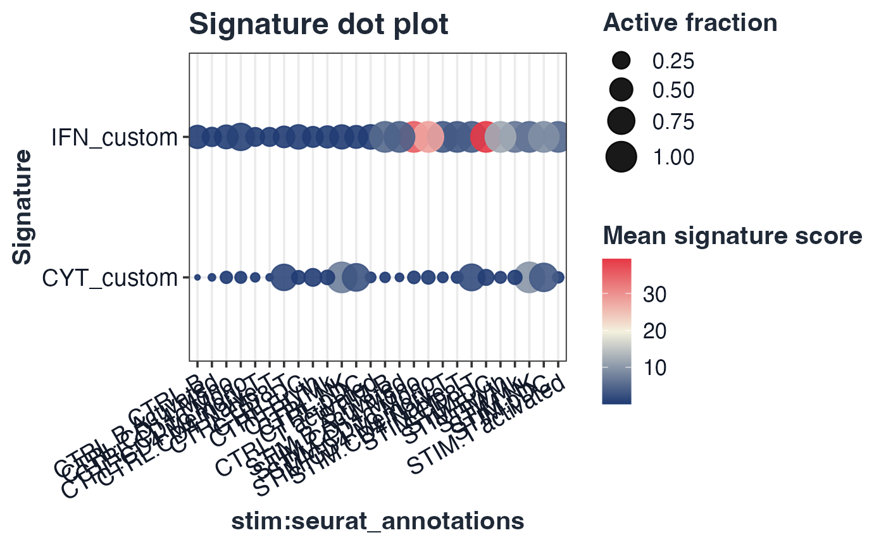

# GLEAM custom geneset example

## Custom named-list genesets

``` r

library(Seurat)
#> Loading required package: SeuratObject
#> Loading required package: sp
#> 
#> Attaching package: 'SeuratObject'
#> The following object is masked from 'package:GLEAM':
#> 
#>     pbmc_small
#> The following objects are masked from 'package:base':
#> 
#>     intersect, t
custom_gs <- list(
  IFN_custom = c("STAT1", "IRF1", "ISG15", "IFIT3"),
  CYT_custom = c("NKG7", "PRF1", "GZMB", "GNLY")
)

ifnb_path <- system.file("extdata", "full_examples", "ifnb_seurat.rds", package = "GLEAM")
if (ifnb_path == "") ifnb_path <- file.path("inst", "extdata", "full_examples", "ifnb_seurat.rds")
seu <- readRDS(ifnb_path)
stratified_keep <- function(meta, n_target, strata_candidates = character()) {
  if (nrow(meta) <= n_target) return(rownames(meta))
  strata <- intersect(strata_candidates, colnames(meta))
  all_ids <- rownames(meta)
  if (length(strata) == 0L) return(all_ids[seq_len(n_target)])
  key <- interaction(meta[, strata, drop = FALSE], drop = TRUE, lex.order = TRUE)
  groups <- split(all_ids, key)
  per_group <- max(1L, floor(n_target / max(1L, length(groups))))
  keep <- unlist(lapply(groups, function(ids) head(sort(ids), per_group)), use.names = FALSE)
  if (length(keep) < n_target) keep <- c(keep, head(setdiff(all_ids, keep), n_target - length(keep)))
  unique(keep)[seq_len(min(n_target, length(unique(keep))))]
}
if (ncol(seu) > 5000) {
  keep <- stratified_keep(seu@meta.data, 5000, c("orig.ident", "stim", "seurat_annotations", "seurat_clusters"))
  seu <- subset(seu, cells = keep)
}

expr_ifnb <- tryCatch(
  Seurat::GetAssayData(seu, assay = DefaultAssay(seu), layer = "counts"),
  error = function(e) Seurat::GetAssayData(seu, assay = DefaultAssay(seu), slot = "counts")
)
meta_ifnb <- seu@meta.data
group_col <- if ("stim" %in% colnames(meta_ifnb)) "stim" else if ("group" %in% colnames(meta_ifnb)) "group" else "group"
celltype_col <- if ("seurat_annotations" %in% colnames(meta_ifnb)) "seurat_annotations" else if ("celltype" %in% colnames(meta_ifnb)) "celltype" else if ("seurat_clusters" %in% colnames(meta_ifnb)) "seurat_clusters" else "celltype"
if (!group_col %in% colnames(meta_ifnb)) meta_ifnb$group <- ifelse(seq_len(nrow(meta_ifnb)) <= nrow(meta_ifnb)/2, "A", "B")
if (!celltype_col %in% colnames(meta_ifnb)) meta_ifnb$celltype <- as.character(Idents(seu))
if (celltype_col == "seurat_clusters") meta_ifnb$celltype <- paste0("cluster_", meta_ifnb$seurat_clusters)

sc <- score_signature(
  expr = expr_ifnb,
  meta = meta_ifnb,
  geneset = custom_gs,
  geneset_source = "list",
  seurat = FALSE,
  method = "mean",
  min_genes = 2,
  verbose = FALSE
)

plot_dot(sc, by = c(group_col, celltype_col))
```


