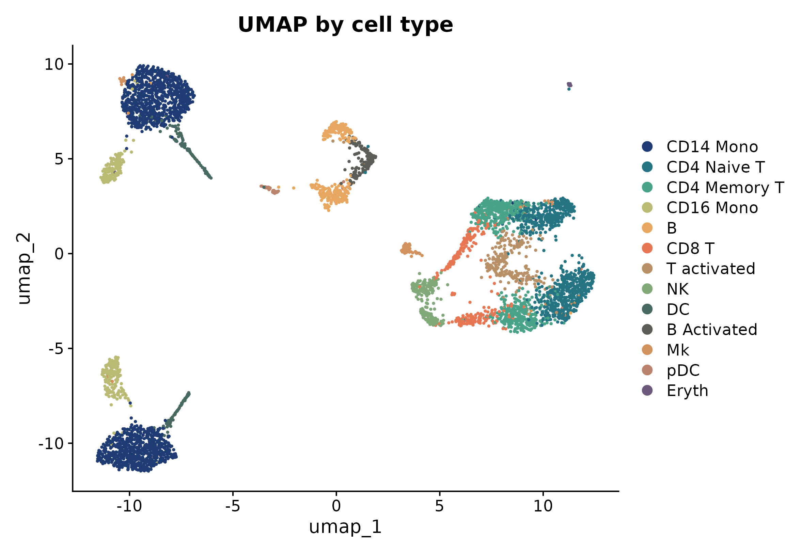
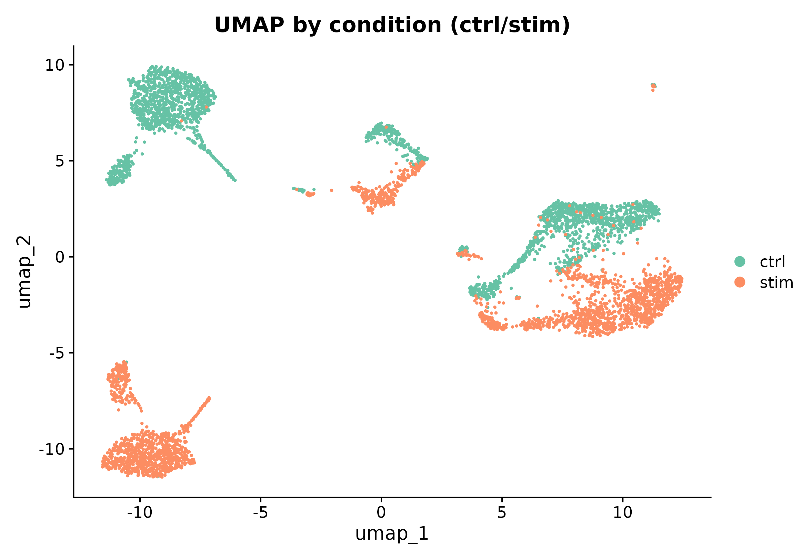
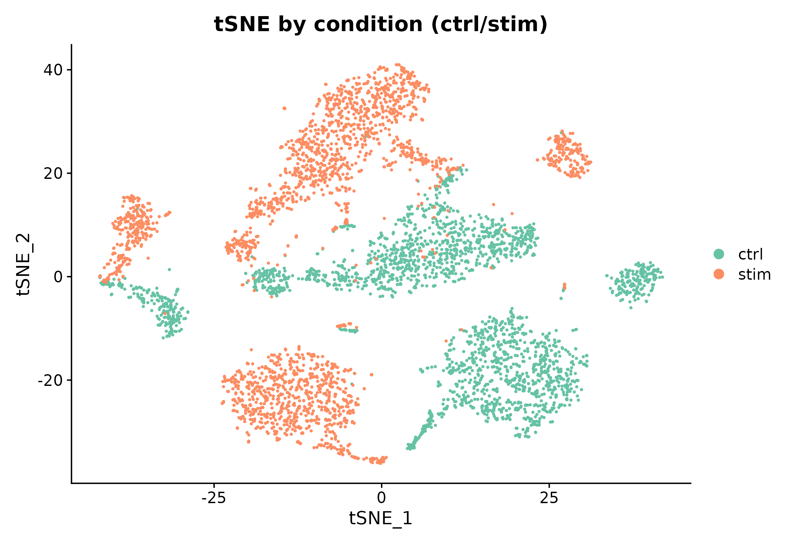
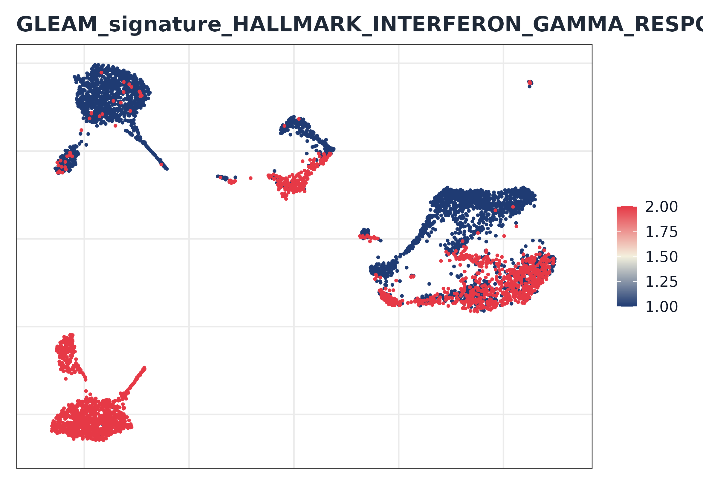
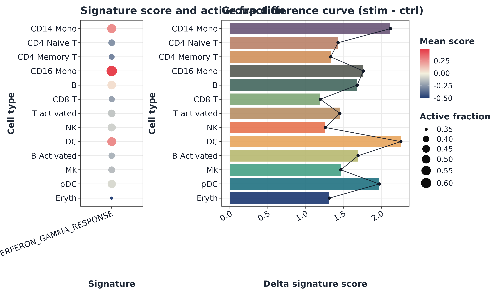
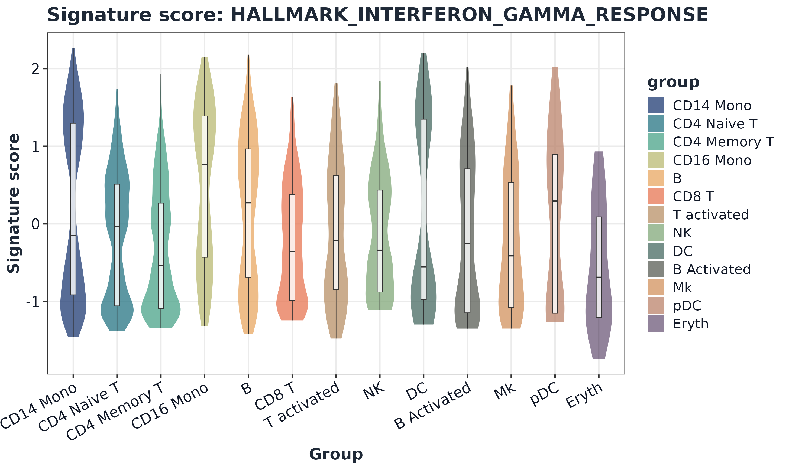
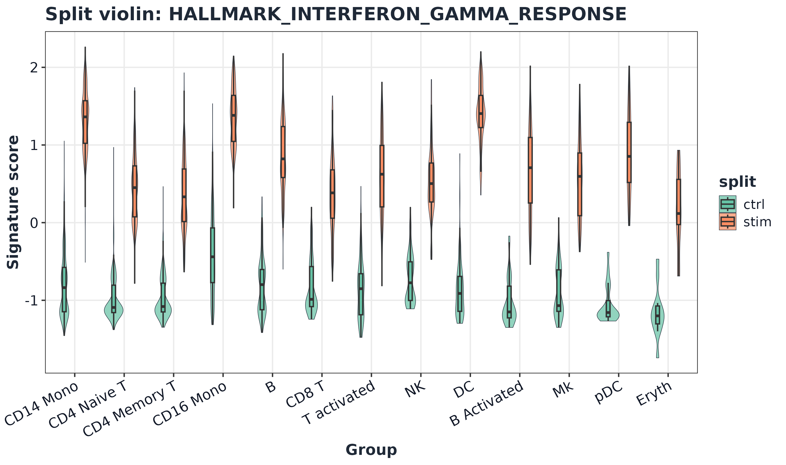
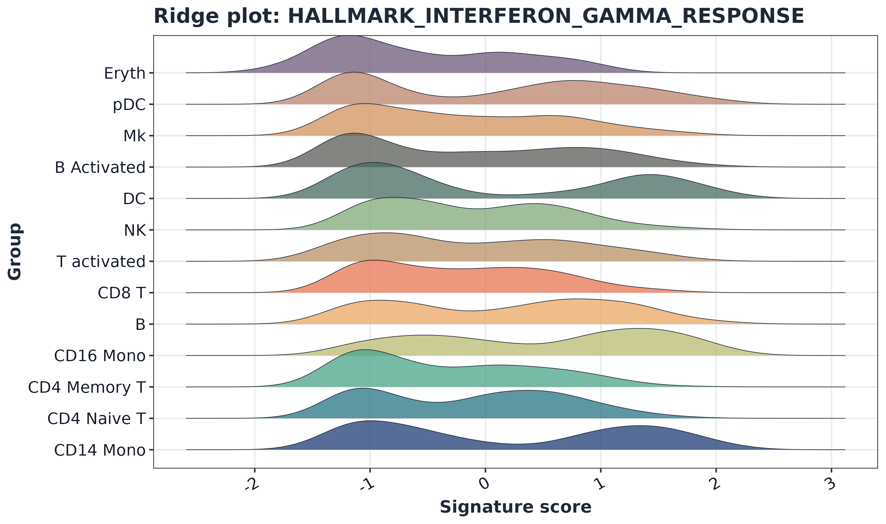
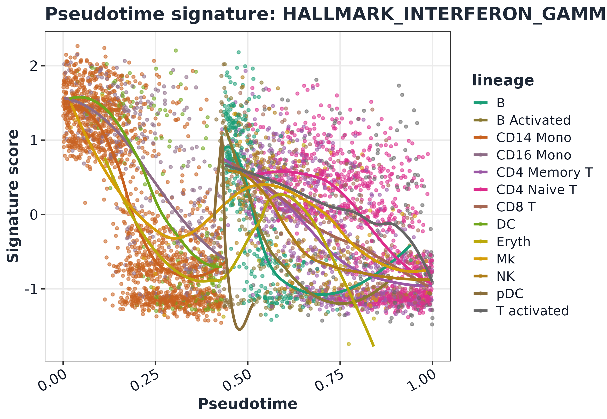
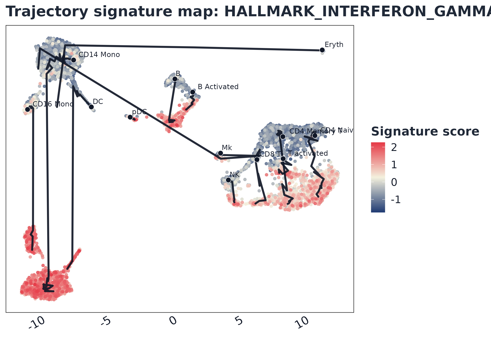

# GLEAM full scRNA-seq workflow

## 1) Load Seurat object

``` r
library(Seurat)
#> Loading required package: SeuratObject
#> Loading required package: sp
#> 
#> Attaching package: 'SeuratObject'
#> The following object is masked from 'package:GLEAM':
#> 
#>     pbmc_small
#> The following objects are masked from 'package:base':
#> 
#>     intersect, t

ifnb_path <- system.file("extdata", "full_examples", "ifnb_seurat.rds", package = "GLEAM")
if (ifnb_path == "") ifnb_path <- file.path("inst", "extdata", "full_examples", "ifnb_seurat.rds")
seu <- readRDS(ifnb_path)

# Keep both CTRL/STIM groups in tutorial subset so group contrasts are always available.
if ("stim" %in% colnames(seu@meta.data)) {
  grp <- as.character(seu$stim)
  grp_levels <- unique(grp)
  n_target <- min(5000L, ncol(seu))
  n_each <- max(1L, floor(n_target / length(grp_levels)))
  cells_use <- unlist(lapply(grp_levels, function(g) {
    ids <- colnames(seu)[grp == g]
    ids[seq_len(min(length(ids), n_each))]
  }), use.names = FALSE)
  if (length(cells_use) < n_target) {
    rem <- setdiff(colnames(seu), cells_use)
    cells_use <- c(cells_use, rem[seq_len(min(length(rem), n_target - length(cells_use)))])
  }
} else {
  cells_use <- colnames(seu)[seq_len(min(5000L, ncol(seu)))]
}
seu <- subset(seu, cells = cells_use)

dim(seu)
#> [1] 14053  5000
seu
#> An object of class Seurat 
#> 14053 features across 5000 samples within 1 assay 
#> Active assay: RNA (14053 features, 0 variable features)
#>  2 layers present: counts, data
```

## 2) Set analysis columns and consistent palettes

``` r
seu$sample <- as.character(seu$orig.ident)
if ("stim" %in% colnames(seu@meta.data)) {
  seu$group <- tolower(as.character(seu$stim))
} else {
  seu$group <- as.character(seu$orig.ident)
}
seu$celltype <- as.character(seu$seurat_annotations)

celltype_levels <- names(sort(table(seu$celltype), decreasing = TRUE))
if (all(c("ctrl", "stim") %in% unique(seu$group))) {
  group_levels <- c("ctrl", "stim")
} else {
  group_levels <- unique(seu$group)
}

seu$celltype <- factor(seu$celltype, levels = celltype_levels)
seu$group <- factor(seu$group, levels = group_levels)

pal_celltype <- setNames(get_palette("gleam_discrete", n = length(celltype_levels), continuous = FALSE), celltype_levels)
pal_group <- setNames(get_palette("brewer_set2", n = length(group_levels), continuous = FALSE), group_levels)

table(seu$group)
#> 
#> ctrl stim 
#> 2500 2500
head(seu@meta.data[, c("sample", "group", "celltype")])
#>                       sample group     celltype
#> AAACATACATTTCC.1 IMMUNE_CTRL  ctrl    CD14 Mono
#> AAACATACCAGAAA.1 IMMUNE_CTRL  ctrl    CD14 Mono
#> AAACATACCTCGCT.1 IMMUNE_CTRL  ctrl    CD14 Mono
#> AAACATACCTGGTA.1 IMMUNE_CTRL  ctrl          pDC
#> AAACATACGATGAA.1 IMMUNE_CTRL  ctrl CD4 Memory T
#> AAACATACGGCATT.1 IMMUNE_CTRL  ctrl    CD14 Mono
```

## 3) Standard Seurat preprocessing

``` r
seu <- NormalizeData(seu, verbose = FALSE)
seu <- FindVariableFeatures(seu, verbose = FALSE)
seu <- ScaleData(seu, verbose = FALSE)
seu <- RunPCA(seu, verbose = FALSE)
seu <- FindNeighbors(seu, dims = 1:20, verbose = FALSE)
seu <- FindClusters(seu, resolution = 0.5, verbose = FALSE)
seu <- RunUMAP(seu, dims = 1:20, verbose = FALSE)
#> Warning: The default method for RunUMAP has changed from calling Python UMAP via reticulate to the R-native UWOT using the cosine metric
#> To use Python UMAP via reticulate, set umap.method to 'umap-learn' and metric to 'correlation'
#> This message will be shown once per session
seu <- RunTSNE(seu, dims = 1:20, verbose = FALSE)

ElbowPlot(seu, ndims = 30)
```


## 4) UMAP and tSNE overview

``` r
DimPlot(seu, reduction = "umap", group.by = "celltype", cols = pal_celltype, pt.size = 0.35) +
  ggplot2::labs(title = "UMAP by cell type")
```



``` r
DimPlot(seu, reduction = "umap", group.by = "group", cols = pal_group, pt.size = 0.35) +
  ggplot2::labs(title = "UMAP by condition (ctrl/stim)")
```



``` r
DimPlot(seu, reduction = "tsne", group.by = "group", cols = pal_group, pt.size = 0.35) +
  ggplot2::labs(title = "tSNE by condition (ctrl/stim)")
```



## 5) Signature scoring

``` r
gs <- get_geneset("hallmark", source = "builtin", species = "human")

sc <- score_signature(
  object = seu,
  geneset = gs,
  geneset_source = "list",
  seurat = TRUE,
  assay = "RNA",
  layer = "data",
  slot = "data",
  method = "ensemble",
  min_genes = 3,
  verbose = FALSE
)

sc$meta$celltype <- factor(as.character(sc$meta$celltype), levels = celltype_levels)
sc$meta$group <- factor(as.character(sc$meta$group), levels = group_levels)

dim(sc$score)
#> [1]    5 5000
```

## 6) Differential analysis

``` r
res_pb <- test_signature(
  sc,
  group = "group",
  sample = "sample",
  celltype = "celltype",
  level = "pseudobulk",
  method = "wilcox"
)

top_sig <- res_pb$table$pathway[order(res_pb$table$p_adj)][1]
head(res_pb$table)
#>                              pathway comparison_type group1 group2
#> 1                 HALLMARK_APOPTOSIS      pseudobulk   ctrl   stim
#> 2   HALLMARK_IL6_JAK_STAT3_SIGNALING      pseudobulk   ctrl   stim
#> 3     HALLMARK_INFLAMMATORY_RESPONSE      pseudobulk   ctrl   stim
#> 4 HALLMARK_INTERFERON_GAMMA_RESPONSE      pseudobulk   ctrl   stim
#> 5 HALLMARK_OXIDATIVE_PHOSPHORYLATION      pseudobulk   ctrl   stim
#>                                                                                          celltype
#> 1 B;B Activated;CD14 Mono;CD16 Mono;CD4 Memory T;CD4 Naive T;CD8 T;DC;Eryth;Mk;NK;pDC;T activated
#> 2 B;B Activated;CD14 Mono;CD16 Mono;CD4 Memory T;CD4 Naive T;CD8 T;DC;Eryth;Mk;NK;pDC;T activated
#> 3 B;B Activated;CD14 Mono;CD16 Mono;CD4 Memory T;CD4 Naive T;CD8 T;DC;Eryth;Mk;NK;pDC;T activated
#> 4 B;B Activated;CD14 Mono;CD16 Mono;CD4 Memory T;CD4 Naive T;CD8 T;DC;Eryth;Mk;NK;pDC;T activated
#> 5 B;B Activated;CD14 Mono;CD16 Mono;CD4 Memory T;CD4 Naive T;CD8 T;DC;Eryth;Mk;NK;pDC;T activated
#>        level effect_size median_group1 median_group2 diff_median      p_value
#> 1 pseudobulk -0.06469235   -0.30914632   -0.24445397 -0.06469235 4.793229e-01
#> 2 pseudobulk -0.15232254   -0.10254860    0.04977394 -0.15232254 1.248390e-03
#> 3 pseudobulk -0.05986874   -0.47481564   -0.41494690 -0.05986874 3.358339e-01
#> 4 pseudobulk -1.45054630   -0.85607494    0.59447136 -1.45054630 1.922966e-07
#> 5 pseudobulk  0.01956142   -0.04851678   -0.06807820  0.01956142 1.533835e-01
#>          p_adj n_group1 n_group2   mean_group1 mean_group2 direction
#> 1 4.793229e-01       13       13  0.0004961131  0.01732366      down
#> 2 3.120974e-03       13       13 -0.0972541324  0.11437032      down
#> 3 4.197924e-01       13       13 -0.2717065892 -0.17290130      down
#> 4 9.614830e-07       13       13 -0.8724480174  0.73448574      down
#> 5 2.556391e-01       13       13  0.1037860590 -0.12311728        up
top_sig
#> [1] "HALLMARK_INTERFERON_GAMMA_RESPONSE"
```

## 7) GLEAM embedding score plot (Seurat-based)

``` r
plot_embedding_score(
  sc,
  signature = top_sig,
  object = seu,
  reduction = "umap",
  point_size = 0.7,
  palette = "gleam_continuous"
)
```



## 8) Dot-bar plot

``` r
plot_dot_bar(
  sc,
  by = c("group", "celltype"),
  signature = top_sig,
  color_palette = "gleam_continuous"
)
```



## 9) Violin plot

``` r
plot_violin(
  sc,
  signature = top_sig,
  group = "celltype",
  palette = pal_celltype,
  point_size = 0,
  alpha = 0.75
) + ggplot2::theme(axis.text.x = ggplot2::element_text(angle = 28, hjust = 1))
```



## 10) Split violin plot

``` r
plot_split_violin(
  sc,
  signature = top_sig,
  x = "celltype",
  split.by = "group",
  palette = pal_group,
  alpha = 0.72
) + ggplot2::theme(axis.text.x = ggplot2::element_text(angle = 28, hjust = 1))
```



## 11) Ridge plot

``` r
plot_ridge(
  sc,
  signature = top_sig,
  group = "celltype",
  palette = pal_celltype,
  alpha = 0.75
)
#> Picking joint bandwidth of 0.284
```



## 12) Trajectory-style plots

``` r
seu$pseudotime <- rank(Embeddings(seu, "pca")[, 1], ties.method = "average") / ncol(seu)
seu$lineage <- as.character(seu$celltype)

sc2 <- score_signature(
  object = seu,
  geneset = gs,
  geneset_source = "list",
  seurat = TRUE,
  assay = "RNA",
  layer = "data",
  slot = "data",
  method = "ensemble",
  min_genes = 3,
  verbose = FALSE
)

lineage_levels <- unique(as.character(sc2$meta$lineage))
pal_lineage <- setNames(get_palette("brewer_dark2", n = length(lineage_levels), continuous = FALSE), lineage_levels)
```

``` r
plot_pseudotime_score(
  sc2,
  signature = top_sig,
  pseudotime = "pseudotime",
  lineage = "lineage",
  palette = pal_lineage
)
```



``` r
plot_trajectory_score(
  sc2,
  signature = top_sig,
  object = seu,
  reduction = "umap",
  palette = "gleam_continuous"
)
```


