# GLEAM full scRNA-seq workflow

## 1) Build a Seurat object with standard preprocessing

For realistic scRNA analysis, signature scoring is most useful after a
standard cell-state workflow (normalization, variable feature selection,
dimensionality reduction, neighbor graph construction, and clustering).

``` r

library(Seurat)
#> Loading required package: SeuratObject
#> Loading required package: sp
#> 
#> Attaching package: 'SeuratObject'
#> The following object is masked from 'package:GLEAM':
#> 
#>     pbmc_small
#> The following objects are masked from 'package:base':
#> 
#>     intersect, t

ifnb_path <- system.file("extdata", "full_examples", "ifnb_seurat.rds", package = "GLEAM")
if (ifnb_path == "") ifnb_path <- file.path("inst", "extdata", "full_examples", "ifnb_seurat.rds")
seu <- readRDS(ifnb_path)
pick_first_col <- function(candidates, cols) {
  hit <- candidates[candidates %in% cols]
  if (length(hit) == 0L) return(NULL)
  hit[[1]]
}

stratified_keep <- function(meta, n_target, strata_candidates = character()) {
  if (nrow(meta) <= n_target) return(rownames(meta))
  strata <- intersect(strata_candidates, colnames(meta))
  all_ids <- rownames(meta)
  if (length(strata) == 0L) return(all_ids[seq_len(n_target)])

  key <- interaction(meta[, strata, drop = FALSE], drop = TRUE, lex.order = TRUE)
  groups <- split(all_ids, key)
  per_group <- max(1L, floor(n_target / max(1L, length(groups))))
  keep <- unlist(lapply(groups, function(ids) {
    ids <- sort(ids)
    head(ids, per_group)
  }), use.names = FALSE)
  if (length(keep) < n_target) {
    keep <- c(keep, head(setdiff(all_ids, keep), n_target - length(keep)))
  }
  unique(keep)[seq_len(min(n_target, length(unique(keep))))]
}

if (ncol(seu) > 7000) {
  md0 <- seu@meta.data
  keep <- stratified_keep(
    meta = md0,
    n_target = 7000,
    strata_candidates = c("orig.ident", "stim", "seurat_annotations", "seurat_clusters")
  )
  seu <- subset(seu, cells = keep)
}

md <- seu@meta.data
sample_col <- pick_first_col(c("sample", "orig.ident"), colnames(md))
if (is.null(sample_col)) {
  md$sample <- "sample_1"
  sample_col <- "sample"
} else if (sample_col != "sample") {
  md$sample <- as.character(md[[sample_col]])
}

group_col <- pick_first_col(c("stim", "group"), colnames(md))
if (is.null(group_col)) {
  md$group <- ifelse(seq_len(nrow(md)) <= nrow(md) / 2, "A", "B")
  group_col <- "group"
} else if (group_col != "group") {
  md$group <- as.character(md[[group_col]])
}

celltype_col <- pick_first_col(c("seurat_annotations", "celltype", "seurat_clusters"), colnames(md))
if (is.null(celltype_col)) {
  md$celltype <- as.character(Idents(seu))
  celltype_col <- "celltype"
} else if (celltype_col == "seurat_clusters") {
  md$celltype <- paste0("cluster_", md$seurat_clusters)
} else if (celltype_col != "celltype") {
  md$celltype <- as.character(md[[celltype_col]])
}
if (length(unique(md$sample)) < 2L) {
  md$sample <- ifelse(seq_len(nrow(md)) <= nrow(md) / 2, "sample_A", "sample_B")
}
if (length(unique(md$group)) < 2L) {
  s1 <- unique(md$sample)[1]
  md$group <- ifelse(md$sample == s1, "A", "B")
}
seu@meta.data <- md

# Basic QC context for tutorial reproducibility.
if (any(grepl("^MT-", rownames(seu)))) {
  seu[["percent.mt"]] <- PercentageFeatureSet(seu, pattern = "^MT-")
}
qc_cols <- intersect(c("nFeature_RNA", "nCount_RNA", "percent.mt"), colnames(seu@meta.data))
summary(seu@meta.data[, qc_cols, drop = FALSE])
#>   nFeature_RNA      nCount_RNA   
#>  Min.   : 501.0   Min.   :  678  
#>  1st Qu.: 551.0   1st Qu.: 1273  
#>  Median : 635.5   Median : 1622  
#>  Mean   : 716.2   Mean   : 2019  
#>  3rd Qu.: 824.0   3rd Qu.: 2534  
#>  Max.   :2644.0   Max.   :10013

# Minimal, conventional Seurat preprocessing path.
if (!"pca" %in% names(seu@reductions)) {
  seu <- NormalizeData(seu)
  seu <- FindVariableFeatures(seu)
  seu <- ScaleData(seu)
  seu <- RunPCA(seu)
}
#> Normalizing layer: counts
#> Finding variable features for layer counts
#> Centering and scaling data matrix
#> PC_ 1 
#> Positive:  NPM1, GIMAP7, LTB, CD3D, CCR7, CD7, SELL, TRAT1, PIK3IP1, RHOH 
#>     ITM2A, CREM, CLEC2D, IL32, IL7R, LEF1, CCL5, RGCC, NOP58, SNHG8 
#>     CD3G, RARRES3, TSC22D3, PASK, NHP2, GNLY, NKG7, MYC, APEX1, ALOX5AP 
#> Negative:  C15orf48, TYROBP, CST3, FCER1G, TIMP1, SOD2, ANXA5, FTL, KYNU, TYMP 
#>     PSAP, SPI1, S100A4, ANXA2, LGALS1, CD63, NPC2, S100A11, LGALS3, CTSB 
#>     LYZ, FCN1, PLAUR, CD68, IGSF6, S100A10, FTH1, HLA-DRA, CTSL, CFP 
#> PC_ 2 
#> Positive:  IL8, S100A8, CLEC5A, CD14, VCAN, S100A9, IER3, PID1, IL1B, GPX1 
#>     MARCKSL1, CXCL3, PLAUR, CD9, THBS1, MGST1, CTB-61M7.2, FTH1, GAPDH, PPIF 
#>     PHLDA1, CXCL2, VIM, LIMS1, OLR1, OSM, C5AR1, INSIG1, CYP1B1, S100A4 
#> Negative:  ISG15, IFIT3, IFIT1, ISG20, TNFSF10, LY6E, MX1, IFIT2, CXCL10, IFI6 
#>     RSAD2, OAS1, CXCL11, IFITM3, IRF7, TNFSF13B, EPSTI1, SAMD9L, IFI35, IFI44L 
#>     OASL, IFITM2, PLSCR1, HERC5, GBP1, MT2A, IDO1, MX2, NT5C3A, APOBEC3A 
#> PC_ 3 
#> Positive:  HLA-DQA1, HLA-DQB1, CD83, HLA-DRA, HLA-DRB1, CD74, HLA-DPA1, HLA-DPB1, MIR155HG, HLA-DMA 
#>     SYNGR2, FABP5, IRF8, REL, TXN, TVP23A, HERPUD1, CCL22, HSP90AB1, NME1 
#>     CCR7, PRMT1, ID3, HSPD1, EBI3, HSPE1, BASP1, CD79A, PIM3, FSCN1 
#> Negative:  GIMAP7, ANXA1, RARRES3, MT2A, GNLY, CD7, PRF1, NKG7, FCGR3A, CCL5 
#>     OASL, C3AR1, CD3D, KLRD1, GZMA, GZMH, CTSW, CLEC2B, FGFBP2, MS4A4A 
#>     IL32, CFD, FCER1G, CD300E, GLRX, APOBEC3G, FASLG, TNFAIP6, GLUL, VAMP5 
#> PC_ 4 
#> Positive:  NKG7, GZMB, GNLY, CST7, PRF1, CLIC3, CCL5, APOBEC3G, CTSW, KLRD1 
#>     GZMA, GZMH, FGFBP2, KLRC1, C1orf21, FASLG, ALOX5AP, CD38, RAMP1, CXCR3 
#>     RARRES3, HOPX, LINC00996, LSP1, SH2D1B, IGFBP7, TNFRSF18, ID2, SPON2, GAPDH 
#> Negative:  LTB, HSP90AB1, HSPD1, TSC22D3, CCR7, HSPH1, SNHG8, LEF1, SELL, CACYBP 
#>     NOP58, SNHG12, HSPE1, SOCS3, MYC, TRAT1, SRSF7, DNAJB1, PIK3IP1, RHOH 
#>     NR4A2, ADTRP, MS4A4A, TXNIP, RSRC2, HSPB1, CHORDC1, GBP1, SCML1, SNHG15 
#> PC_ 5 
#> Positive:  IL7R, ANXA1, GPR183, LMNA, GADD45B, TRAT1, BIRC3, DNAJB4, CACYBP, HSPA1A 
#>     HSPA1B, ZFAND2A, CLK1, SNHG12, DDIT4, HSPH1, RSRC2, RGS1, RAB9A, HSPB1 
#>     DNAJB1, FSCN1, CCL22, ICOS, YPEL5, IDO1, GIMAP7, CLIC2, PKIB, CALCRL 
#> Negative:  CD79A, FCGR3A, MS4A1, MS4A4A, VMO1, CD74, IRF8, HVCN1, MS4A7, HERPUD1 
#>     NME1, BLNK, HLA-DRA, PPM1N, ID3, HN1, TNFRSF13B, CD79B, SRM, PLAC8 
#>     CTSC, AIF1, SERPINA1, BANK1, HLA-DPA1, IGJ, SNX10, HLA-DRB1, TCF4, CFD
ElbowPlot(seu, ndims = 30)
```


``` r

if (!"umap" %in% names(seu@reductions)) {
  seu <- FindNeighbors(seu, dims = 1:20)
  seu <- FindClusters(seu, resolution = 0.5)
  seu <- RunUMAP(seu, dims = 1:20)
}
#> Computing nearest neighbor graph
#> Computing SNN
#> Modularity Optimizer version 1.3.0 by Ludo Waltman and Nees Jan van Eck
#> 
#> Number of nodes: 7000
#> Number of edges: 266122
#> 
#> Running Louvain algorithm...
#> Maximum modularity in 10 random starts: 0.9276
#> Number of communities: 17
#> Elapsed time: 0 seconds
#> Warning: The default method for RunUMAP has changed from calling Python UMAP via reticulate to the R-native UWOT using the cosine metric
#> To use Python UMAP via reticulate, set umap.method to 'umap-learn' and metric to 'correlation'
#> This message will be shown once per session
#> 21:17:03 UMAP embedding parameters a = 0.9922 b = 1.112
#> 21:17:03 Read 7000 rows and found 20 numeric columns
#> 21:17:03 Using Annoy for neighbor search, n_neighbors = 30
#> 21:17:03 Building Annoy index with metric = cosine, n_trees = 50
#> 0%   10   20   30   40   50   60   70   80   90   100%
#> [----|----|----|----|----|----|----|----|----|----|
#> **************************************************|
#> 21:17:04 Writing NN index file to temp file /var/folders/wz/y39q7cvx4hl3qhtftc16hnn00000gn/T//RtmpmAXa2V/file1314e61319ce4
#> 21:17:04 Searching Annoy index using 1 thread, search_k = 3000
#> 21:17:05 Annoy recall = 100%
#> 21:17:05 Commencing smooth kNN distance calibration using 1 thread with target n_neighbors = 30
#> 21:17:05 Initializing from normalized Laplacian + noise (using RSpectra)
#> 21:17:06 Commencing optimization for 500 epochs, with 293486 positive edges
#> 21:17:06 Using rng type: pcg
#> 21:17:13 Optimization finished
if (!"tsne" %in% names(seu@reductions)) {
  seu <- RunTSNE(seu, dims = 1:20)
}

if (!"pseudotime" %in% colnames(seu@meta.data)) {
  seu$pseudotime <- rank(Embeddings(seu, "pca")[, 1], ties.method = "average") / ncol(seu)
}
if (!"lineage" %in% colnames(seu@meta.data)) {
  seu$lineage <- as.character(seu[[celltype_col, drop = TRUE]])
}

# Show object context before downstream analysis
dim(seu)
#> [1] 14053  7000
seu
#> An object of class Seurat 
#> 14053 features across 7000 samples within 1 assay 
#> Active assay: RNA (14053 features, 2000 variable features)
#>  3 layers present: counts, data, scale.data
#>  3 dimensional reductions calculated: pca, umap, tsne
head(seu@meta.data[, unique(c("sample", group_col, celltype_col, "pseudotime", "lineage"))])
#>                       sample stim seurat_annotations pseudotime      lineage
#> AAACATACATTTCC.1 IMMUNE_CTRL CTRL          CD14 Mono  0.1355714    CD14 Mono
#> AAACATACCAGAAA.1 IMMUNE_CTRL CTRL          CD14 Mono  0.1157143    CD14 Mono
#> AAACATACCTCGCT.1 IMMUNE_CTRL CTRL          CD14 Mono  0.2434286    CD14 Mono
#> AAACATACCTGGTA.1 IMMUNE_CTRL CTRL                pDC  0.3795714          pDC
#> AAACATACGATGAA.1 IMMUNE_CTRL CTRL       CD4 Memory T  0.7665714 CD4 Memory T
#> AAACATACGGCATT.1 IMMUNE_CTRL CTRL          CD14 Mono  0.2308571    CD14 Mono
table(Idents(seu))
#> 
#>    0    1    2    3    4    5    6    7    8    9   10   11   12   13   14   15 
#> 1270 1067  836  558  478  450  372  328  293  283  278  246  214  148  108   38 
#>   16 
#>   33
DimPlot(seu, reduction = "umap", group.by = "seurat_clusters", label = TRUE, repel = TRUE, pt.size = 0.35)
```

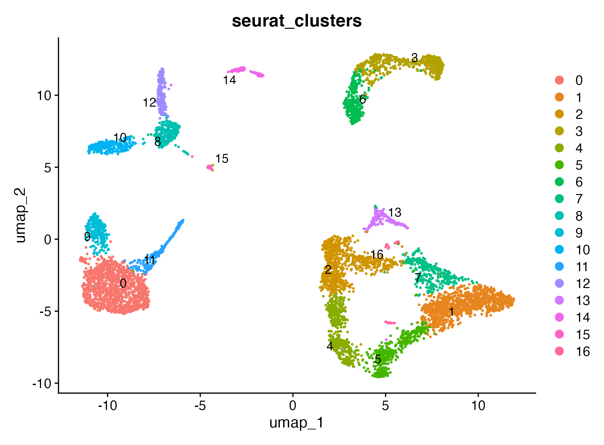

``` r

DimPlot(seu, reduction = "umap", group.by = "celltype", pt.size = 0.35)
```

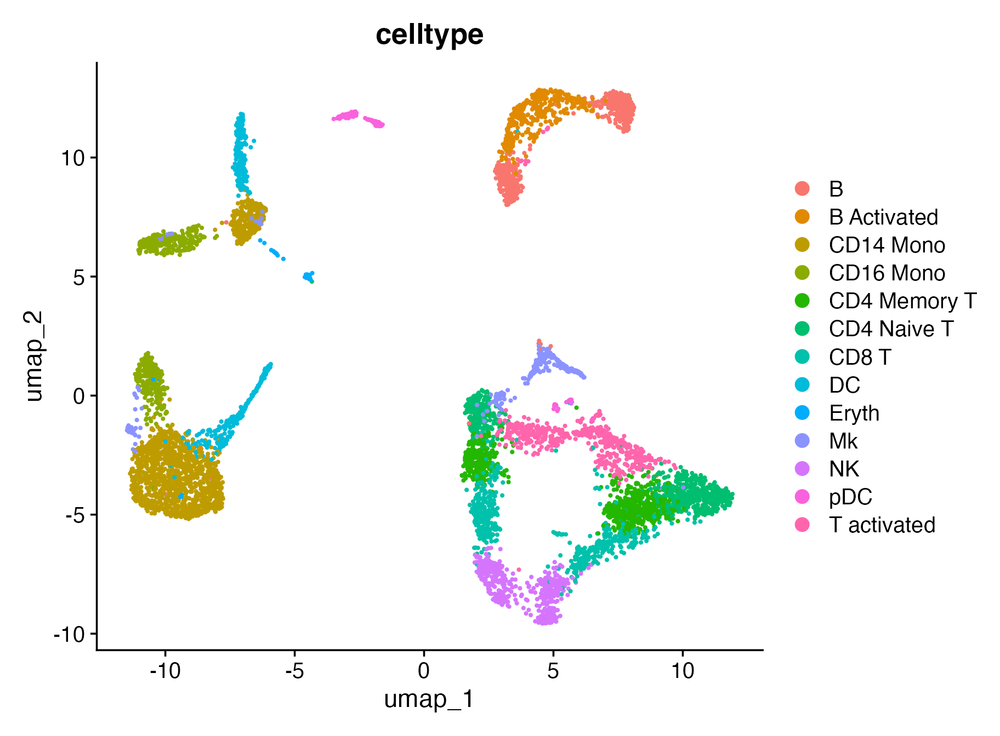

``` r

DimPlot(seu, reduction = "tsne", group.by = "group", pt.size = 0.35)
```

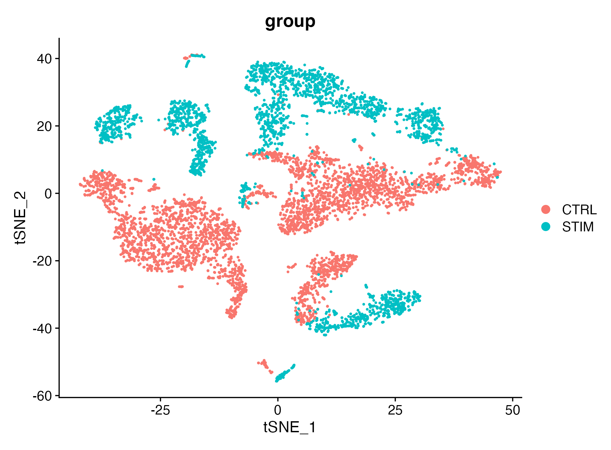

## 2) Built-in geneset scoring + optional custom scoring

``` r

map_geneset_to_expr <- function(gs, expr_genes) {
  expr_genes <- as.character(expr_genes)
  expr_upper <- toupper(expr_genes)
  mapped <- lapply(gs, function(g) {
    idx <- match(toupper(unique(as.character(g))), expr_upper, nomatch = 0L)
    unique(expr_genes[idx[idx > 0L]])
  })
  mapped[vapply(mapped, length, integer(1)) > 0L]
}

fallback_signatures <- function(expr_genes) {
  g <- unique(as.character(expr_genes))
  g <- g[!is.na(g) & nzchar(g)]
  k <- min(30L, max(3L, floor(length(g) / 4)))
  idx1 <- seq_len(min(k, length(g)))
  idx2 <- seq.int(max(1L, length(g) - k + 1L), length(g))
  list(
    Signature_A = g[idx1],
    Signature_B = g[idx2]
  )
}

gs_h <- NULL
for (sp in c("human", "mouse")) {
  gs_try <- try(get_geneset("hallmark", source = "builtin", species = sp), silent = TRUE)
  if (inherits(gs_try, "try-error")) next
  gs_try <- map_geneset_to_expr(gs_try, rownames(seu))
  gs_try <- gs_try[vapply(gs_try, length, integer(1)) >= 3L]
  if (length(gs_try) > 0L) {
    gs_h <- gs_try
    break
  }
}
if (is.null(gs_h) || length(gs_h) == 0L) {
  message("[GLEAM] No matched Hallmark signatures; using object-derived fallback signatures.")
  gs_h <- fallback_signatures(rownames(seu))
}

sc <- score_signature(
  object = seu,
  geneset = gs_h,
  geneset_source = "list",
  seurat = TRUE,
  assay = "RNA",
  layer = "data",
  slot = "data",
  method = "ensemble",
  min_genes = 3
)
#> [GLEAM] matched pathways: 5
#> [GLEAM] median matched genes: 5.0
#> [GLEAM] scoring rank method...
#> [GLEAM] scoring auc method (top_n=703)...
#> [GLEAM] scoring zmean method...

custom <- list(IFN_custom = c("STAT1", "IRF1", "ISG15", "IFIT3", "CXCL10"))
sc_custom <- score_signature(object = seu, geneset = custom, geneset_source = "list", seurat = TRUE, method = "mean", min_genes = 2)
#> [GLEAM] matched pathways: 1
#> [GLEAM] median matched genes: 5.0
#> [GLEAM] scoring mean method...
```

## 3) Differential analysis after scoring

``` r

# cell-level exploratory
res_cell <- test_signature(sc, group = group_col, level = "cell", method = "wilcox")
#> Warning: Cell-level testing is exploratory. Prefer sample/pseudobulk-level for
#> formal inference.

# sample-level
res_sample <- test_signature(sc, group = group_col, sample = "sample", level = "sample", method = "wilcox")

# pseudobulk sample + celltype
res_pb <- test_signature(sc, group = group_col, sample = "sample", celltype = celltype_col, level = "pseudobulk", method = "wilcox")

# within-celltype (pick a celltype that has >=2 groups; otherwise skip gracefully)
ct_order <- names(sort(table(sc$meta[[celltype_col]]), decreasing = TRUE))
target_ct <- NA_character_
for (ct in ct_order) {
  idx <- sc$meta[[celltype_col]] == ct
  if (length(unique(sc$meta[[group_col]][idx])) >= 2L) {
    target_ct <- ct
    break
  }
}
if (!is.na(target_ct)) {
  wct_level <- if (length(unique(sc$meta$sample[sc$meta[[celltype_col]] == target_ct])) >= 2L) "sample" else "cell"
  res_wct <- test_signature(
    sc,
    group = group_col,
    sample = "sample",
    celltype = celltype_col,
    target_celltype = target_ct,
    level = wct_level
  )
} else {
  message("[GLEAM] within-celltype test skipped: no celltype has >=2 groups.")
  res_wct <- res_cell
}
```

## 4) Embedding and Seurat-style visualizations

``` r

top_pw <- res_pb$table$pathway[order(res_pb$table$p_adj)][1]
plot_embedding_score(sc, pathway = top_pw, object = seu, reduction = "umap")
```


``` r

plot_embedding_score(sc, pathway = top_pw, object = seu, reduction = "pca")
```

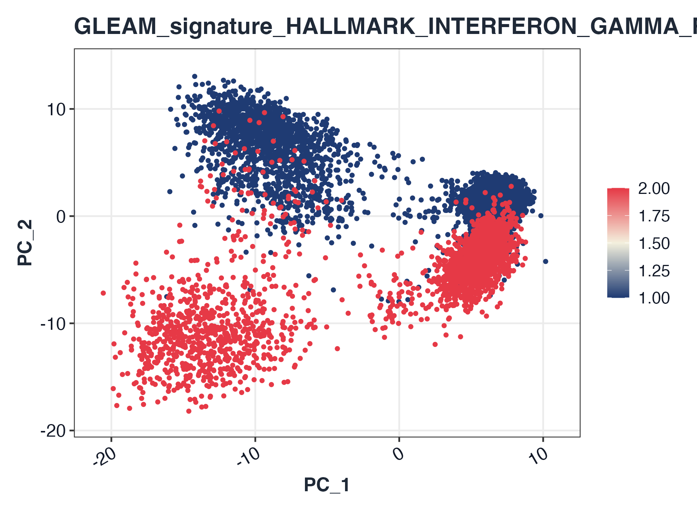

``` r

plot_embedding_score(sc, pathway = top_pw, object = seu, reduction = "tsne")
```

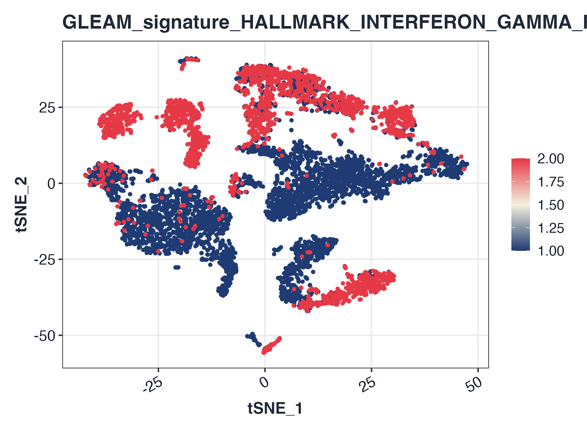

``` r


plot_dot(sc, by = c(group_col, celltype_col))
```

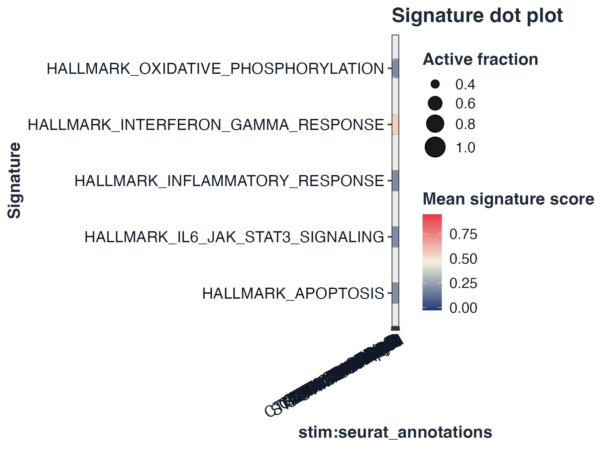

``` r

plot_dot_bar(sc, by = c(group_col, celltype_col))
```

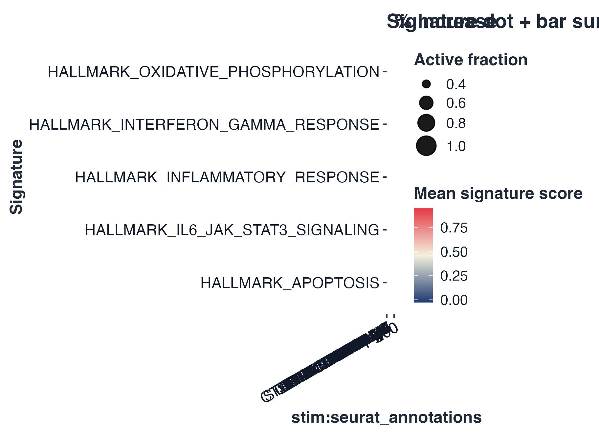

``` r

plot_violin(sc, pathway = rownames(sc$score)[1], group = group_col)
```

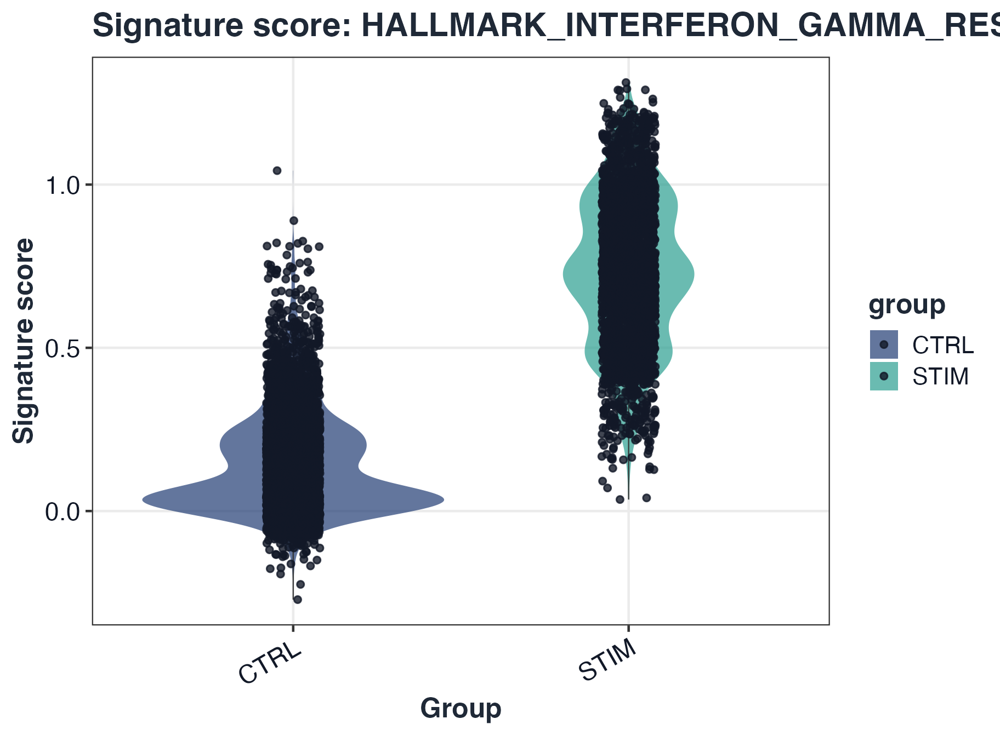

``` r

plot_split_violin(sc, pathway = rownames(sc$score)[1], x = celltype_col, split.by = group_col)
```

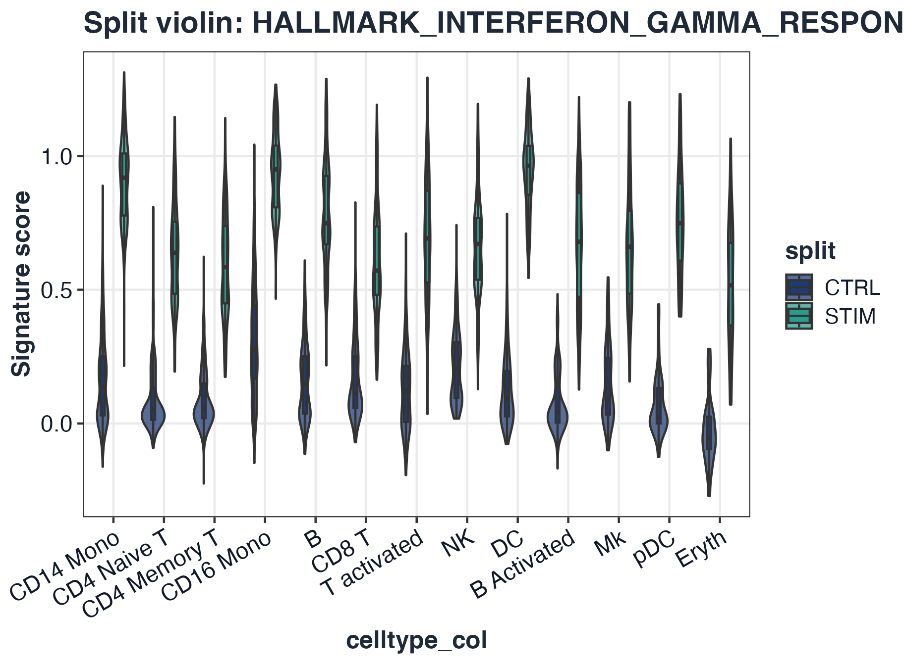

``` r

plot_ridge(sc, pathway = rownames(sc$score)[1], group = celltype_col)
#> Picking joint bandwidth of 0.091
```

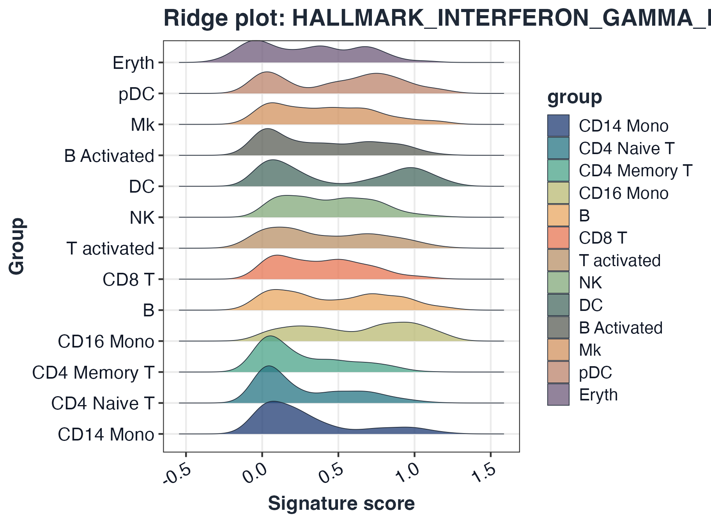

``` r

plot_pseudobulk_box(sc, pathway = rownames(sc$score)[1], group = group_col, sample = "sample", celltype = celltype_col)
```

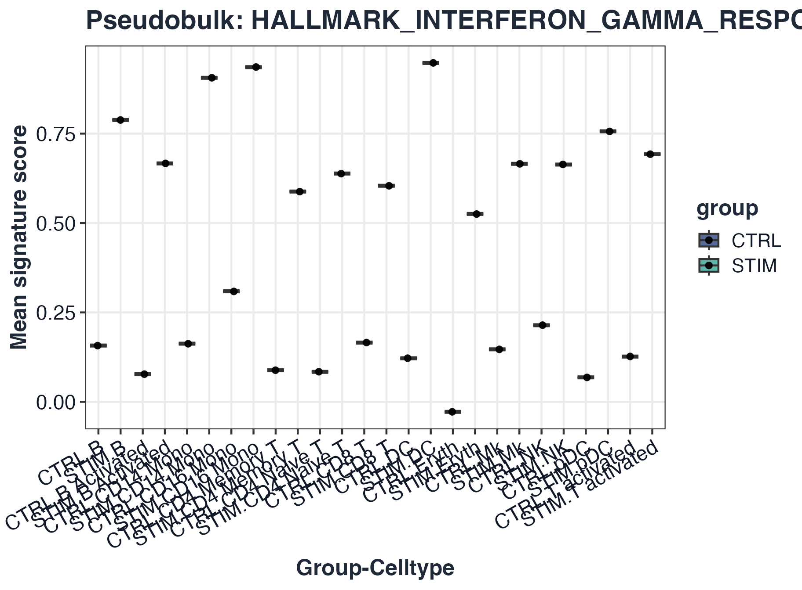

``` r

plot_volcano(res_pb)
```

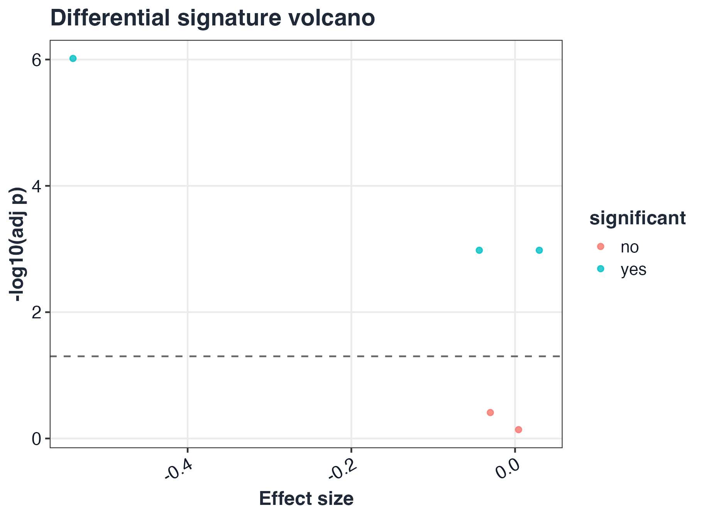

## 5) Trajectory / pseudotime integration

``` r

# Generic metadata-driven trajectory fields
traj_res <- test_signature_trajectory(sc, pseudotime = "pseudotime", lineage = "lineage", method = "spearman")
#> [GLEAM] trajectory test completed for 5 pathways.
plot_pseudotime_score(sc, pathway = rownames(sc$score)[1], pseudotime = "pseudotime", lineage = "lineage")
```

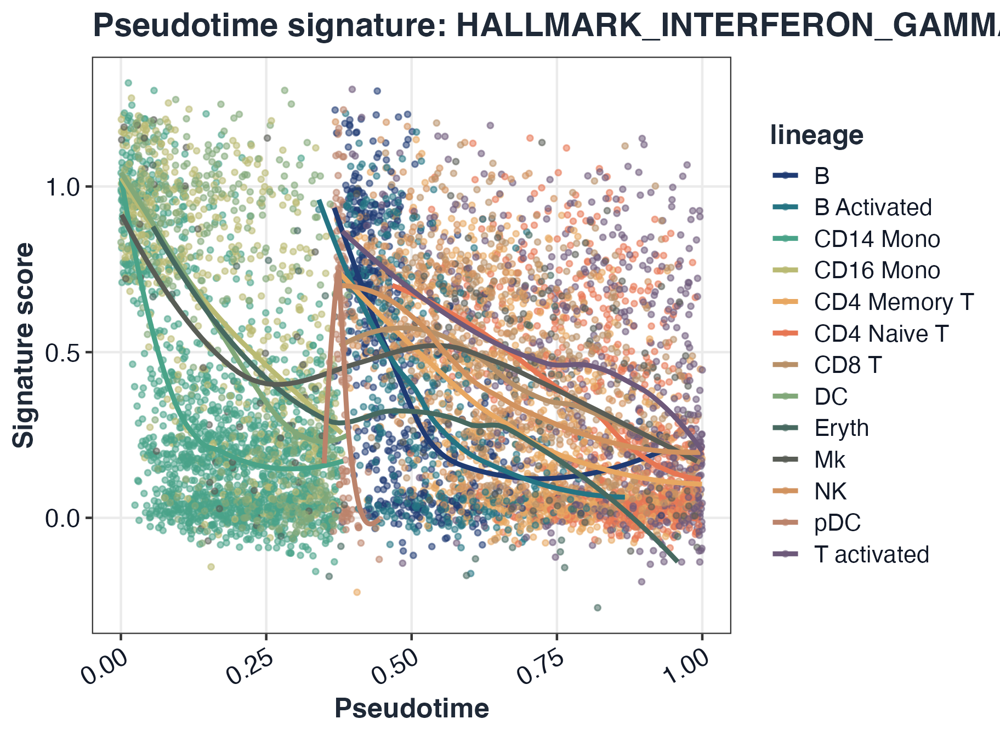

``` r

plot_trajectory_score(sc, pathway = rownames(sc$score)[1], object = seu, reduction = "umap")
```

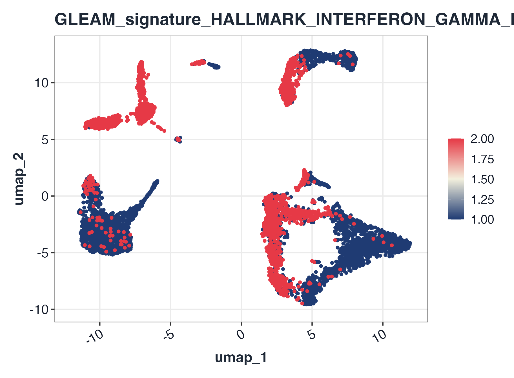

### Optional Monocle2 / Monocle3 / slingshot object pathways

``` r

# Monocle2 object (package monocle)
# traj_res_m2 <- test_signature_trajectory(sc, pseudotime = cds_monocle2, lineage = cds_monocle2, method = "spearman")

# Monocle3 object (package monocle3)
# traj_res_m3 <- test_signature_trajectory(sc, pseudotime = cds_monocle3, lineage = "lineage", method = "spearman")

# slingshot object
# traj_res_sl <- test_signature_trajectory(sc, pseudotime = sds, lineage = sds, method = "spearman")
```

## 6) Export score tables and compare methods

``` r

long_tbl <- pivot_scores_long(sc)
sum_tbl <- summarize_scores(sc, by = c("sample", "group"), fun = "mean")
out_csv <- file.path(tempdir(), "gleam_scores_scrna.csv")
export_scores(sc, out_csv, format = "csv", include_meta = TRUE)

head(long_tbl)
#>                              pathway          cell_id      score
#> 1 HALLMARK_INTERFERON_GAMMA_RESPONSE AAACATACATTTCC.1 0.52515272
#> 2     HALLMARK_INFLAMMATORY_RESPONSE AAACATACATTTCC.1 0.29436010
#> 3                 HALLMARK_APOPTOSIS AAACATACATTTCC.1 0.24696516
#> 4 HALLMARK_OXIDATIVE_PHOSPHORYLATION AAACATACATTTCC.1 0.71923153
#> 5   HALLMARK_IL6_JAK_STAT3_SIGNALING AAACATACATTTCC.1 0.49551131
#> 6 HALLMARK_INTERFERON_GAMMA_RESPONSE AAACATACCAGAAA.1 0.01940029
head(sum_tbl)
#>                              pathway        group_key     value      sample
#> 1 HALLMARK_INTERFERON_GAMMA_RESPONSE IMMUNE_CTRL.CTRL 0.1464492 IMMUNE_CTRL
#> 2     HALLMARK_INFLAMMATORY_RESPONSE IMMUNE_CTRL.CTRL 0.2191187 IMMUNE_CTRL
#> 3                 HALLMARK_APOPTOSIS IMMUNE_CTRL.CTRL 0.2107841 IMMUNE_CTRL
#> 4 HALLMARK_OXIDATIVE_PHOSPHORYLATION IMMUNE_CTRL.CTRL 0.3760304 IMMUNE_CTRL
#> 5   HALLMARK_IL6_JAK_STAT3_SIGNALING IMMUNE_CTRL.CTRL 0.2051387 IMMUNE_CTRL
#> 6 HALLMARK_INTERFERON_GAMMA_RESPONSE IMMUNE_STIM.STIM 0.7353622 IMMUNE_STIM
#>   group summary_method
#> 1  CTRL           mean
#> 2  CTRL           mean
#> 3  CTRL           mean
#> 4  CTRL           mean
#> 5  CTRL           mean
#> 6  STIM           mean
```
