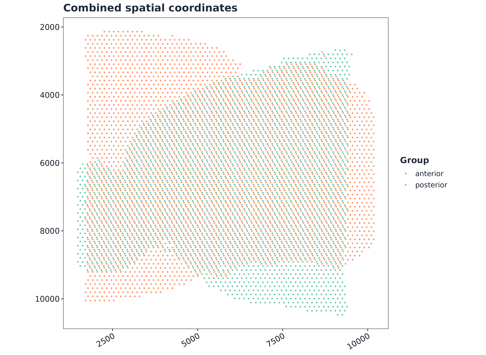
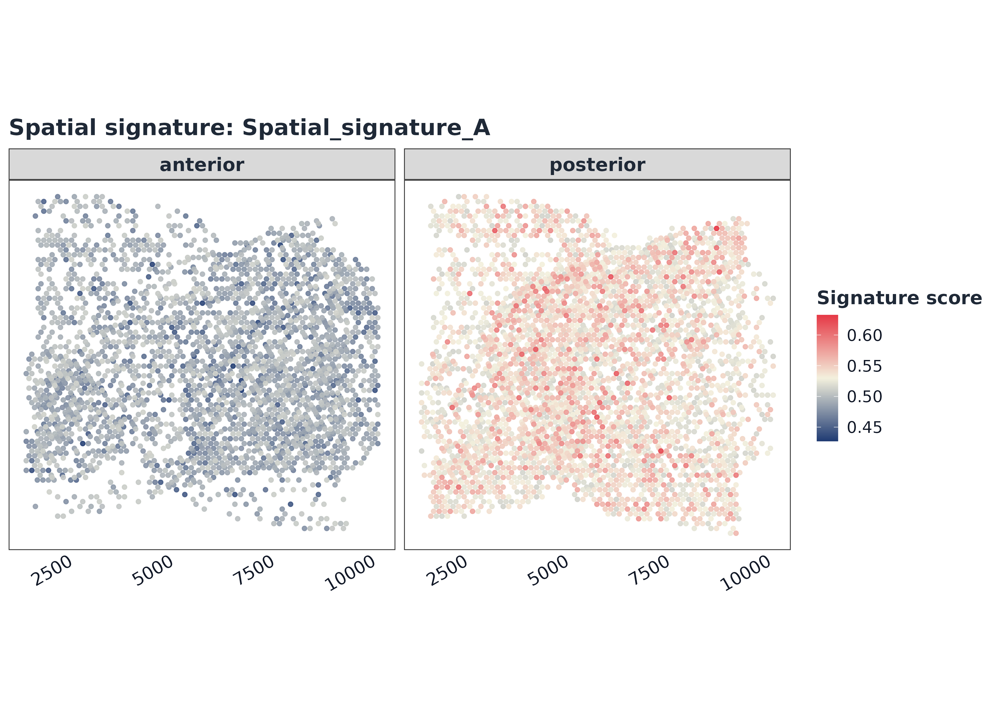
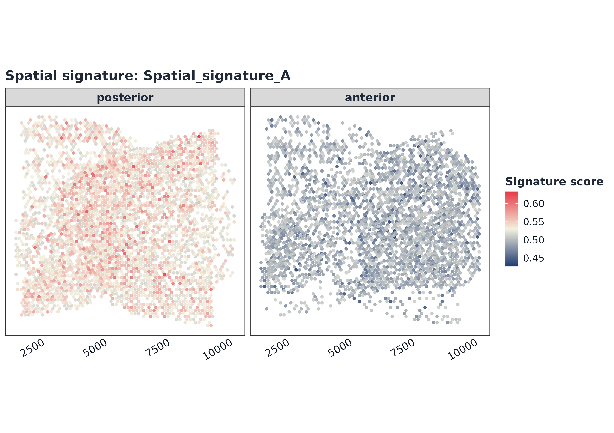
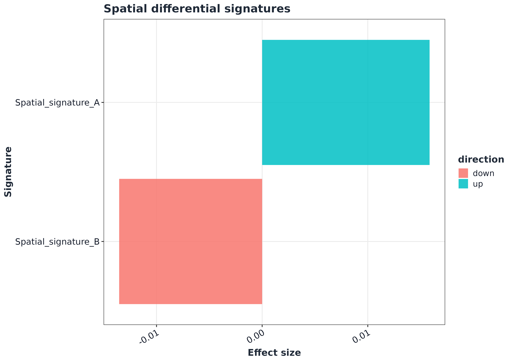
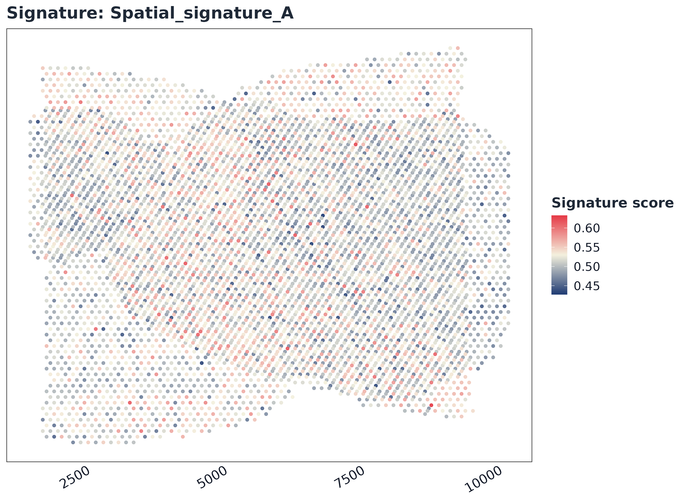
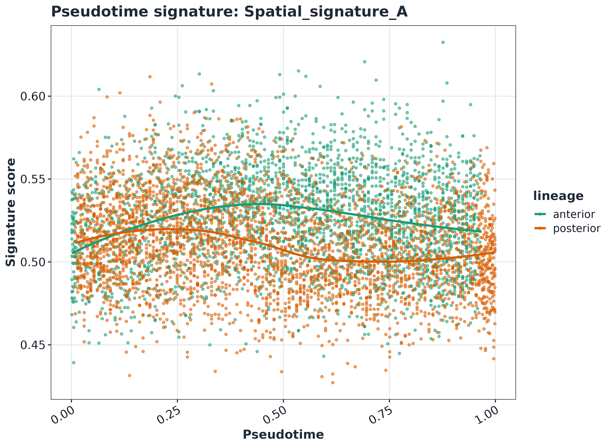

# GLEAM full spatial transcriptomics workflow

## 1) Load spatial Seurat objects

``` r
library(Seurat)
#> Loading required package: SeuratObject
#> Loading required package: sp
#> 
#> Attaching package: 'SeuratObject'
#> The following object is masked from 'package:GLEAM':
#> 
#>     pbmc_small
#> The following objects are masked from 'package:base':
#> 
#>     intersect, t

a1_path <- system.file("extdata", "full_examples", "stxBrain_anterior1_seurat.rds", package = "GLEAM")
p1_path <- system.file("extdata", "full_examples", "stxBrain_posterior1_seurat.rds", package = "GLEAM")
if (a1_path == "") a1_path <- file.path("inst", "extdata", "full_examples", "stxBrain_anterior1_seurat.rds")
if (p1_path == "") p1_path <- file.path("inst", "extdata", "full_examples", "stxBrain_posterior1_seurat.rds")

sp_a1 <- readRDS(a1_path)
sp_p1 <- readRDS(p1_path)
sp_a1 <- tryCatch(SeuratObject::UpdateSeuratObject(sp_a1), error = function(e) sp_a1)
#> Validating object structure
#> Updating object slots
#> Ensuring keys are in the proper structure
#> Ensuring keys are in the proper structure
#> Ensuring feature names don't have underscores or pipes
#> Updating slots in Spatial
#> Updating slots in anterior1
#> Warning: Not validating Centroids objects
#> Updated Centroids object 'centroids' in FOV 'anterior1'
#> Updated boundaries in FOV 'anterior1'
#> Validating object structure for Assay5 'Spatial'
#> Validating object structure for VisiumV2 'anterior1'
#> Object representation is consistent with the most current Seurat version
sp_p1 <- tryCatch(SeuratObject::UpdateSeuratObject(sp_p1), error = function(e) sp_p1)
#> Validating object structure
#> Updating object slots
#> Ensuring keys are in the proper structure
#> Ensuring keys are in the proper structure
#> Ensuring feature names don't have underscores or pipes
#> Updating slots in Spatial
#> Updating slots in posterior1
#> Warning: Not validating Centroids objects
#> Updated Centroids object 'centroids' in FOV 'posterior1'
#> Updated boundaries in FOV 'posterior1'
#> Validating object structure for Assay5 'Spatial'
#> Validating object structure for VisiumV2 'posterior1'
#> Object representation is consistent with the most current Seurat version

dim(sp_a1)
#> [1] 31053  2696
dim(sp_p1)
#> [1] 31053  3353
sp_a1
#> An object of class Seurat 
#> 31053 features across 2696 samples within 1 assay 
#> Active assay: Spatial (31053 features, 0 variable features)
#>  1 layer present: counts
#>  1 spatial field of view present: anterior1
```

## 1b) Spatial preflight validation

``` r
imgs_a1 <- tryCatch(names(sp_a1@images), error = function(e) character())
imgs_p1 <- tryCatch(names(sp_p1@images), error = function(e) character())
cat("anterior images:", paste(imgs_a1, collapse = ", "), "\n")
#> anterior images: anterior1
cat("posterior images:", paste(imgs_p1, collapse = ", "), "\n")
#> posterior images: posterior1

coords_a1_check <- tryCatch(GLEAM:::extract_spatial_coords(object = sp_a1), error = function(e) e)
coords_p1_check <- tryCatch(GLEAM:::extract_spatial_coords(object = sp_p1), error = function(e) e)

if (inherits(coords_a1_check, "error")) stop("anterior coordinate extraction failed: ", conditionMessage(coords_a1_check))
if (inherits(coords_p1_check, "error")) stop("posterior coordinate extraction failed: ", conditionMessage(coords_p1_check))

cat("anterior coords:", nrow(coords_a1_check), "spots\n")
#> anterior coords: 2696 spots
cat("posterior coords:", nrow(coords_p1_check), "spots\n")
#> posterior coords: 3353 spots

if (!all(colnames(sp_a1) %in% rownames(coords_a1_check))) {
  miss <- setdiff(colnames(sp_a1), rownames(coords_a1_check))
  stop("anterior coordinate alignment failed; missing spots: ", paste(utils::head(miss, 5), collapse = ", "))
}
if (!all(colnames(sp_p1) %in% rownames(coords_p1_check))) {
  miss <- setdiff(colnames(sp_p1), rownames(coords_p1_check))
  stop("posterior coordinate alignment failed; missing spots: ", paste(utils::head(miss, 5), collapse = ", "))
}
```

## 2) Native slice view

``` r
p_a1 <- tryCatch(
  Seurat::SpatialDimPlot(sp_a1, group.by = "orig.ident", pt.size.factor = 1.6),
  error = function(e) {
    md <- as.data.frame(sp_a1[[]], stringsAsFactors = FALSE)
    coords <- tryCatch(
      GLEAM:::extract_spatial_coords(object = sp_a1),
      error = function(e1) tryCatch(GLEAM:::extract_spatial_coords(meta = md, seurat = FALSE), error = function(e2) NULL)
    )
    if (!is.null(coords)) {
      coords <- as.data.frame(coords, stringsAsFactors = FALSE)
      coords <- coords[rownames(md), c("x", "y"), drop = FALSE]
      md$x <- as.numeric(coords$x)
      md$y <- as.numeric(coords$y)
    } else {
      md$x <- seq_len(nrow(md))
      md$y <- seq_len(nrow(md))
    }
    col_var <- if ("orig.ident" %in% colnames(md)) "orig.ident" else colnames(md)[1]
    ggplot2::ggplot(md, ggplot2::aes(x = .data$x, y = .data$y, color = .data[[col_var]])) +
      ggplot2::geom_point(size = 0.55, alpha = 0.9) +
      ggplot2::coord_fixed() +
      ggplot2::scale_y_reverse() +
      ggplot2::labs(
        title = "Anterior slice (coordinate fallback)",
        subtitle = conditionMessage(e),
        x = NULL,
        y = NULL,
        color = col_var
      ) +
      gleam_theme(base_size = 12)
  }
)
p_a1 + ggplot2::labs(title = "Anterior slice")
```


``` r
p_p1 <- tryCatch(
  Seurat::SpatialDimPlot(sp_p1, group.by = "orig.ident", pt.size.factor = 1.6),
  error = function(e) {
    md <- as.data.frame(sp_p1[[]], stringsAsFactors = FALSE)
    coords <- tryCatch(
      GLEAM:::extract_spatial_coords(object = sp_p1),
      error = function(e1) tryCatch(GLEAM:::extract_spatial_coords(meta = md, seurat = FALSE), error = function(e2) NULL)
    )
    if (!is.null(coords)) {
      coords <- as.data.frame(coords, stringsAsFactors = FALSE)
      coords <- coords[rownames(md), c("x", "y"), drop = FALSE]
      md$x <- as.numeric(coords$x)
      md$y <- as.numeric(coords$y)
    } else {
      md$x <- seq_len(nrow(md))
      md$y <- seq_len(nrow(md))
    }
    col_var <- if ("orig.ident" %in% colnames(md)) "orig.ident" else colnames(md)[1]
    ggplot2::ggplot(md, ggplot2::aes(x = .data$x, y = .data$y, color = .data[[col_var]])) +
      ggplot2::geom_point(size = 0.55, alpha = 0.9) +
      ggplot2::coord_fixed() +
      ggplot2::scale_y_reverse() +
      ggplot2::labs(
        title = "Posterior slice (coordinate fallback)",
        subtitle = conditionMessage(e),
        x = NULL,
        y = NULL,
        color = col_var
      ) +
      gleam_theme(base_size = 12)
  }
)
p_p1 + ggplot2::labs(title = "Posterior slice")
```


## 3) Build matrix + metadata for combined analysis

``` r
assay_a1 <- SeuratObject::DefaultAssay(sp_a1)
assay_p1 <- SeuratObject::DefaultAssay(sp_p1)

expr_a1 <- SeuratObject::LayerData(sp_a1, assay = assay_a1, layer = "counts")
expr_p1 <- SeuratObject::LayerData(sp_p1, assay = assay_p1, layer = "counts")
orig_cells_a1 <- colnames(expr_a1)
orig_cells_p1 <- colnames(expr_p1)
colnames(expr_a1) <- paste0("anterior_", orig_cells_a1)
colnames(expr_p1) <- paste0("posterior_", orig_cells_p1)

common_genes <- intersect(rownames(expr_a1), rownames(expr_p1))
expr <- cbind(expr_a1[common_genes, , drop = FALSE], expr_p1[common_genes, , drop = FALSE])

meta_a1 <- as.data.frame(sp_a1[[]], stringsAsFactors = FALSE)
meta_p1 <- as.data.frame(sp_p1[[]], stringsAsFactors = FALSE)
rownames(meta_a1) <- colnames(expr_a1)
rownames(meta_p1) <- colnames(expr_p1)

coords_a1 <- as.data.frame(coords_a1_check, stringsAsFactors = FALSE)
coords_p1 <- as.data.frame(coords_p1_check, stringsAsFactors = FALSE)
coords_a1 <- coords_a1[orig_cells_a1, c("x", "y"), drop = FALSE]
coords_p1 <- coords_p1[orig_cells_p1, c("x", "y"), drop = FALSE]
rownames(coords_a1) <- colnames(expr_a1)
rownames(coords_p1) <- colnames(expr_p1)

meta_a1$sample <- "anterior"
meta_p1$sample <- "posterior"
meta <- rbind(meta_a1[colnames(expr_a1), , drop = FALSE], meta_p1[colnames(expr_p1), , drop = FALSE])
coords <- rbind(coords_a1[colnames(expr_a1), , drop = FALSE], coords_p1[colnames(expr_p1), , drop = FALSE])

common_cells <- Reduce(intersect, list(colnames(expr), rownames(meta), rownames(coords)))
if (length(common_cells) < 50L) {
  stop("Too few matched cells between expression matrix and metadata.")
}
expr <- expr[, common_cells, drop = FALSE]
meta <- meta[common_cells, , drop = FALSE]
coords <- coords[common_cells, c("x", "y"), drop = FALSE]

cells_use <- common_cells[seq_len(min(7000L, length(common_cells)))]
meta <- meta[cells_use, , drop = FALSE]
expr <- expr[, cells_use, drop = FALSE]
coords <- coords[cells_use, c("x", "y"), drop = FALSE]

meta$section <- as.character(meta$sample)
meta$group <- as.character(meta$sample)
region_col <- if ("seurat_annotations" %in% colnames(meta)) "seurat_annotations" else if ("region" %in% colnames(meta)) "region" else if ("seurat_clusters" %in% colnames(meta)) "seurat_clusters" else NULL
if (is.null(region_col)) {
  meta$region <- "region_1"
} else if (region_col == "seurat_clusters") {
  meta$region <- paste0("cluster_", as.character(meta[[region_col]]))
} else {
  meta$region <- as.character(meta[[region_col]])
}
meta$x <- as.numeric(coords[rownames(meta), "x"])
meta$y <- as.numeric(coords[rownames(meta), "y"])
meta$pseudotime <- rank(meta$x, ties.method = "average") / nrow(meta)
meta$lineage <- as.character(meta$region)

region_levels <- names(sort(table(meta$region), decreasing = TRUE))
group_levels <- unique(meta$group)
meta$region <- factor(meta$region, levels = region_levels)
meta$group <- factor(meta$group, levels = group_levels)

pal_region <- setNames(get_palette("gleam_discrete", n = length(region_levels), continuous = FALSE), region_levels)
pal_group <- setNames(get_palette("brewer_set2", n = length(group_levels), continuous = FALSE), group_levels)

head(meta[, c("sample", "group", "region", "x", "y")])
#>                               sample    group   region    x    y
#> anterior_AAACAAGTATCTCCCA-1 anterior anterior anterior 8501 7475
#> anterior_AAACACCAATAACTGC-1 anterior anterior anterior 2788 8553
#> anterior_AAACAGAGCGACTCCT-1 anterior anterior anterior 7950 3164
#> anterior_AAACAGCTTTCAGAAG-1 anterior anterior anterior 2099 6637
#> anterior_AAACAGGGTCTATATT-1 anterior anterior anterior 2375 7116
#> anterior_AAACATGGTGAGAGGA-1 anterior anterior anterior 1480 8913
```

## 4) Combined coordinate view

``` r
ggplot2::ggplot(meta, ggplot2::aes(x = .data$x, y = .data$y, color = .data$group)) +
  ggplot2::geom_point(size = 0.55, alpha = 0.82) +
  ggplot2::scale_color_manual(values = pal_group, drop = FALSE) +
  ggplot2::coord_fixed() +
  ggplot2::scale_y_reverse() +
  ggplot2::labs(title = "Combined spatial coordinates", x = NULL, y = NULL, color = "Group") +
  gleam_theme(base_size = 12) +
  ggplot2::theme(panel.grid = ggplot2::element_blank())
```



## 5) Signature scoring

``` r
sp_genes <- rownames(expr)
gs <- list(
  Spatial_signature_A = unique(sp_genes[seq_len(min(30, length(sp_genes)))]),
  Spatial_signature_B = unique(rev(sp_genes)[seq_len(min(30, length(sp_genes)))])
)

sp <- score_signature(
  expr = expr,
  meta = meta,
  geneset = gs,
  geneset_source = "list",
  seurat = FALSE,
  method = "rank",
  min_genes = 3,
  verbose = FALSE
)
#> Warning in asMethod(object): sparse->dense coercion: allocating vector of size
#> 1.4 GiB

slice_genes <- rownames(sp_a1)
gs_slice <- list(
  Spatial_signature_A = intersect(gs$Spatial_signature_A, slice_genes),
  Spatial_signature_B = intersect(gs$Spatial_signature_B, slice_genes)
)

sp_slice <- score_signature(
  object = sp_a1,
  geneset = gs_slice,
  geneset_source = "list",
  seurat = TRUE,
  layer = "counts",
  slot = "counts",
  method = "rank",
  min_genes = 3,
  verbose = FALSE
)

dim(sp$score)
#> [1]    2 6049
```

## 6) Slice-level signature map (tissue context)

``` r
top_sig <- rownames(sp_slice$score)[1]
plot_spatial_score(
  sp_slice,
  signature = top_sig,
  object = sp_a1,
  point_size = 1.7,
  alpha = 0.92,
  palette = "gleam_continuous"
)
```


## 7) Combined spatial score maps

``` r
coords <- data.frame(x = meta$x, y = meta$y, row.names = rownames(meta))
plot_spatial_score(
  sp,
  signature = rownames(sp$score)[1],
  coords = coords,
  split.by = "section",
  point_size = 1.25,
  alpha = 0.9,
  palette = "gleam_continuous"
)
```



``` r
plot_spatial_multi(
  sp,
  pathways = rownames(sp$score)[seq_len(min(4, nrow(sp$score)))],
  coords = coords,
  point_size = 1.15,
  alpha = 0.88,
  palette = "gleam_continuous"
)
```


## 8) Spatial differential analysis

``` r
res_group_region <- test_signature(
  sp,
  region = "region",
  group = "group",
  sample = "sample",
  level = "sample_region",
  method = "wilcox"
)

top_sp <- res_group_region$table$pathway[order(res_group_region$table$p_adj)][1]
head(res_group_region$table)
#>               pathway comparison_type   group1    group2 celltype         level
#> 1 Spatial_signature_A      pseudobulk anterior posterior     <NA> sample_region
#> 2 Spatial_signature_B      pseudobulk anterior posterior     <NA> sample_region
#>   effect_size median_group1 median_group2 diff_median p_value p_adj n_group1
#> 1  0.01585193     0.5261013     0.5102494  0.01585193      NA    NA        1
#> 2 -0.01353957     0.4288974     0.4424370 -0.01353957      NA    NA        1
#>   n_group2 mean_group1 mean_group2 direction
#> 1        1   0.5261013   0.5102494        up
#> 2        1   0.4288974   0.4424370      down
top_sp
#> [1] "Spatial_signature_A"
```

``` r
p1 <- plot_spatial_score(
  sp,
  signature = top_sp,
  coords = coords,
  split.by = "region",
  point_size = 1.3,
  alpha = 0.9,
  palette = "gleam_continuous"
)
p2 <- plot_spatial_compare(res_group_region)

p1
```



``` r
p2
```



## 9) Embedding-style and pseudotime-style views

``` r
emb2 <- as.matrix(meta[, c("x", "y"), drop = FALSE])
rownames(emb2) <- rownames(meta)
colnames(emb2) <- c("Spatial_1", "Spatial_2")

plot_embedding_score(
  sp,
  signature = rownames(sp$score)[1],
  embedding = emb2,
  reduction = "umap",
  palette = "gleam_continuous"
)
```



``` r
lineage_levels <- unique(as.character(meta$lineage))
pal_lineage <- setNames(get_palette("brewer_dark2", n = length(lineage_levels), continuous = FALSE), lineage_levels)

plot_pseudotime_score(
  sp,
  signature = rownames(sp$score)[1],
  pseudotime = "pseudotime",
  lineage = "lineage",
  palette = pal_lineage
)
```


