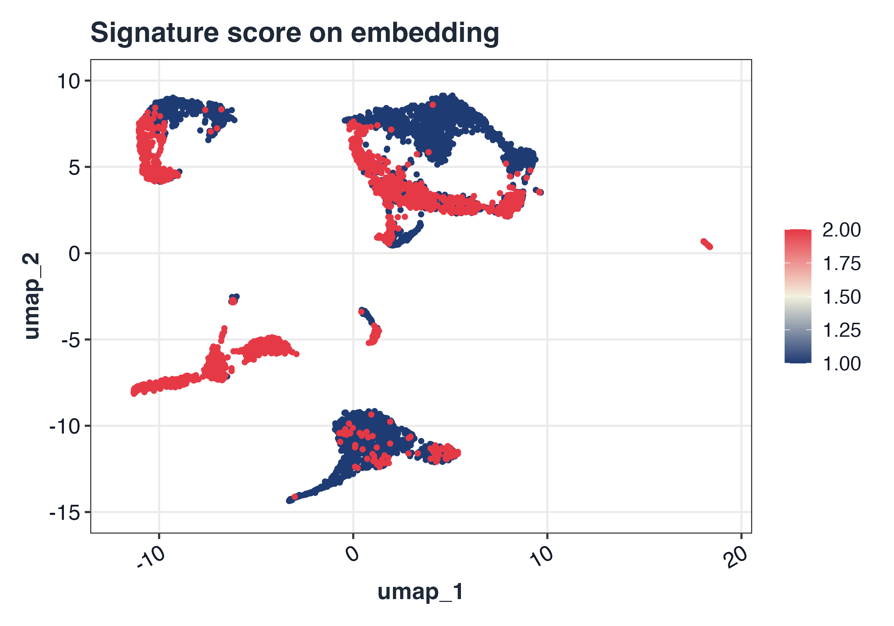
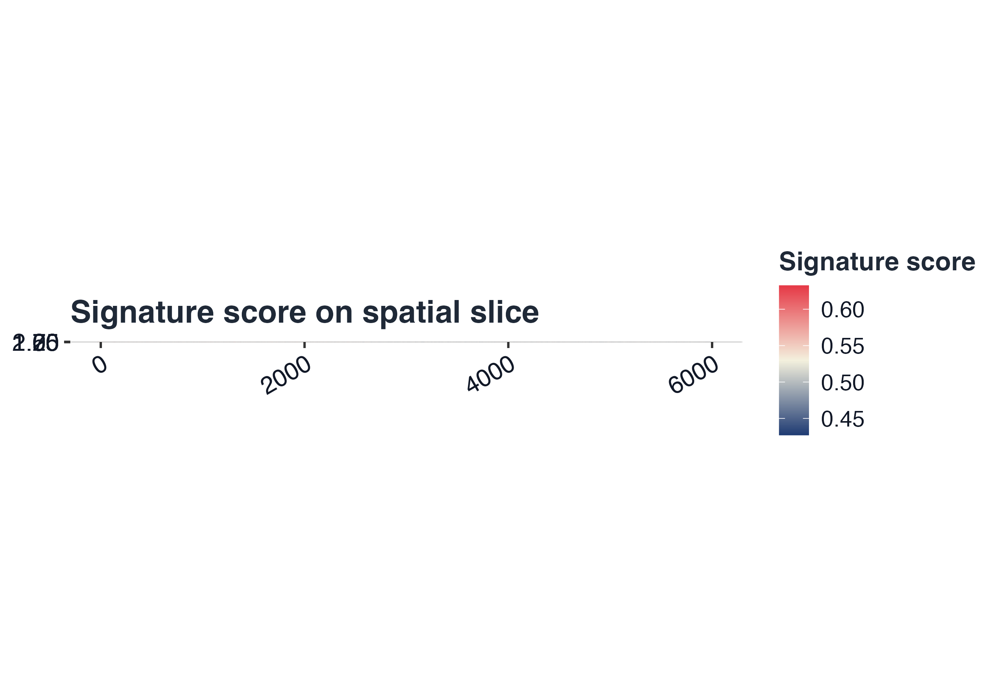
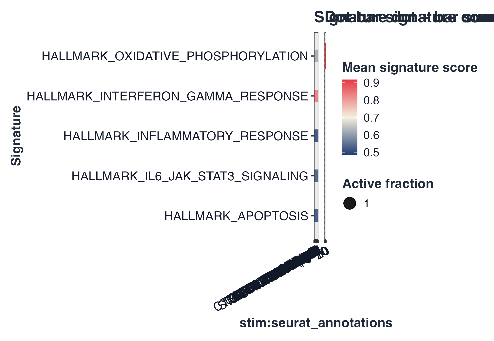
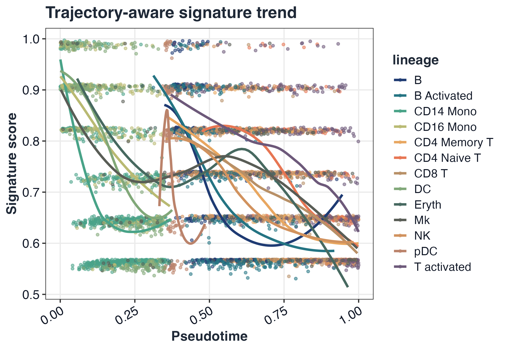

# GLEAM homepage workflow showcase

This vignette generates the canonical homepage figures used by
README/pkgdown.

``` r

library(Seurat)
#> Loading required package: SeuratObject
#> Loading required package: sp
#> 
#> Attaching package: 'SeuratObject'
#> The following object is masked from 'package:GLEAM':
#> 
#>     pbmc_small
#> The following objects are masked from 'package:base':
#> 
#>     intersect, t

ifnb_path <- system.file("extdata", "full_examples", "ifnb_seurat.rds", package = "GLEAM")
a1_path <- system.file("extdata", "full_examples", "stxBrain_anterior1_seurat.rds", package = "GLEAM")
p1_path <- system.file("extdata", "full_examples", "stxBrain_posterior1_seurat.rds", package = "GLEAM")

if (ifnb_path == "") ifnb_path <- file.path("inst", "extdata", "full_examples", "ifnb_seurat.rds")
if (a1_path == "") a1_path <- file.path("inst", "extdata", "full_examples", "stxBrain_anterior1_seurat.rds")
if (p1_path == "") p1_path <- file.path("inst", "extdata", "full_examples", "stxBrain_posterior1_seurat.rds")

seu <- readRDS(ifnb_path)
pick_first_col <- function(candidates, cols) {
  hit <- candidates[candidates %in% cols]
  if (length(hit) == 0L) return(NULL)
  hit[[1]]
}

stratified_keep <- function(meta, n_target, strata_candidates = character()) {
  if (nrow(meta) <= n_target) return(rownames(meta))
  strata <- intersect(strata_candidates, colnames(meta))
  all_ids <- rownames(meta)
  if (length(strata) == 0L) return(all_ids[seq_len(n_target)])

  key <- interaction(meta[, strata, drop = FALSE], drop = TRUE, lex.order = TRUE)
  groups <- split(all_ids, key)
  per_group <- max(1L, floor(n_target / max(1L, length(groups))))
  keep <- unlist(lapply(groups, function(ids) {
    ids <- sort(ids)
    head(ids, per_group)
  }), use.names = FALSE)
  if (length(keep) < n_target) {
    keep <- c(keep, head(setdiff(all_ids, keep), n_target - length(keep)))
  }
  unique(keep)[seq_len(min(n_target, length(unique(keep))))]
}

if (ncol(seu) > 5000) {
  keep <- stratified_keep(
    meta = seu@meta.data,
    n_target = 5000,
    strata_candidates = c("orig.ident", "stim", "seurat_annotations", "seurat_clusters")
  )
  seu <- subset(seu, cells = keep)
}
md <- seu@meta.data
sample_col <- pick_first_col(c("sample", "orig.ident"), colnames(md))
if (is.null(sample_col)) {
  md$sample <- "sample_1"
  sample_col <- "sample"
} else if (sample_col != "sample") {
  md$sample <- as.character(md[[sample_col]])
}

group_col <- pick_first_col(c("stim", "group"), colnames(md))
if (is.null(group_col)) {
  md$group <- ifelse(seq_len(nrow(md)) <= nrow(md) / 2, "A", "B")
  group_col <- "group"
} else if (group_col != "group") {
  md$group <- as.character(md[[group_col]])
}

celltype_col <- pick_first_col(c("seurat_annotations", "celltype", "seurat_clusters"), colnames(md))
if (is.null(celltype_col)) {
  md$celltype <- as.character(Idents(seu))
  celltype_col <- "celltype"
} else if (celltype_col == "seurat_clusters") {
  md$celltype <- paste0("cluster_", md$seurat_clusters)
} else if (celltype_col != "celltype") {
  md$celltype <- as.character(md[[celltype_col]])
}
if (!"pca" %in% names(seu@reductions)) {
  seu <- NormalizeData(seu)
  seu <- FindVariableFeatures(seu)
  seu <- ScaleData(seu)
  seu <- RunPCA(seu)
}
#> Normalizing layer: counts
#> Finding variable features for layer counts
#> Centering and scaling data matrix
#> PC_ 1 
#> Positive:  NPM1, CD3D, LTB, GIMAP7, CCR7, CD7, SELL, PIK3IP1, TRAT1, RHOH 
#>     PTPRCAP, ITM2A, C1QBP, IL32, CREM, CLEC2D, CD247, IL7R, NOP58, RGCC 
#>     CCL5, NHP2, SNHG8, MYC, TSC22D3, PASK, APEX1, RARRES3, GNLY, NKG7 
#> Negative:  C15orf48, TYROBP, CST3, FCER1G, TIMP1, SOD2, ANXA5, KYNU, FTL, TYMP 
#>     SPI1, PSAP, S100A4, ANXA2, LGALS1, CD63, S100A11, NPC2, LYZ, CTSB 
#>     FCN1, LGALS3, IGSF6, CD68, PLAUR, S100A10, APOBEC3A, PILRA, CFP, FTH1 
#> PC_ 2 
#> Positive:  IL8, S100A8, CLEC5A, CD14, VCAN, S100A9, IER3, PID1, IL1B, GPX1 
#>     PLAUR, CD9, CXCL3, FTH1, THBS1, MARCKSL1, CTB-61M7.2, CXCL2, MGST1, PPIF 
#>     OLR1, LIMS1, PHLDA1, GAPDH, C5AR1, VIM, CYP1B1, S100A4, OSM, LGALS3 
#> Negative:  ISG15, IFIT3, IFIT1, ISG20, MX1, TNFSF10, LY6E, IFIT2, IFI6, CXCL10 
#>     RSAD2, OAS1, IRF7, CXCL11, IFITM3, EPSTI1, IFI44L, SAMD9L, IFI35, OASL 
#>     TNFSF13B, IFITM2, HERC5, PLSCR1, GBP1, CMPK2, NT5C3A, MT2A, DDX58, IDO1 
#> PC_ 3 
#> Positive:  GIMAP7, ANXA1, MT2A, RARRES3, CD7, GNLY, CD3D, OASL, FCGR3A, PRF1 
#>     C3AR1, CCL5, NKG7, CLEC2B, KLRD1, CD247, IL32, IFIT1, GZMA, GZMH 
#>     MS4A4A, CTSW, CFD, GLRX, FCER1G, FGFBP2, LY6E, CD300E, IFI6, TNFAIP6 
#> Negative:  HLA-DQA1, HLA-DQB1, HLA-DRA, HLA-DRB1, CD74, CD83, HLA-DPA1, MIR155HG, HLA-DPB1, SYNGR2 
#>     HLA-DMA, FABP5, TXN, IRF8, HERPUD1, NME1, REL, TVP23A, HSP90AB1, PRMT1 
#>     CCL22, ID3, TSPAN13, CCR7, HSPD1, EBI3, HSPE1, BASP1, PIM3, PRDX1 
#> PC_ 4 
#> Positive:  GZMB, NKG7, CST7, GNLY, CLIC3, PRF1, CCL5, APOBEC3G, CTSW, KLRD1 
#>     GZMA, GZMH, FGFBP2, ALOX5AP, KLRC1, LSP1, CD38, RAMP1, ID2, FASLG 
#>     RARRES3, CXCR3, ITM2C, LINC00996, TSPAN13, IGFBP7, CALCRL, CCL22, SERPINF1, GAPDH 
#> Negative:  HSP90AB1, MYC, HSPD1, NME1, MS4A4A, MIR155HG, NOP58, HSPE1, ID3, MS4A7 
#>     CFD, SRSF7, CD79A, GBP1, CCL3, MS4A1, TNFAIP6, HSPH1, C3AR1, PYCR1 
#>     FKBP4, NR4A2, CMSS1, CCR7, SOD2, AIF1, CHORDC1, NHP2, NPM1, SERPINA1 
#> PC_ 5 
#> Positive:  IL7R, GPR183, CCL22, BIRC3, FSCN1, TRAT1, CCR7, PKIB, RAB9A, ANXA1 
#>     IDO1, CLIC2, CALCRL, DNAJB4, LYZ, GPR137B, GIMAP7, PIK3IP1, OGFRL1, CD3D 
#>     LMNA, RGS1, MARCKSL1, TBC1D4, CACYBP, CLK1, LAMP3, GADD45B, ICOS, SNHG12 
#> Negative:  GZMB, FCGR3A, IGJ, CTSC, CLIC3, NKG7, HERPUD1, TSPAN13, CD79A, LILRA4 
#>     IRF8, TCF4, SPIB, MS4A4A, MAP1A, SMPD3, PLAC8, SCT, ITM2C, BLNK 
#>     MS4A1, HVCN1, GNLY, MYBL2, CD74, TCL1A, CCL4, NME1, NEK8, SRM
if (!"umap" %in% names(seu@reductions)) {
  seu <- FindNeighbors(seu, dims = 1:20)
  seu <- FindClusters(seu, resolution = 0.4)
  seu <- RunUMAP(seu, dims = 1:20)
}
#> Computing nearest neighbor graph
#> Computing SNN
#> Modularity Optimizer version 1.3.0 by Ludo Waltman and Nees Jan van Eck
#> 
#> Number of nodes: 5000
#> Number of edges: 187843
#> 
#> Running Louvain algorithm...
#> Maximum modularity in 10 random starts: 0.9368
#> Number of communities: 17
#> Elapsed time: 0 seconds
#> Warning: The default method for RunUMAP has changed from calling Python UMAP via reticulate to the R-native UWOT using the cosine metric
#> To use Python UMAP via reticulate, set umap.method to 'umap-learn' and metric to 'correlation'
#> This message will be shown once per session
#> 21:19:05 UMAP embedding parameters a = 0.9922 b = 1.112
#> 21:19:05 Read 5000 rows and found 20 numeric columns
#> 21:19:05 Using Annoy for neighbor search, n_neighbors = 30
#> 21:19:05 Building Annoy index with metric = cosine, n_trees = 50
#> 0%   10   20   30   40   50   60   70   80   90   100%
#> [----|----|----|----|----|----|----|----|----|----|
#> **************************************************|
#> 21:19:06 Writing NN index file to temp file /var/folders/wz/y39q7cvx4hl3qhtftc16hnn00000gn/T//RtmpvNmFxb/file1372159107bdb
#> 21:19:06 Searching Annoy index using 1 thread, search_k = 3000
#> 21:19:06 Annoy recall = 100%
#> 21:19:07 Commencing smooth kNN distance calibration using 1 thread with target n_neighbors = 30
#> 21:19:07 Initializing from normalized Laplacian + noise (using RSpectra)
#> 21:19:07 Commencing optimization for 500 epochs, with 205430 positive edges
#> 21:19:07 Using rng type: pcg
#> 21:19:13 Optimization finished
md$pseudotime <- rank(Embeddings(seu, "pca")[, 1], ties.method = "average") / ncol(seu)
md$lineage <- as.character(md[[celltype_col]])
seu@meta.data <- md

map_geneset_to_expr <- function(gs, expr_genes) {
  expr_genes <- as.character(expr_genes)
  expr_upper <- toupper(expr_genes)
  mapped <- lapply(gs, function(g) {
    idx <- match(toupper(unique(as.character(g))), expr_upper, nomatch = 0L)
    unique(expr_genes[idx[idx > 0L]])
  })
  mapped[vapply(mapped, length, integer(1)) > 0L]
}

fallback_signatures <- function(expr_genes) {
  g <- unique(as.character(expr_genes))
  g <- g[!is.na(g) & nzchar(g)]
  k <- min(30L, max(3L, floor(length(g) / 4)))
  idx1 <- seq_len(min(k, length(g)))
  idx2 <- seq.int(max(1L, length(g) - k + 1L), length(g))
  list(
    Signature_A = g[idx1],
    Signature_B = g[idx2]
  )
}

hallmark_gs <- NULL
for (sp in c("human", "mouse")) {
  gs_try <- try(get_geneset("hallmark", source = "builtin", species = sp), silent = TRUE)
  if (inherits(gs_try, "try-error")) next
  gs_try <- map_geneset_to_expr(gs_try, rownames(seu))
  gs_try <- gs_try[vapply(gs_try, length, integer(1)) >= 3L]
  if (length(gs_try) > 0L) {
    hallmark_gs <- gs_try
    break
  }
}
if (is.null(hallmark_gs) || length(hallmark_gs) == 0L) {
  message("[GLEAM] No matched Hallmark signatures; using object-derived fallback signatures.")
  hallmark_gs <- fallback_signatures(rownames(seu))
}
sc <- score_signature(
  object = seu,
  geneset = hallmark_gs,
  geneset_source = "list",
  seurat = TRUE,
  method = "rank",
  min_genes = 3,
  verbose = FALSE
)

resolve_expr <- function(obj) {
  assay_candidates <- unique(c(
    tryCatch(SeuratObject::DefaultAssay(obj), error = function(e) NULL),
    "Spatial",
    "RNA"
  ))
  assay_candidates <- assay_candidates[!is.na(assay_candidates) & nzchar(assay_candidates)]

  get_if_nonempty <- function(expr) {
    m <- tryCatch(eval.parent(substitute(expr)), error = function(e) NULL)
    if (!is.null(m) && nrow(m) > 0L && ncol(m) > 0L) return(m)
    NULL
  }

  for (assay in assay_candidates) {
    m <- get_if_nonempty(SeuratObject::LayerData(object = obj, assay = assay, layer = "data"))
    if (!is.null(m)) return(m)
    m <- get_if_nonempty(SeuratObject::LayerData(object = obj, assay = assay, layer = "counts"))
    if (!is.null(m)) return(m)
    m <- get_if_nonempty(SeuratObject::GetAssayData(object = obj, assay = assay, slot = "data"))
    if (!is.null(m)) return(m)
    m <- get_if_nonempty(SeuratObject::GetAssayData(object = obj, assay = assay, slot = "counts"))
    if (!is.null(m)) return(m)
  }

  stop("Failed to extract non-empty expression matrix from Seurat spatial object.")
}

prep_spatial_object <- function(obj, sample_label) {
  expr <- resolve_expr(obj)
  md <- as.data.frame(obj[[]], stringsAsFactors = FALSE)
  if (is.null(rownames(md))) rownames(md) <- colnames(expr)
  md <- md[colnames(expr), , drop = FALSE]
  if (!"sample" %in% colnames(md)) md$sample <- sample_label
  if (!"section" %in% colnames(md)) md$section <- sample_label
  if (!all(c("x", "y") %in% colnames(md))) {
    if (all(c("imagecol", "imagerow") %in% colnames(md))) {
      md$x <- md$imagecol
      md$y <- md$imagerow
    } else if (all(c("col", "row") %in% colnames(md))) {
      md$x <- md$col
      md$y <- md$row
    }
  }
  prefixed_ids <- make.unique(paste0(sample_label, "_", colnames(expr)), sep = "_dup")
  colnames(expr) <- prefixed_ids
  rownames(md) <- prefixed_ids
  list(expr = expr, meta = md)
}

sp_a1 <- prep_spatial_object(readRDS(a1_path), "anterior")
#> Warning: Layer 'data' is empty
sp_p1 <- prep_spatial_object(readRDS(p1_path), "posterior")
#> Warning: Layer 'data' is empty

common_genes <- intersect(rownames(sp_a1$expr), rownames(sp_p1$expr))
sp_expr <- cbind(
  sp_a1$expr[common_genes, , drop = FALSE],
  sp_p1$expr[common_genes, , drop = FALSE]
)
sp_md <- rbind(
  sp_a1$meta[colnames(sp_a1$expr), , drop = FALSE],
  sp_p1$meta[colnames(sp_p1$expr), , drop = FALSE]
)
sp_md <- sp_md[colnames(sp_expr), , drop = FALSE]
if (!"sample" %in% colnames(sp_md)) sp_md$sample <- "sample_1"
if (!"group" %in% colnames(sp_md)) sp_md$group <- ifelse(grepl("anterior", sp_md$sample, ignore.case = TRUE), "anterior", "posterior")
if (!"region" %in% colnames(sp_md)) sp_md$region <- if ("seurat_clusters" %in% colnames(sp_md)) paste0("cluster_", sp_md$seurat_clusters) else sp_md$group
if (!"section" %in% colnames(sp_md)) sp_md$section <- sp_md$sample
if (ncol(sp_expr) > 6000) {
  keep <- stratified_keep(
    meta = sp_md,
    n_target = 6000,
    strata_candidates = c("sample", "section", "group", "region", "seurat_clusters")
  )
  sp_expr <- sp_expr[, keep, drop = FALSE]
  sp_md <- sp_md[keep, , drop = FALSE]
}
if (!all(c("x", "y") %in% colnames(sp_md))) {
  if (all(c("array_col", "array_row") %in% colnames(sp_md))) {
    sp_md$x <- sp_md$array_col
    sp_md$y <- sp_md$array_row
  } else {
    n <- nrow(sp_md)
    sp_md$x <- seq_len(n)
    sample_vec <- if ("sample" %in% colnames(sp_md)) sp_md$sample else rep("sample_1", n)
    sp_md$y <- as.numeric(as.factor(sample_vec))
  }
}

sp_genes <- rownames(sp_expr)
half_n <- max(30, floor(length(sp_genes) / 2))
idx_a <- seq_len(min(half_n, length(sp_genes)))
idx_b <- seq(from = min(half_n + 1, length(sp_genes)), to = length(sp_genes))
gs_sp <- list(
  Spatial_signature_A = unique(sp_genes[idx_a])[1:min(30, length(unique(sp_genes[idx_a])))],
  Spatial_signature_B = unique(sp_genes[idx_b])[1:min(30, length(unique(sp_genes[idx_b])))]
)
sp <- score_signature(
  expr = sp_expr,
  meta = sp_md,
  geneset = gs_sp,
  geneset_source = "list",
  seurat = FALSE,
  method = "rank",
  min_genes = 3,
  verbose = FALSE
)
#> Warning in asMethod(object): sparse->dense coercion: allocating vector of size
#> 1.4 GiB

coords <- data.frame(x = sp_md$x, y = sp_md$y, row.names = rownames(sp_md))
```

``` r

plot_embedding_score(sc, pathway = rownames(sc$score)[1], object = seu, reduction = "umap") +
  ggplot2::labs(title = "Signature score on embedding")
```



``` r

tissue_bg <- as.raster(matrix(colorRampPalette(c("#f8f5ea", "#e8dcc4", "#d2b48c"))(256), nrow = 16))
plot_spatial_score(sp, pathway = rownames(sp$score)[1], coords = coords, image = tissue_bg) +
  ggplot2::labs(title = "Signature score on spatial slice")
```



``` r

plot_dot_bar(sc, by = c(group_col, celltype_col), pathway = rownames(sc$score)[1:5]) +
  ggplot2::labs(title = "Dot-bar signature comparison")
```



``` r

plot_pseudotime_score(sc, pathway = rownames(sc$score)[1], pseudotime = "pseudotime", lineage = "lineage") +
  ggplot2::labs(title = "Trajectory-aware signature trend")
```


