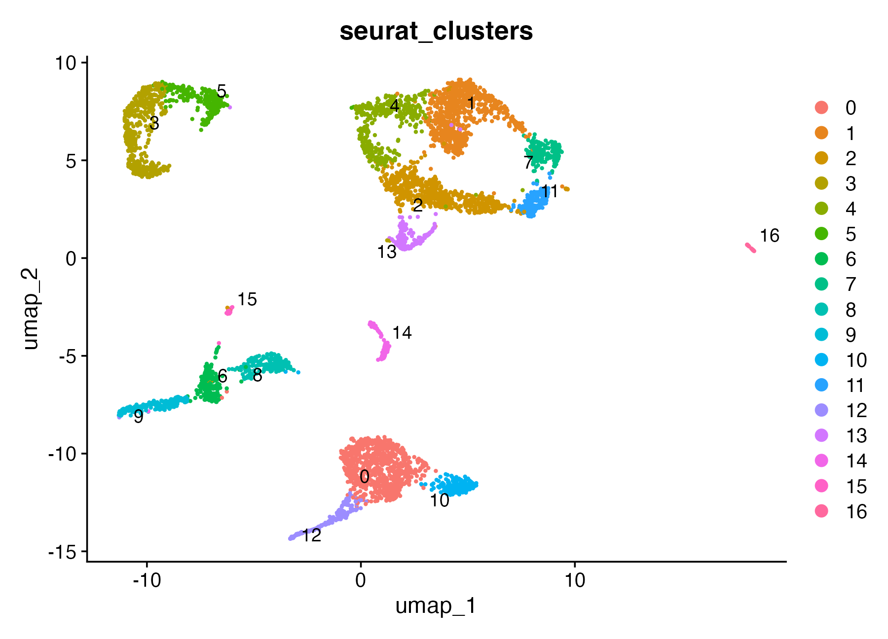
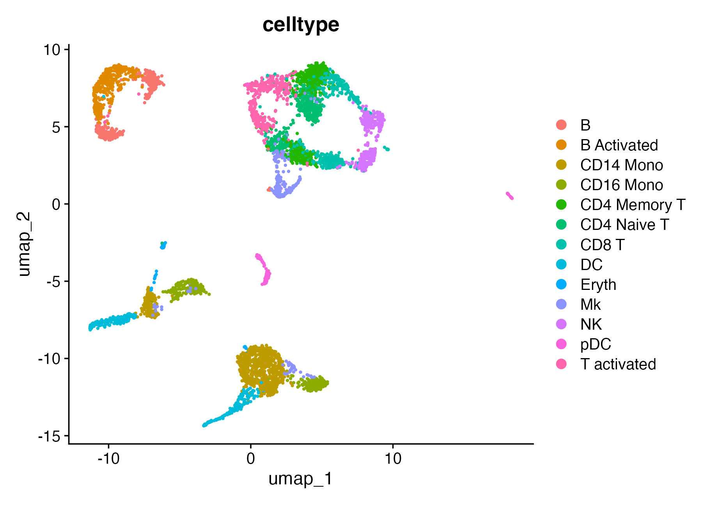
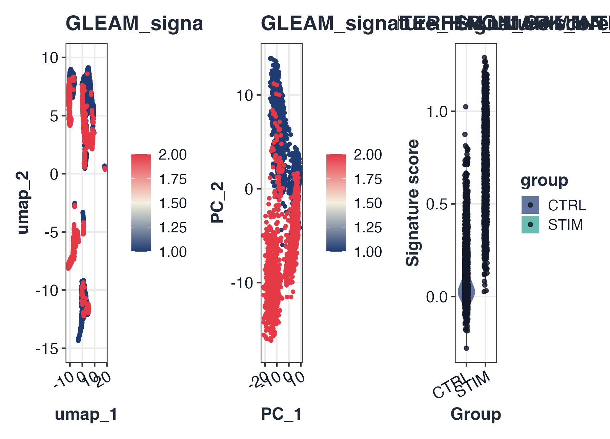

# GLEAM quick start: scRNA-seq Seurat workflow

## Goal

This quick start demonstrates a practical Seurat-first scRNA workflow:

1.  Start from a Seurat object
2.  Run standard preprocessing (normalization, HVG, PCA, neighbors,
    clustering, UMAP/tSNE)
3.  Load IFNB Seurat example object
4.  Load Hallmark gene sets
5.  Score signature activity
6.  Run differential analysis after scoring
7.  Visualize scores with patchwork composition

## 1) Prepare Seurat object and run standard preprocessing

Before signature scoring, we run a conventional Seurat preprocessing
path so that:

- embeddings (`umap`, `pca`, `tsne`) are available for score
  visualization;
- cluster labels are available for state-level interpretation;
- downstream differential comparisons are based on a well-structured
  object.

``` r

library(Seurat)
#> Loading required package: SeuratObject
#> Loading required package: sp
#> 
#> Attaching package: 'SeuratObject'
#> The following object is masked from 'package:GLEAM':
#> 
#>     pbmc_small
#> The following objects are masked from 'package:base':
#> 
#>     intersect, t

# Use full IFNB Seurat example object
ifnb_path <- system.file("extdata", "full_examples", "ifnb_seurat.rds", package = "GLEAM")
if (ifnb_path == "") ifnb_path <- file.path("inst", "extdata", "full_examples", "ifnb_seurat.rds")
seu <- readRDS(ifnb_path)
pick_first_col <- function(candidates, cols) {
  hit <- candidates[candidates %in% cols]
  if (length(hit) == 0L) return(NULL)
  hit[[1]]
}

stratified_keep <- function(meta, n_target, strata_candidates = character()) {
  if (nrow(meta) <= n_target) return(rownames(meta))
  strata <- intersect(strata_candidates, colnames(meta))
  all_ids <- rownames(meta)
  if (length(strata) == 0L) return(all_ids[seq_len(n_target)])

  key <- interaction(meta[, strata, drop = FALSE], drop = TRUE, lex.order = TRUE)
  groups <- split(all_ids, key)
  per_group <- max(1L, floor(n_target / max(1L, length(groups))))
  keep <- unlist(lapply(groups, function(ids) {
    ids <- sort(ids)
    head(ids, per_group)
  }), use.names = FALSE)
  if (length(keep) < n_target) {
    keep <- c(keep, head(setdiff(all_ids, keep), n_target - length(keep)))
  }
  unique(keep)[seq_len(min(n_target, length(unique(keep))))]
}

if (ncol(seu) > 5000) {
  md0 <- seu@meta.data
  keep <- stratified_keep(
    meta = md0,
    n_target = 5000,
    strata_candidates = c("orig.ident", "stim", "seurat_annotations", "seurat_clusters")
  )
  seu <- subset(seu, cells = keep)
}

md <- seu@meta.data
sample_col <- pick_first_col(c("sample", "orig.ident"), colnames(md))
if (is.null(sample_col)) {
  md$sample <- "sample_1"
  sample_col <- "sample"
} else if (sample_col != "sample") {
  md$sample <- as.character(md[[sample_col]])
}

group_col <- pick_first_col(c("stim", "group"), colnames(md))
if (is.null(group_col)) {
  md$group <- ifelse(seq_len(nrow(md)) <= nrow(md) / 2, "A", "B")
  group_col <- "group"
} else if (group_col != "group") {
  md$group <- as.character(md[[group_col]])
}

celltype_col <- pick_first_col(c("seurat_annotations", "celltype", "seurat_clusters"), colnames(md))
if (is.null(celltype_col)) {
  md$celltype <- as.character(Idents(seu))
  celltype_col <- "celltype"
} else if (celltype_col == "seurat_clusters") {
  md$celltype <- paste0("cluster_", md$seurat_clusters)
} else if (celltype_col != "celltype") {
  md$celltype <- as.character(md[[celltype_col]])
}
if (length(unique(md$sample)) < 2L) {
  md$sample <- ifelse(seq_len(nrow(md)) <= nrow(md) / 2, "sample_A", "sample_B")
}
if (length(unique(md$group)) < 2L) {
  s1 <- unique(md$sample)[1]
  md$group <- ifelse(md$sample == s1, "A", "B")
}
seu@meta.data <- md

# Minimal QC context for a quick start (no aggressive filtering here).
if (any(grepl("^MT-", rownames(seu)))) {
  seu[["percent.mt"]] <- PercentageFeatureSet(seu, pattern = "^MT-")
}
qc_cols <- intersect(c("nFeature_RNA", "nCount_RNA", "percent.mt"), colnames(seu@meta.data))
summary(seu@meta.data[, qc_cols, drop = FALSE])
#>   nFeature_RNA      nCount_RNA   
#>  Min.   : 501.0   Min.   :  788  
#>  1st Qu.: 552.0   1st Qu.: 1269  
#>  Median : 641.0   Median : 1630  
#>  Mean   : 726.9   Mean   : 2054  
#>  3rd Qu.: 841.0   3rd Qu.: 2592  
#>  Max.   :2644.0   Max.   :10013

if (!"pca" %in% names(seu@reductions)) {
  seu <- NormalizeData(seu)
  seu <- FindVariableFeatures(seu)
  seu <- ScaleData(seu)
  seu <- RunPCA(seu)
}
#> Normalizing layer: counts
#> Finding variable features for layer counts
#> Centering and scaling data matrix
#> PC_ 1 
#> Positive:  NPM1, CD3D, LTB, GIMAP7, CCR7, CD7, SELL, PIK3IP1, TRAT1, RHOH 
#>     PTPRCAP, ITM2A, C1QBP, IL32, CREM, CLEC2D, CD247, IL7R, NOP58, RGCC 
#>     CCL5, NHP2, SNHG8, MYC, TSC22D3, PASK, APEX1, RARRES3, GNLY, NKG7 
#> Negative:  C15orf48, TYROBP, CST3, FCER1G, TIMP1, SOD2, ANXA5, KYNU, FTL, TYMP 
#>     SPI1, PSAP, S100A4, ANXA2, LGALS1, CD63, S100A11, NPC2, LYZ, CTSB 
#>     FCN1, LGALS3, IGSF6, CD68, PLAUR, S100A10, APOBEC3A, PILRA, CFP, FTH1 
#> PC_ 2 
#> Positive:  IL8, S100A8, CLEC5A, CD14, VCAN, S100A9, IER3, PID1, IL1B, GPX1 
#>     PLAUR, CD9, CXCL3, FTH1, THBS1, MARCKSL1, CTB-61M7.2, CXCL2, MGST1, PPIF 
#>     OLR1, LIMS1, PHLDA1, GAPDH, C5AR1, VIM, CYP1B1, S100A4, OSM, LGALS3 
#> Negative:  ISG15, IFIT3, IFIT1, ISG20, MX1, TNFSF10, LY6E, IFIT2, IFI6, CXCL10 
#>     RSAD2, OAS1, IRF7, CXCL11, IFITM3, EPSTI1, IFI44L, SAMD9L, IFI35, OASL 
#>     TNFSF13B, IFITM2, HERC5, PLSCR1, GBP1, CMPK2, NT5C3A, MT2A, DDX58, IDO1 
#> PC_ 3 
#> Positive:  GIMAP7, ANXA1, MT2A, RARRES3, CD7, GNLY, CD3D, OASL, FCGR3A, PRF1 
#>     C3AR1, CCL5, NKG7, CLEC2B, KLRD1, CD247, IL32, IFIT1, GZMA, GZMH 
#>     MS4A4A, CTSW, CFD, GLRX, FCER1G, FGFBP2, LY6E, CD300E, IFI6, TNFAIP6 
#> Negative:  HLA-DQA1, HLA-DQB1, HLA-DRA, HLA-DRB1, CD74, CD83, HLA-DPA1, MIR155HG, HLA-DPB1, SYNGR2 
#>     HLA-DMA, FABP5, TXN, IRF8, HERPUD1, NME1, REL, TVP23A, HSP90AB1, PRMT1 
#>     CCL22, ID3, TSPAN13, CCR7, HSPD1, EBI3, HSPE1, BASP1, PIM3, PRDX1 
#> PC_ 4 
#> Positive:  GZMB, NKG7, CST7, GNLY, CLIC3, PRF1, CCL5, APOBEC3G, CTSW, KLRD1 
#>     GZMA, GZMH, FGFBP2, ALOX5AP, KLRC1, LSP1, CD38, RAMP1, ID2, FASLG 
#>     RARRES3, CXCR3, ITM2C, LINC00996, TSPAN13, IGFBP7, CALCRL, CCL22, SERPINF1, GAPDH 
#> Negative:  HSP90AB1, MYC, HSPD1, NME1, MS4A4A, MIR155HG, NOP58, HSPE1, ID3, MS4A7 
#>     CFD, SRSF7, CD79A, GBP1, CCL3, MS4A1, TNFAIP6, HSPH1, C3AR1, PYCR1 
#>     FKBP4, NR4A2, CMSS1, CCR7, SOD2, AIF1, CHORDC1, NHP2, NPM1, SERPINA1 
#> PC_ 5 
#> Positive:  IL7R, GPR183, CCL22, BIRC3, FSCN1, TRAT1, CCR7, PKIB, RAB9A, ANXA1 
#>     IDO1, CLIC2, CALCRL, DNAJB4, LYZ, GPR137B, GIMAP7, PIK3IP1, OGFRL1, CD3D 
#>     LMNA, RGS1, MARCKSL1, TBC1D4, CACYBP, CLK1, LAMP3, GADD45B, ICOS, SNHG12 
#> Negative:  GZMB, FCGR3A, IGJ, CTSC, CLIC3, NKG7, HERPUD1, TSPAN13, CD79A, LILRA4 
#>     IRF8, TCF4, SPIB, MS4A4A, MAP1A, SMPD3, PLAC8, SCT, ITM2C, BLNK 
#>     MS4A1, HVCN1, GNLY, MYBL2, CD74, TCL1A, CCL4, NME1, NEK8, SRM
if (!"umap" %in% names(seu@reductions)) {
  seu <- FindNeighbors(seu, dims = 1:20)
  seu <- FindClusters(seu, resolution = 0.4)
  seu <- RunUMAP(seu, dims = 1:20)
}
#> Computing nearest neighbor graph
#> Computing SNN
#> Modularity Optimizer version 1.3.0 by Ludo Waltman and Nees Jan van Eck
#> 
#> Number of nodes: 5000
#> Number of edges: 187843
#> 
#> Running Louvain algorithm...
#> Maximum modularity in 10 random starts: 0.9368
#> Number of communities: 17
#> Elapsed time: 0 seconds
#> Warning: The default method for RunUMAP has changed from calling Python UMAP via reticulate to the R-native UWOT using the cosine metric
#> To use Python UMAP via reticulate, set umap.method to 'umap-learn' and metric to 'correlation'
#> This message will be shown once per session
#> 21:20:15 UMAP embedding parameters a = 0.9922 b = 1.112
#> 21:20:15 Read 5000 rows and found 20 numeric columns
#> 21:20:15 Using Annoy for neighbor search, n_neighbors = 30
#> 21:20:15 Building Annoy index with metric = cosine, n_trees = 50
#> 0%   10   20   30   40   50   60   70   80   90   100%
#> [----|----|----|----|----|----|----|----|----|----|
#> **************************************************|
#> 21:20:15 Writing NN index file to temp file /var/folders/wz/y39q7cvx4hl3qhtftc16hnn00000gn/T//Rtmptd8hFQ/file13868cb34be7
#> 21:20:15 Searching Annoy index using 1 thread, search_k = 3000
#> 21:20:16 Annoy recall = 100%
#> 21:20:16 Commencing smooth kNN distance calibration using 1 thread with target n_neighbors = 30
#> 21:20:16 Initializing from normalized Laplacian + noise (using RSpectra)
#> 21:20:16 Commencing optimization for 500 epochs, with 205430 positive edges
#> 21:20:16 Using rng type: pcg
#> 21:20:22 Optimization finished
if (!"tsne" %in% names(seu@reductions)) {
  seu <- RunTSNE(seu, dims = 1:20)
}

# Show object context early
dim(seu)
#> [1] 14053  5000
seu
#> An object of class Seurat 
#> 14053 features across 5000 samples within 1 assay 
#> Active assay: RNA (14053 features, 2000 variable features)
#>  3 layers present: counts, data, scale.data
#>  3 dimensional reductions calculated: pca, umap, tsne
head(seu@meta.data[, unique(c("sample", group_col, celltype_col))])
#>                       sample stim seurat_annotations
#> AAACATACATTTCC.1 IMMUNE_CTRL CTRL          CD14 Mono
#> AAACATACCAGAAA.1 IMMUNE_CTRL CTRL          CD14 Mono
#> AAACATACCTCGCT.1 IMMUNE_CTRL CTRL          CD14 Mono
#> AAACATACCTGGTA.1 IMMUNE_CTRL CTRL                pDC
#> AAACATACGATGAA.1 IMMUNE_CTRL CTRL       CD4 Memory T
#> AAACATACGGCATT.1 IMMUNE_CTRL CTRL          CD14 Mono
table(Idents(seu))
#> 
#>   0   1   2   3   4   5   6   7   8   9  10  11  12  13  14  15  16 
#> 796 772 615 507 395 258 211 204 201 191 188 178 171 144 108  36  25
DimPlot(seu, reduction = "umap", group.by = "seurat_clusters", label = TRUE, repel = TRUE, pt.size = 0.4)
```



``` r

DimPlot(seu, reduction = "umap", group.by = "celltype", pt.size = 0.4)
```



## 2) Load built-in genesets

``` r

map_geneset_to_expr <- function(gs, expr_genes) {
  expr_genes <- as.character(expr_genes)
  expr_upper <- toupper(expr_genes)
  mapped <- lapply(gs, function(g) {
    idx <- match(toupper(unique(as.character(g))), expr_upper, nomatch = 0L)
    unique(expr_genes[idx[idx > 0L]])
  })
  mapped[vapply(mapped, length, integer(1)) > 0L]
}

fallback_signatures <- function(expr_genes) {
  g <- unique(as.character(expr_genes))
  g <- g[!is.na(g) & nzchar(g)]
  k <- min(30L, max(3L, floor(length(g) / 4)))
  idx1 <- seq_len(min(k, length(g)))
  idx2 <- seq.int(max(1L, length(g) - k + 1L), length(g))
  list(
    Signature_A = g[idx1],
    Signature_B = g[idx2]
  )
}

gs_hallmark <- NULL
for (sp in c("human", "mouse")) {
  gs_try <- try(get_geneset("hallmark", source = "builtin", species = sp), silent = TRUE)
  if (inherits(gs_try, "try-error")) next
  gs_try <- map_geneset_to_expr(gs_try, rownames(seu))
  gs_try <- gs_try[vapply(gs_try, length, integer(1)) >= 3L]
  if (length(gs_try) > 0L) {
    gs_hallmark <- gs_try
    break
  }
}
if (is.null(gs_hallmark) || length(gs_hallmark) == 0L) {
  message("[GLEAM] No matched Hallmark signatures; using object-derived fallback signatures.")
  gs_hallmark <- fallback_signatures(rownames(seu))
}
```

## 3) Score signatures

``` r

sc <- score_signature(
  object = seu,
  geneset = gs_hallmark,
  geneset_source = "list",
  seurat = TRUE,
  assay = "RNA",
  layer = "data",
  slot = "data",
  method = "ensemble",
  min_genes = 3
)
#> [GLEAM] matched pathways: 5
#> [GLEAM] median matched genes: 5.0
#> [GLEAM] scoring rank method...
#> [GLEAM] scoring auc method (top_n=703)...
#> [GLEAM] scoring zmean method...
```

## 4) Differential analysis after scoring

``` r

res <- test_signature(
  score = sc,
  group = group_col,
  sample = "sample",
  celltype = celltype_col,
  level = "pseudobulk",
  method = "wilcox"
)
```

## 5) Core visualizations (patchwork layout)

``` r

top_pw <- res$table$pathway[order(res$table$p_adj)][1]
p1 <- plot_embedding_score(sc, pathway = top_pw, object = seu, reduction = "umap")
p2 <- plot_embedding_score(sc, pathway = top_pw, object = seu, reduction = "pca")
p3 <- plot_violin(sc, pathway = rownames(sc$score)[1], group = group_col)

if (requireNamespace("patchwork", quietly = TRUE)) {
  p1 + p2 + p3 + patchwork::plot_layout(ncol = 3)
} else {
  p1
  p2
  p3
}
```


