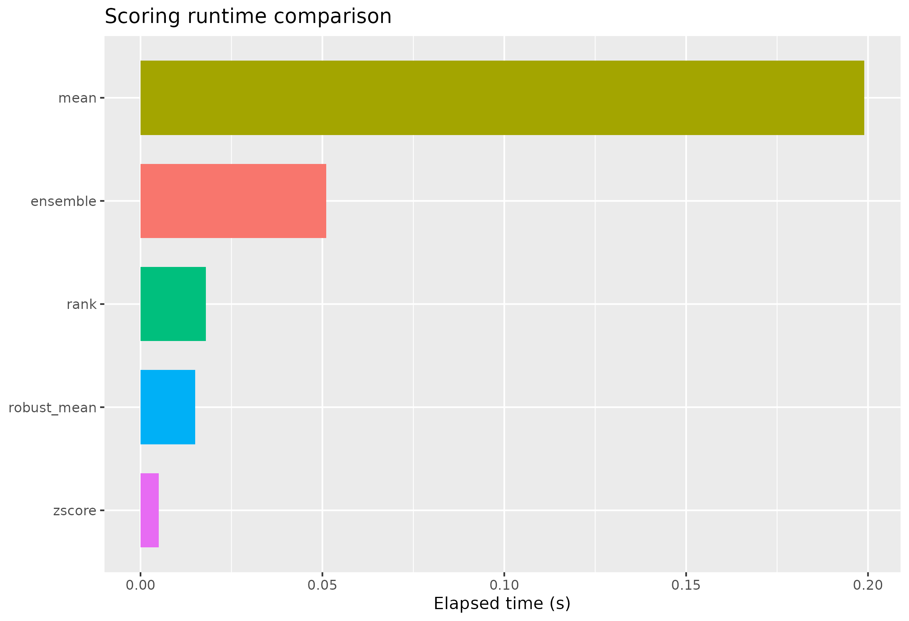
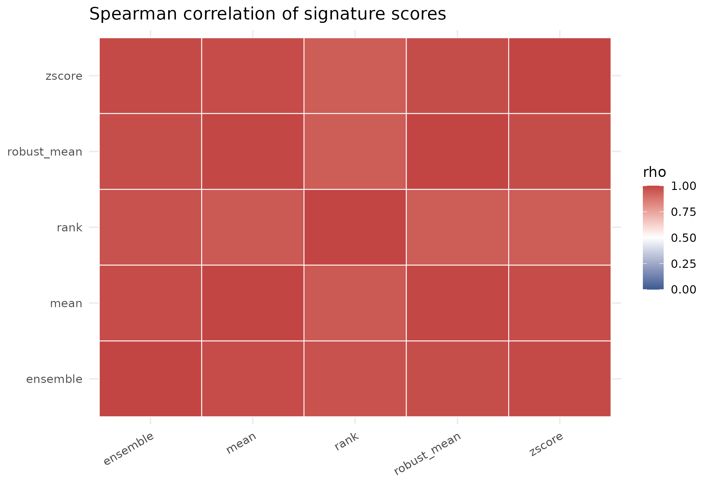
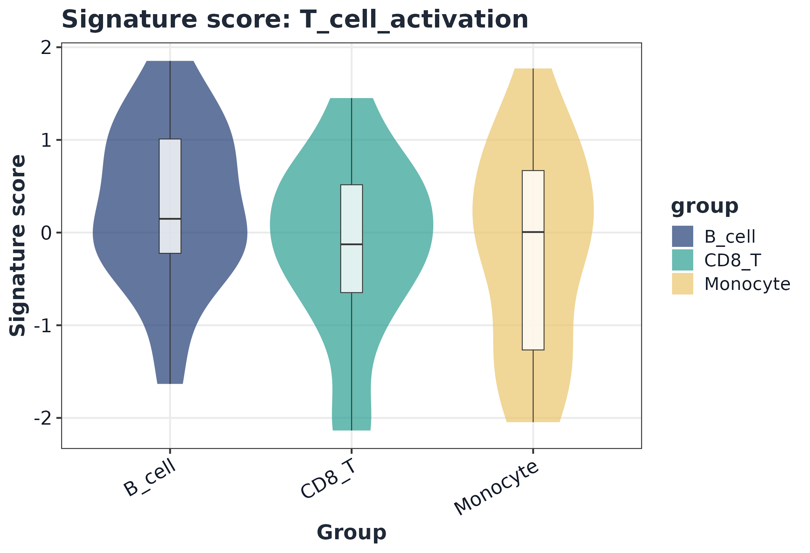

# GLEAM scoring benchmark

## 1) Load benchmark input

``` r
data("toy_expr", package = "GLEAM")

expr <- toy_expr$expr
meta <- toy_expr$meta
geneset <- "immune_small"

dim(expr)
#> [1] 120  60
head(meta)
#>                   cell_id sample   group celltype donor batch condition
#> toy_cell_001 toy_cell_001    S01 control   B_cell    D1    B1   control
#> toy_cell_002 toy_cell_002    S01 control   B_cell    D1    B1   control
#> toy_cell_003 toy_cell_003    S01 control   B_cell    D1    B1   control
#> toy_cell_004 toy_cell_004    S01 control   B_cell    D1    B1   control
#> toy_cell_005 toy_cell_005    S01 control    CD8_T    D1    B1   control
#> toy_cell_006 toy_cell_006    S01 control    CD8_T    D1    B1   control
#>              pseudotime lineage
#> toy_cell_001 0.00000000      L1
#> toy_cell_002 0.01694915      L1
#> toy_cell_003 0.03389831      L1
#> toy_cell_004 0.05084746      L1
#> toy_cell_005 0.06779661      L1
#> toy_cell_006 0.08474576      L1
```

## 2) Methods compared

``` r
base_methods <- c("rank", "mean", "zscore", "robust_mean", "ensemble")
optional_methods <- c()

if (requireNamespace("UCell", quietly = TRUE)) optional_methods <- c(optional_methods, "UCell")
if (requireNamespace("AUCell", quietly = TRUE)) optional_methods <- c(optional_methods, "AUCell")
if (requireNamespace("GSVA", quietly = TRUE)) optional_methods <- c(optional_methods, "ssGSEA")

methods <- c(base_methods, optional_methods)
methods
#> [1] "rank"        "mean"        "zscore"      "robust_mean" "ensemble"
```

## 3) Runtime benchmark

``` r
bench <- lapply(methods, function(m) {
  t0 <- proc.time()
  sc <- score_signature(
    expr = expr,
    meta = meta,
    geneset = geneset,
    seurat = FALSE,
    method = m,
    min_genes = 3,
    ensemble_methods = c("rank", "zscore", "mean"),
    ensemble_standardize = "zscore",
    verbose = FALSE
  )
  elapsed <- unname((proc.time() - t0)[["elapsed"]])
  list(method = m, score = sc$score, elapsed = elapsed)
})

runtime_df <- data.frame(
  method = vapply(bench, `[[`, character(1), "method"),
  elapsed_sec = vapply(bench, `[[`, numeric(1), "elapsed"),
  stringsAsFactors = FALSE
)
runtime_df <- runtime_df[order(runtime_df$elapsed_sec), , drop = FALSE]
runtime_df
#>        method elapsed_sec
#> 3      zscore       0.005
#> 4 robust_mean       0.015
#> 1        rank       0.018
#> 5    ensemble       0.051
#> 2        mean       0.199

ggplot(runtime_df, aes(x = reorder(method, elapsed_sec), y = elapsed_sec, fill = method)) +
  geom_col(width = 0.72, show.legend = FALSE) +
  coord_flip() +
  labs(x = NULL, y = "Elapsed time (s)", title = "Scoring runtime comparison")
```



## 4) Score correlation across methods

``` r
score_vec <- lapply(bench, function(x) as.numeric(x$score))
names(score_vec) <- vapply(bench, `[[`, character(1), "method")
mat <- do.call(cbind, score_vec)
colnames(mat) <- names(score_vec)
cor_mat <- stats::cor(mat, use = "pairwise.complete.obs", method = "spearman")
round(cor_mat, 3)
#>              rank  mean zscore robust_mean ensemble
#> rank        1.000 0.951  0.940       0.941    0.969
#> mean        0.951 1.000  0.983       0.996    0.983
#> zscore      0.940 0.983  1.000       0.982    0.988
#> robust_mean 0.941 0.996  0.982       1.000    0.979
#> ensemble    0.969 0.983  0.988       0.979    1.000

cor_df <- as.data.frame(as.table(cor_mat), stringsAsFactors = FALSE)
colnames(cor_df) <- c("method_x", "method_y", "rho")

ggplot(cor_df, aes(method_x, method_y, fill = rho)) +
  geom_tile(color = "white", linewidth = 0.35) +
  scale_fill_gradient2(low = "#3B5B92", high = "#C24543", mid = "white", midpoint = 0.5, limits = c(0, 1)) +
  theme_minimal(base_size = 12) +
  theme(axis.title = element_blank(), axis.text.x = element_text(angle = 30, hjust = 1)) +
  labs(title = "Spearman correlation of signature scores")
```



## 5) Visualization example

``` r
sc_ens <- score_signature(
  expr = expr,
  meta = meta,
  geneset = geneset,
  seurat = FALSE,
  method = "ensemble",
  ensemble_methods = c("rank", "zscore", "mean"),
  ensemble_standardize = "zscore",
  min_genes = 3,
  verbose = FALSE
)

sig <- rownames(sc_ens$score)[1]
plot_violin(sc_ens, signature = sig, group = "celltype", point_size = 0)
```


