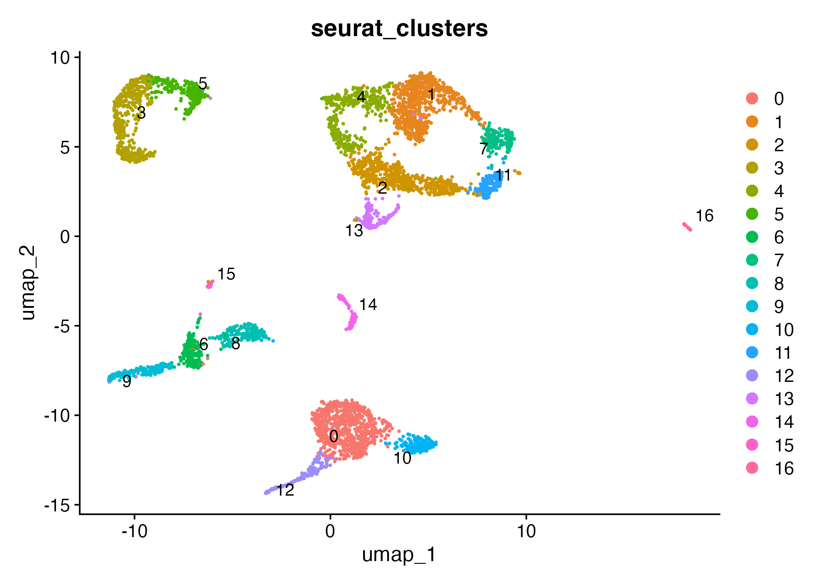
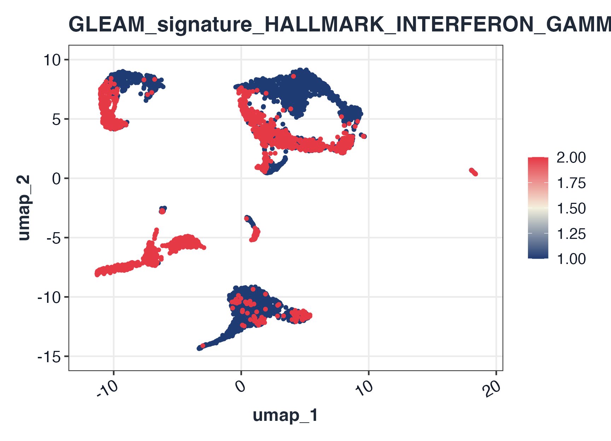
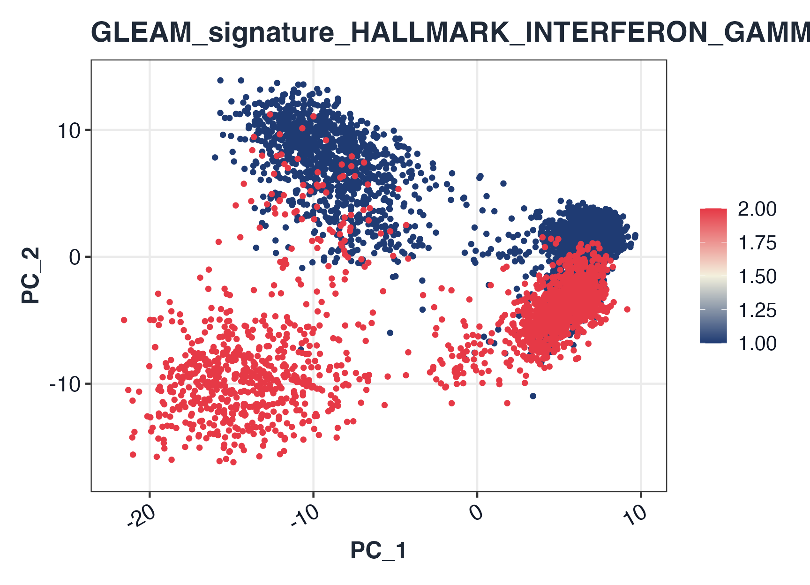
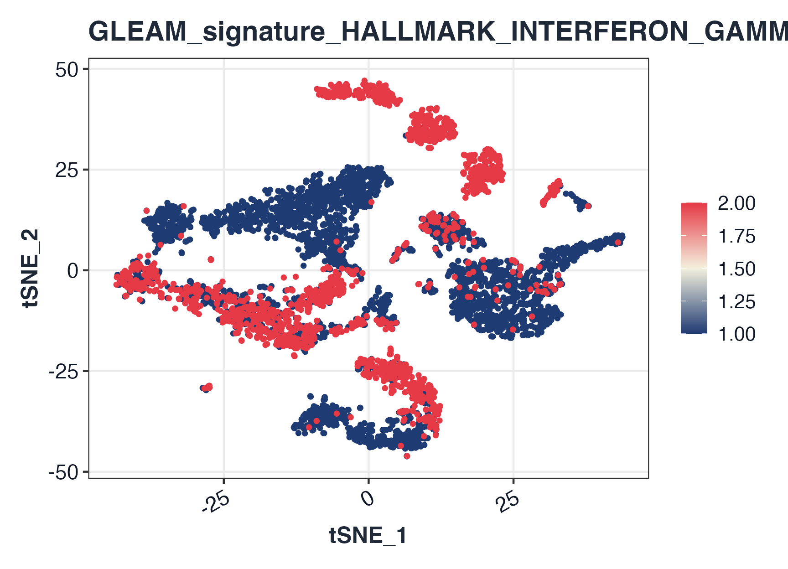

# GLEAM Seurat v4/v5 input guide

## Why this guide

[`score_signature()`](https://JamesWu7.github.io/GLEAM/reference/score_signature.md)
supports Seurat v4 and v5 with the same top-level API. This guide
demonstrates:

1.  Standard Seurat preprocessing before scoring
2.  v5-style `layer` usage
3.  v4-compatible `slot` fallback
4.  Reduction extraction and embedding-based signature display

## 1) Build a Seurat object and run standard workflow

``` r

library(Seurat)
#> Loading required package: SeuratObject
#> Loading required package: sp
#> 
#> Attaching package: 'SeuratObject'
#> The following object is masked from 'package:GLEAM':
#> 
#>     pbmc_small
#> The following objects are masked from 'package:base':
#> 
#>     intersect, t

ifnb_path <- system.file("extdata", "full_examples", "ifnb_seurat.rds", package = "GLEAM")
if (ifnb_path == "") ifnb_path <- file.path("inst", "extdata", "full_examples", "ifnb_seurat.rds")
seu <- readRDS(ifnb_path)
if (ncol(seu) > 5000) {
  md0 <- seu@meta.data
  stratified_keep <- function(meta, n_target, strata_candidates = character()) {
    if (nrow(meta) <= n_target) return(rownames(meta))
    strata <- intersect(strata_candidates, colnames(meta))
    all_ids <- rownames(meta)
    if (length(strata) == 0L) return(all_ids[seq_len(n_target)])
    key <- interaction(meta[, strata, drop = FALSE], drop = TRUE, lex.order = TRUE)
    groups <- split(all_ids, key)
    per_group <- max(1L, floor(n_target / max(1L, length(groups))))
    keep <- unlist(lapply(groups, function(ids) head(sort(ids), per_group)), use.names = FALSE)
    if (length(keep) < n_target) keep <- c(keep, head(setdiff(all_ids, keep), n_target - length(keep)))
    unique(keep)[seq_len(min(n_target, length(unique(keep))))]
  }
  keep <- stratified_keep(md0, 5000, c("orig.ident", "stim", "seurat_annotations", "seurat_clusters"))
  seu <- subset(seu, cells = keep)
}

if (!"pca" %in% names(seu@reductions)) {
  seu <- NormalizeData(seu)
  seu <- FindVariableFeatures(seu)
  seu <- ScaleData(seu)
  seu <- RunPCA(seu)
}
#> Normalizing layer: counts
#> Finding variable features for layer counts
#> Centering and scaling data matrix
#> PC_ 1 
#> Positive:  NPM1, CD3D, LTB, GIMAP7, CCR7, CD7, SELL, PIK3IP1, TRAT1, RHOH 
#>     PTPRCAP, ITM2A, C1QBP, IL32, CREM, CLEC2D, CD247, IL7R, NOP58, RGCC 
#>     CCL5, NHP2, SNHG8, MYC, TSC22D3, PASK, APEX1, RARRES3, GNLY, NKG7 
#> Negative:  C15orf48, TYROBP, CST3, FCER1G, TIMP1, SOD2, ANXA5, KYNU, FTL, TYMP 
#>     SPI1, PSAP, S100A4, ANXA2, LGALS1, CD63, S100A11, NPC2, LYZ, CTSB 
#>     FCN1, LGALS3, IGSF6, CD68, PLAUR, S100A10, APOBEC3A, PILRA, CFP, FTH1 
#> PC_ 2 
#> Positive:  IL8, S100A8, CLEC5A, CD14, VCAN, S100A9, IER3, PID1, IL1B, GPX1 
#>     PLAUR, CD9, CXCL3, FTH1, THBS1, MARCKSL1, CTB-61M7.2, CXCL2, MGST1, PPIF 
#>     OLR1, LIMS1, PHLDA1, GAPDH, C5AR1, VIM, CYP1B1, S100A4, OSM, LGALS3 
#> Negative:  ISG15, IFIT3, IFIT1, ISG20, MX1, TNFSF10, LY6E, IFIT2, IFI6, CXCL10 
#>     RSAD2, OAS1, IRF7, CXCL11, IFITM3, EPSTI1, IFI44L, SAMD9L, IFI35, OASL 
#>     TNFSF13B, IFITM2, HERC5, PLSCR1, GBP1, CMPK2, NT5C3A, MT2A, DDX58, IDO1 
#> PC_ 3 
#> Positive:  GIMAP7, ANXA1, MT2A, RARRES3, CD7, GNLY, CD3D, OASL, FCGR3A, PRF1 
#>     C3AR1, CCL5, NKG7, CLEC2B, KLRD1, CD247, IL32, IFIT1, GZMA, GZMH 
#>     MS4A4A, CTSW, CFD, GLRX, FCER1G, FGFBP2, LY6E, CD300E, IFI6, TNFAIP6 
#> Negative:  HLA-DQA1, HLA-DQB1, HLA-DRA, HLA-DRB1, CD74, CD83, HLA-DPA1, MIR155HG, HLA-DPB1, SYNGR2 
#>     HLA-DMA, FABP5, TXN, IRF8, HERPUD1, NME1, REL, TVP23A, HSP90AB1, PRMT1 
#>     CCL22, ID3, TSPAN13, CCR7, HSPD1, EBI3, HSPE1, BASP1, PIM3, PRDX1 
#> PC_ 4 
#> Positive:  GZMB, NKG7, CST7, GNLY, CLIC3, PRF1, CCL5, APOBEC3G, CTSW, KLRD1 
#>     GZMA, GZMH, FGFBP2, ALOX5AP, KLRC1, LSP1, CD38, RAMP1, ID2, FASLG 
#>     RARRES3, CXCR3, ITM2C, LINC00996, TSPAN13, IGFBP7, CALCRL, CCL22, SERPINF1, GAPDH 
#> Negative:  HSP90AB1, MYC, HSPD1, NME1, MS4A4A, MIR155HG, NOP58, HSPE1, ID3, MS4A7 
#>     CFD, SRSF7, CD79A, GBP1, CCL3, MS4A1, TNFAIP6, HSPH1, C3AR1, PYCR1 
#>     FKBP4, NR4A2, CMSS1, CCR7, SOD2, AIF1, CHORDC1, NHP2, NPM1, SERPINA1 
#> PC_ 5 
#> Positive:  IL7R, GPR183, CCL22, BIRC3, FSCN1, TRAT1, CCR7, PKIB, RAB9A, ANXA1 
#>     IDO1, CLIC2, CALCRL, DNAJB4, LYZ, GPR137B, GIMAP7, PIK3IP1, OGFRL1, CD3D 
#>     LMNA, RGS1, MARCKSL1, TBC1D4, CACYBP, CLK1, LAMP3, GADD45B, ICOS, SNHG12 
#> Negative:  GZMB, FCGR3A, IGJ, CTSC, CLIC3, NKG7, HERPUD1, TSPAN13, CD79A, LILRA4 
#>     IRF8, TCF4, SPIB, MS4A4A, MAP1A, SMPD3, PLAC8, SCT, ITM2C, BLNK 
#>     MS4A1, HVCN1, GNLY, MYBL2, CD74, TCL1A, CCL4, NME1, NEK8, SRM
if (!"umap" %in% names(seu@reductions)) {
  seu <- FindNeighbors(seu, dims = 1:20)
  seu <- FindClusters(seu, resolution = 0.4)
  seu <- RunUMAP(seu, dims = 1:20)
}
#> Computing nearest neighbor graph
#> Computing SNN
#> Modularity Optimizer version 1.3.0 by Ludo Waltman and Nees Jan van Eck
#> 
#> Number of nodes: 5000
#> Number of edges: 187843
#> 
#> Running Louvain algorithm...
#> Maximum modularity in 10 random starts: 0.9368
#> Number of communities: 17
#> Elapsed time: 0 seconds
#> Warning: The default method for RunUMAP has changed from calling Python UMAP via reticulate to the R-native UWOT using the cosine metric
#> To use Python UMAP via reticulate, set umap.method to 'umap-learn' and metric to 'correlation'
#> This message will be shown once per session
#> 21:21:43 UMAP embedding parameters a = 0.9922 b = 1.112
#> 21:21:43 Read 5000 rows and found 20 numeric columns
#> 21:21:43 Using Annoy for neighbor search, n_neighbors = 30
#> 21:21:43 Building Annoy index with metric = cosine, n_trees = 50
#> 0%   10   20   30   40   50   60   70   80   90   100%
#> [----|----|----|----|----|----|----|----|----|----|
#> **************************************************|
#> 21:21:43 Writing NN index file to temp file /var/folders/wz/y39q7cvx4hl3qhtftc16hnn00000gn/T//Rtmp9u64ZC/file1390869c08b47
#> 21:21:43 Searching Annoy index using 1 thread, search_k = 3000
#> 21:21:44 Annoy recall = 100%
#> 21:21:44 Commencing smooth kNN distance calibration using 1 thread with target n_neighbors = 30
#> 21:21:44 Initializing from normalized Laplacian + noise (using RSpectra)
#> 21:21:45 Commencing optimization for 500 epochs, with 205430 positive edges
#> 21:21:45 Using rng type: pcg
#> 21:21:50 Optimization finished
if (!"tsne" %in% names(seu@reductions)) {
  seu <- RunTSNE(seu, dims = 1:20)
}

dim(seu)
#> [1] 14053  5000
seu
#> An object of class Seurat 
#> 14053 features across 5000 samples within 1 assay 
#> Active assay: RNA (14053 features, 2000 variable features)
#>  3 layers present: counts, data, scale.data
#>  3 dimensional reductions calculated: pca, umap, tsne
table(Idents(seu))
#> 
#>   0   1   2   3   4   5   6   7   8   9  10  11  12  13  14  15  16 
#> 796 772 615 507 395 258 211 204 201 191 188 178 171 144 108  36  25
DimPlot(seu, reduction = "umap", group.by = "seurat_clusters", label = TRUE, repel = TRUE)
```



## 2) Seurat v5-preferred path (`layer`)

``` r

map_geneset_to_expr <- function(gs, expr_genes) {
  expr_genes <- as.character(expr_genes)
  expr_upper <- toupper(expr_genes)
  mapped <- lapply(gs, function(g) {
    idx <- match(toupper(unique(as.character(g))), expr_upper, nomatch = 0L)
    unique(expr_genes[idx[idx > 0L]])
  })
  mapped[vapply(mapped, length, integer(1)) > 0L]
}

fallback_signatures <- function(expr_genes) {
  g <- unique(as.character(expr_genes))
  g <- g[!is.na(g) & nzchar(g)]
  k <- min(30L, max(3L, floor(length(g) / 4)))
  idx1 <- seq_len(min(k, length(g)))
  idx2 <- seq.int(max(1L, length(g) - k + 1L), length(g))
  list(
    Signature_A = g[idx1],
    Signature_B = g[idx2]
  )
}

gs_for_score <- NULL
for (sp in c("human", "mouse")) {
  gs_try <- try(get_geneset("hallmark", source = "builtin", species = sp), silent = TRUE)
  if (inherits(gs_try, "try-error")) next
  gs_try <- map_geneset_to_expr(gs_try, rownames(seu))
  gs_try <- gs_try[vapply(gs_try, length, integer(1)) >= 3L]
  if (length(gs_try) > 0L) {
    gs_for_score <- gs_try
    break
  }
}
if (is.null(gs_for_score) || length(gs_for_score) == 0L) {
  message("[GLEAM] No matched Hallmark signatures; using object-derived fallback signatures.")
  gs_for_score <- fallback_signatures(rownames(seu))
}
```

``` r

sc_v5 <- score_signature(
  object = seu,
  geneset = gs_for_score,
  geneset_source = "list",
  seurat = TRUE,
  assay = "RNA",
  layer = "data",
  slot = "data",
  method = "rank",
  min_genes = 3
)
#> [GLEAM] matched pathways: 5
#> [GLEAM] median matched genes: 5.0
#> [GLEAM] scoring rank method...
```

## 3) Seurat v4-compatible path (`slot` fallback)

``` r

sc_v4 <- score_signature(
  object = seu,
  geneset = gs_for_score,
  geneset_source = "list",
  seurat = TRUE,
  assay = "RNA",
  layer = NULL,
  slot = "data",
  method = "rank",
  min_genes = 3
)
#> [GLEAM] matched pathways: 5
#> [GLEAM] median matched genes: 5.0
#> [GLEAM] scoring rank method...
```

## 4) Reduction extraction and signature visualization

``` r

emb_umap <- extract_embedding(object = seu, reduction = "umap")
head(emb_umap)
#>                      umap_1     umap_2
#> AAACATACATTTCC.1  0.7218792 -11.912743
#> AAACATACCAGAAA.1  1.9888098  -9.800850
#> AAACATACCTCGCT.1  0.7525521 -10.532711
#> AAACATACCTGGTA.1  0.4387092  -3.290254
#> AAACATACGATGAA.1  3.8817142   8.404407
#> AAACATACGGCATT.1 -0.5036513  -9.686464

top_sig <- rownames(sc_v5$score)[1]
plot_embedding_score(sc_v5, pathway = top_sig, object = seu, reduction = "umap")
```



``` r

plot_embedding_score(sc_v5, pathway = top_sig, object = seu, reduction = "pca")
```



``` r

plot_embedding_score(sc_v5, pathway = top_sig, object = seu, reduction = "tsne")
```


