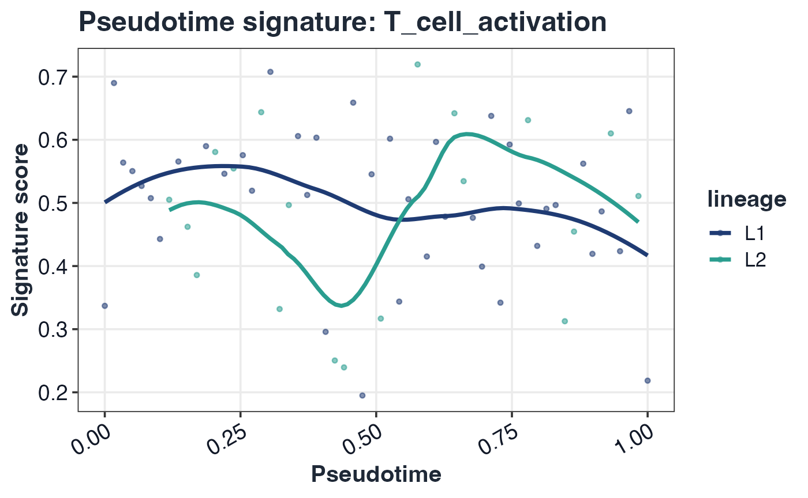

# GLEAM trajectory mapping and testing

## Generic trajectory input

``` r

traj_tbl <- as_trajectory_data(sc, pseudotime = "pseudotime", lineage = "lineage")
head(traj_tbl)
#>                   cell_id pseudotime lineage
#> toy_cell_001 toy_cell_001 0.00000000      L1
#> toy_cell_002 toy_cell_002 0.01694915      L1
#> toy_cell_003 toy_cell_003 0.03389831      L1
#> toy_cell_004 toy_cell_004 0.05084746      L1
#> toy_cell_005 toy_cell_005 0.06779661      L1
#> toy_cell_006 toy_cell_006 0.08474576      L1
```

## Trajectory differential testing

``` r

tr <- test_signature_trajectory(sc, pseudotime = "pseudotime", lineage = "lineage", method = "spearman", verbose = FALSE)
head(tr$table)
#>                pathway comparison_type     group1 group2 celltype      level
#> 1    T_cell_activation      trajectory pseudotime   <NA>       L1 trajectory
#> 2         Cytotoxicity      trajectory pseudotime   <NA>       L1 trajectory
#> 3         IFN_response      trajectory pseudotime   <NA>       L1 trajectory
#> 4 Antigen_presentation      trajectory pseudotime   <NA>       L1 trajectory
#> 5           Exhaustion      trajectory pseudotime   <NA>       L1 trajectory
#>     effect_size median_group1 median_group2   diff_median    p_value     p_adj
#> 1 -0.1287875631     0.5092437            NA -0.1287875631 0.32674526 0.5445754
#> 2  0.2155440706     0.5126050            NA  0.2155440706 0.09813146 0.4906573
#> 3 -0.0910631918     0.5058824            NA -0.0910631918 0.48895365 0.6111921
#> 4 -0.0008058018     0.5142857            NA -0.0008058018 0.99512463 0.9951246
#> 5  0.1669237083     0.5285714            NA  0.1669237083 0.20239718 0.5059929
#>   n_group1 n_group2
#> 1       60       NA
#> 2       60       NA
#> 3       60       NA
#> 4       60       NA
#> 5       60       NA
```

## Trajectory visualizations

``` r

plot_pseudotime_score(sc, pathway = rownames(sc$score)[1], pseudotime = "pseudotime", lineage = "lineage")
```



## Optional backend object integration

``` r

# Monocle2 (monocle package)
# tr_m2 <- test_signature_trajectory(sc, pseudotime = cds_monocle2, lineage = cds_monocle2, method = "spearman")

# Monocle3
# tr_m3 <- test_signature_trajectory(sc, pseudotime = cds_monocle3, lineage = "lineage", method = "spearman")

# slingshot
# tr_sl <- test_signature_trajectory(sc, pseudotime = sds, lineage = sds, method = "spearman")
```
